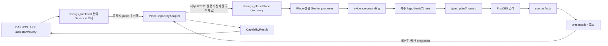

# Place 자연어 발견 기능 운영 이주 계획

> 상태: **승격 계획 — 구현은 단계별 PR에서 진행**
>
> 작성일: 2026-09-03
>
> 대상 기준점: `SAJOYO/DAENGS_dev` `dev` · `e8e57ae`
>
> 후보 원본 기준점: `rkbuhtig/DAENGS_geo` · `3ff268a`

이 문서는 `DAENGS_geo`에서 검증한 Place 자연어 해석·복수 검색 가설·표시 정책을
`DAENGS_dev`로 옮길 때 지켜야 할 코드·프로세스·공개 계약 경계를 고정한다. 실제 승격
PR은 작업 트리 전체를 복사하지 않고 각 PR 본문에 정확한 source commit과 포함·제외 범위를
다시 기록한다.

현재 운영 정본에는 다음 두 기반이 이미 들어왔다.

- PR #183: KTO/KCISA source facts, 출처·충돌·상태 보존
- PR #184: typed search plan, capability gate/compiler/guard, 기존 검색 실행 연결

다음 단계의 목표는 이 기반 위에 자연어 발견 기능을 올리는 것이다. 기존
`POST /v2/places/search`의 요청·응답·정렬 의미를 바꾸는 작업은 아니다.

## 1. 변하지 않는 경계

1. **전역 라우터는 목적지만 고른다.** `daengs_backend`의 Gemini 의미 라우터는 요청을
   `place`로 보낼지까지만 판단한다. 장소 종류·목적·조용함·가격·복수 가설을 만들지 않는다.
2. **Place 의미는 Place가 소유한다.** Place 전용 proposer, 원문 evidence grounding,
   hypothesis/lens/refinement, typed plan, 검색, source facts, presentation은
   `daengs_place` 안에서 닫는다.
3. **LLM 출력은 검색 조건이 아니다.** 모델의 제안은 evidence grounding과 typed planner,
   실행 직전 guard를 모두 통과한 뒤에만 검색에 쓰인다.
4. **두 실행 서비스는 Python import로 연결하지 않는다.** `daengs_backend`와
   `daengs_place`의 런타임 접점은 내부 HTTP다. `daengs_place`는
   `daengs_backend`를 import하지 않는다.
5. **기존 검색은 LLM 없이 계속 뜬다.** Gemini 키·외부 provider 장애와 무관하게
   `/health`, `/health/ready`, `/v2/places/search`, `/territory/sites/nearby`는 기존처럼
   PostGIS만으로 동작해야 한다.
6. **앱은 원천 사실을 재해석하지 않는다.** Android는 서버가 만든 제한된 semantic
   presentation과 refinement 선택지를 표시한다. KTO/KCISA raw나 내부 정책 trace를 받아
   자체적으로 합치지 않는다.

## 2. 목표 요청 흐름



Place는 우선 `EXECUTE` 후보로 본다. 검색이 동기적으로 끝나고 후보·복수 가설·refinement를
한 응답에 보존해야 하기 때문이다. 지도 화면 이동은 결과를 받은 뒤 CTA로 붙일 수 있다.
다만 `CapabilityResult` 응답 크기와 앱 소비 계약을 검증하기 전에는
`CapabilityName.PLACE`와 전역 router schema를 변경하지 않는다.

## 3. 대상 저장소에 맞춘 코드 배치

Geo의 최상위 `app.discovery`를 그대로 만들지 않는다. Place 전용 코드는 기존
`daengs_place.place.planning`·`source_facts`와 같은 소유권 아래에 둔다.

```text
backend/src/daengs_place/
├─ api/
│  ├─ places_v2.py                  # 기존 공개 검색; 호환성 유지
│  └─ discovery_internal.py         # 후속 단계의 내부 전용 진입점
├─ place/
│  ├─ planning/                     # 이미 승격됨
│  ├─ source_facts/                 # 이미 승격됨
│  ├─ information_needs.py          # intent와 presentation이 공유하는 식별자
│  ├─ intent/
│  │  ├─ contract.py
│  │  ├─ prompt.py
│  │  ├─ hypotheses.py
│  │  ├─ open_discovery.py
│  │  ├─ suggestions.py
│  │  ├─ lenses.py
│  │  ├─ refinement.py
│  │  ├─ confirmation.py
│  │  └─ service.py
│  ├─ presentation/
│  │  ├─ contract.py
│  │  ├─ needs.py
│  │  ├─ policy.py
│  │  └─ assembler.py
│  └─ discovery/
│     ├─ contract.py
│     └─ service.py
└─ main.py
```

운영 오케스트레이션에는 구현을 복제하지 않고 기존 adapter 모양의 접점만 추가한다.

```text
backend/src/daengs_backend/orchestration/
├─ contracts.py                     # PlacePayload, CapabilityName.PLACE
├─ semantic.py                      # place 목적지 선택만
├─ planner.py                       # 신뢰된 context에서 payload 조립
├─ adapters/place.py                # place-search 내부 HTTP 호출
└─ aggregate.py                     # Place 결과의 사용자 메시지 투영
```

Geo 이름은 다음처럼 바꿔 옮긴다.

| Geo | 운영 대상 | 이유 |
| --- | --- | --- |
| `app/discovery/place_intent/*` | `daengs_place/place/intent/*` | 범용 discovery가 아니라 Place 소유 의미 해석이다 |
| `app/place/presentation/*` | `daengs_place/place/presentation/*` | 기존 planning/source facts와 같은 제품 계약이다 |
| `presentation.needs.InformationNeedId` | `daengs_place/place/information_needs.py` | intent가 presentation 구현을 선행 참조하지 않게 식별자만 공유한다 |
| `place_intent/assembly.py` | `daengs_place/place/discovery/service.py` | planning·검색·표시를 묶는 응용 서비스다 |
| `PlaceCapabilityInput` | `PlaceDiscoveryRequest` | capability는 공통 오케스트레이터가 소유하는 용어다 |
| `orchestration_bridge.py` | 그대로 승격하지 않음 | Geo 호환성 실험을 운영 계약처럼 복제하지 않는다 |

## 4. 런타임 계약

### 4.1 공통 오케스트레이터 입력

`daengs_backend.orchestration.contracts.PlacePayload`는 다음 최소값만 가진다.

```text
query      사용자의 원문; 다시 쓰거나 요약하지 않는다
lat, lon   인증된 HTTP 요청의 검증된 구조화 위치
```

반경·lens 수·후보 수는 클라이언트 입력이 아니라 서버 정책으로 정한다. Place adapter만
`lon`을 Place 내부 이름인 `lng`로 바꾼다.

### 4.2 Place 도메인 입력

`PlaceDiscoveryRequest`는 다음을 받는다.

```text
query
spatial {lat, lng, radius_m}
conditions {dog_size, dog_weight_kg, dog_age_years} | null
result_policy {서버가 정한 lens/후보 상한}
```

`active_dog_id`는 받지 않는다. Place 검색은 identity가 아니라 값만 받는다는 기존 계약을
유지한다. 소유권 확인된 profile projection이 준비되기 전에는 `conditions=null`로 실행하고
개인화했다고 표시하지 않는다.

### 4.3 오케스트레이션 공개 projection

풍부한 내부 `PlaceDiscoveryData`를 그대로 `CapabilityResult.data`에 복사하지 않는다.
대화 저장소가 공개 Assistant 응답 전체를 JSON으로 보존하므로 크기와 노출 범위를 별도로
통제해야 한다.

```text
PlaceCapabilityData
  contract_version
  answer
  interpretation_summary
  groups[]
    lens_id
    label
    candidates[]       지도와 카드에 필요한 제한된 필드
  refinements[]
  notices[]
```

provider 원출력, 원문 grounding 내부 trace, 원천 raw, 전체 디버그 영수증은 이 projection에
넣지 않는다. `answer`는 모델이 다시 쓰지 않고 Place 결과 상태에서 결정적으로 만든다.

## 5. 운영 안전장치

### 결과 예산

일반 검색 엔진의 상한과 대화형 발견 결과의 상한을 분리한다. Geo의
`limit_per_kind <= 3000`, 전체 5,000건 계약은 내부 검색에는 유효하지만 Assistant 응답에
직접 적용하지 않는다.

초기 운영 기본값은 다음 범위 안에서 고정하고, 실측 뒤 별도 PR로 조정한다.

- executable lens 최대 3개
- lens당 표시 후보 5~10개
- 전체 표시 후보 15~20개
- 직렬화된 capability data에 별도 byte 상한 적용

클라이언트가 이 값을 늘릴 수 없어야 한다. 예산 초과 시 임의 순서로 자르지 않고 정책상
정해진 lens·후보 순서대로 축소한 사실을 notice에 남긴다.

### 좌표

Assistant 공개 계약의 남한 범위(`lat 33~39`, `lon 124~132`)를 먼저 적용한다. Place 내부
계약의 더 넓은 범위(`lat 32~40`, `lng 123~133`)가 외부 검증을 느슨하게 만들지 않는다.
위치가 없으면 검색 의미의 모호함과 달리 실행 자체가 불가능하므로 전역 `CLARIFY`를 사용할
수 있다. Place 내부 모호성은 후보와 refinement를 함께 반환한다.

### 프로필과 신원

현재 `CapabilityAdapter.run`은 principal을 받지 않으므로 adapter에서 `active_dog_id`를
바로 조회·전달하지 않는다. 첫 연결은 비개인화 검색으로 시작한다. 이후 별도 설계에서
소유권 확인과 profile 값 projection의 책임 위치를 결정한다.

### Gemini와 장애 격리

- 기존 `GEMINI_API_KEY` 배포 값을 재사용하되 공통 LLM 추상화를 새로 만들지 않는다.
- Geo holdout은 Gemini Interactions 요청·응답 형태로 측정됐다. 대상의 기존
  `google-genai generate_content` 호출로 transport를 바꾸면 같은 모델 이름이어도 평가
  동등성을 가정하지 않는다. evaluated schema와 호출 의미를 보존하거나 calibration과
  holdout을 다시 통과한 뒤 활성화한다.
- Place proposer client는 첫 discovery 요청까지 만들지 않는다.
- 키가 없거나 provider가 실패해도 기존 Place 공개 API와 health는 정상이어야 한다.
- Place 호출에는 독립 timeout과 요청당 호출 횟수 상한을 둔다.
- 잘못된 provider 출력은 raw를 노출하지 않고 domain 상태로 변환한다.
- provider 실패 fallback의 제품 의미는 승격 PR에서 바꾸지 않는다. 원본 동작을 먼저
  보존하고 정보 우선 fallback 개선은 평가 근거가 있는 별도 PR로 한다.

### 관측과 개인정보

Geo의 lab 관측 테이블을 그대로 옮기지 않는다. 저장형 `/assistant/query`는 이미 사용자
질문과 공개 응답을 대화 turn으로 보존하므로 Place DB에 원문을 중복 저장하지 않는다.
필요한 운영 지표는 원문 없이 disposition, lens 수, 후보 수, 실패 코드, latency처럼
구조화된 집계부터 별도 설계한다.

## 6. 승격하지 않는 실험 코드

- `place_intent/lab.py`, `place_intent_lab.html`
- Geo의 intent 관측 migration과 운영자용 lab 조회
- `openai.py`
- Geo 공통 `usage` 계층과 in-memory budget
- 평가 실행기, calibration/holdout recording 원문
- Geo의 공통 RoutePlan·CapabilityResult 호환 타입
- Android 실험 화면과 Geo 통합 FastAPI 진입점

평가 fixture는 운영 코드의 입력·출력 회귀에 필요한 최소 사례만 선별한다. 연구 보고서는
원본 저장소에 남기고, 운영 수용 기준과 결과 요약만 대상 저장소 문서에 기록한다.

## 7. PR 순서와 각 단계의 금지선

### PR2 — provider 없는 Place intent core

- intent contract, evidence grounding, hypothesis, open discovery, suggestion, lens,
  refinement, confirmation, service를 `daengs_place.place.intent`로 승격
- lens와 presentation이 공유할 `InformationNeedId`만 Place 공용 계약으로 분리
- namespace 변경 외 의미 변경 금지
- Gemini/config/API/migration/오케스트레이션 변경 금지

완료 기준: 선별한 Geo 고정 테스트가 대상 패키지에서 통과하고 기존 Place 전체 테스트와
OpenAPI가 변하지 않는다.

### PR3 — presentation

- presentation contract, information-need catalog, policy, assembler 승격
- PR2에서 분리한 공용 `InformationNeedId`를 재사용하고 presentation 안에 중복 정의하지 않음
- KTO/KCISA source-fact bundle과 검색 hit의 identity 일치 검증
- 기존 `/v2/places/search` 응답 변경 금지

완료 기준: 동일 원천의 검색 hit와 source-fact bundle만 조립되고, 사실의 상태·출처·연결
receipt가 표시 계약에서 보존되며, 기존 Place 전체 테스트와 OpenAPI가 변하지 않는다.

### PR4 — 내부 discovery 조립

- `PlaceDiscoveryRequest`, 내부 planning/result, assembly service 추가
- intent → plan → guard → search → source facts → presentation을 순수 서비스로 연결
- 대화형 lens·후보·byte 예산 추가
- HTTP와 provider wiring 금지

### PR5 — Place 내부 endpoint와 Gemini proposer

- container network에서 사용할 내부 discovery endpoint 추가
- optional Gemini 설정과 lazy client 조립
- 키 없음·timeout·provider/schema 실패 격리 테스트
- nginx의 기존 공개 `/v2/places/` 계약 확장 금지
- `daengs_place.main`의 PostGIS-only 설명과 경계 테스트를 새 현실에 맞게 갱신하되,
  keyless boot와 기존 네 공개 경로는 계속 기계적으로 보장
- Geo에서 평가한 provider transport를 바꾸면 holdout 재실행

### PR6 — `daengs_backend` Place adapter

- `CapabilityName.PLACE`, `PlacePayload`, 내부 HTTP adapter, aggregate projection 추가
- 우선 `requested_capability=place`로 표적 종단 테스트
- profile identity 전달 금지
- 전역 semantic router prompt/schema 변경 금지

### PR7 — 전역 의미 라우터 편입

- `place` 목적지 선택만 schema와 prompt에 추가
- Place 단일·복합·부정·무관 발화 gold set을 먼저 동결
- 기존 80개 라우팅 회귀와 새 Place 수용 기준을 함께 통과한 뒤 활성화

### PR8 — DAENGS_APP 연결

- Place capability data를 기존 지도 marker·카드·상세·refinement UI에 연결
- 기존 직접 `/v2/places/search` 화면 유지
- 빈 결과, 복수 가설, 근거 부족, 부분 실패를 실제 KTO/KCISA 데이터로 종단 확인

## 8. 모든 승격 PR의 공통 검사

- source commit과 포함·제외 파일이 PR 본문에 고정되어 있다.
- `daengs_place`가 `daengs_backend`, `daengs_life`, `daengs_journey`를 import하지 않는다.
- 기존 네 공개 경로와 `/v2/places/search` OpenAPI schema가 의도 없이 변하지 않는다.
- Gemini 키 없이 Place 앱 import와 기존 검색 검증 경로가 동작한다.
- LLM 출력만으로 `locked` gate나 unsupported capability가 실행되지 않는다.
- KTO/KCISA 사실과 연결 상태가 presentation에서 합쳐져 출처를 잃지 않는다.
- provider raw와 내부 trace가 HTTP·로그·대화 저장 JSON에 들어가지 않는다.
- 실패한 새 기능이 기존 Place 검색의 health와 응답을 끌어내리지 않는다.

## 9. 연결 직전 다시 닫을 결정

아래 항목은 코어 승격(PR2~PR4)을 막지 않지만 runtime 연결 전에 코드와 문서에서
명시적으로 닫아야 한다.

- `EXECUTE` 최종 수용과 지도 화면 CTA 모양
- 내부 endpoint 경로와 인증되지 않은 외부 접근 차단 방식
- Assistant용 정확한 lens·후보·byte 상한
- Place proposer 호출 예산의 공유 저장소와 운영 제한
- 소유권 확인된 dog profile projection의 책임 위치
- provider 실패 때 후보를 제공할 fallback 정책
- refinement를 새 `/assistant/query` turn으로 보낼지 Place 전용 action으로 보낼지

이 결정 때문에 Place 내부 intent·planning·presentation 계약을 다시 만들지 않도록,
PR2~PR4는 transport와 오케스트레이션 타입을 모르는 상태로 유지한다.
