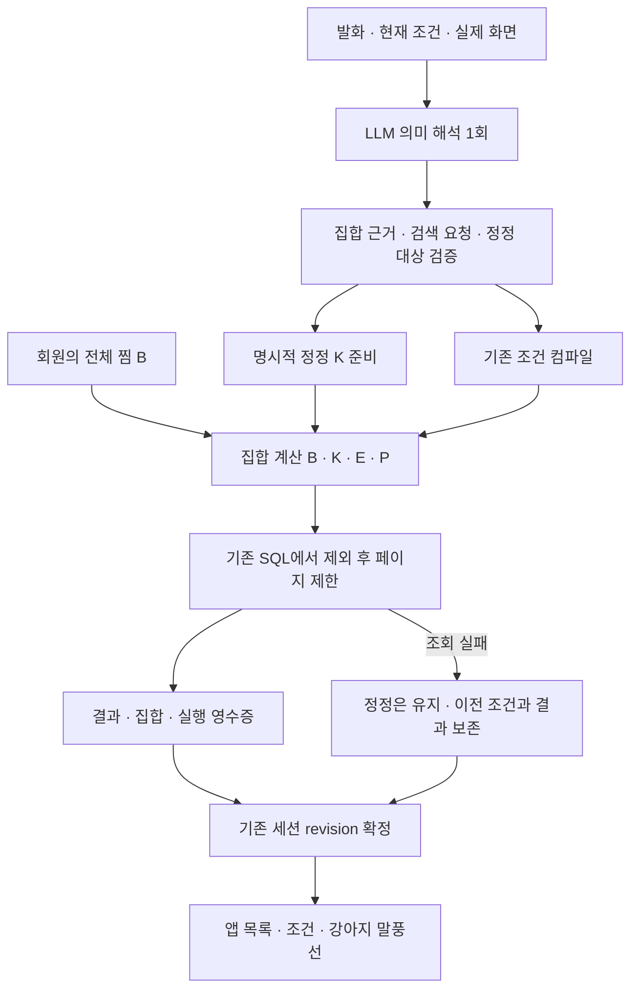

# 새 후보와 이미 아는 장소 정정 — 2단계

서버 [#455](https://github.com/SAJOYO/DAENGS_dev/pull/455), 앱
[#326](https://github.com/SAJOYO/DAENGS_APP/pull/326). 2026-09-11 구현·로컬 검증.
[1단계](search-policy.md)의 공통 정책과 기존 찜·시설 조회를 확장한다.

## 사용자에게 보이는 동작

“새로운 카페 찾아줘”는 현재 조건에서 찜한 곳과 이번 탐색에서 이미 안다고 정정한 곳을 뺀다.
새 후보 목록에서 “첫 번째 이미 알아”라고 하면 해당 장소를 기록하고 빈자리를 채운다.
다른 카드는 유지하되 오래된 목록이거나 조건·다음 페이지 요청이 함께면 전체 후보를 다시 조회한다.
일반 검색에서는 기록만 남기고 현재 목록을 유지한다.
“여기 이미 알아. 주차 되는 카페 보여줘”는 정정과 지원하는 조건 변경을 함께 처리한다.

## 집합의 의미와 수명

조건을 만족하는 전체 후보를 F라 한다. 동일성은 `(source, ref)`다.

| 상태 | 뜻 | 원본·수명 |
| --- | --- | --- |
| B | 찜한 곳, 확정적으로 아는 장소로 취급 | 기존 회원 찜 API. 요청마다 전체 키 최대 200개 조회 |
| K | 이미 안다고 명시적으로 정정한 곳 | 기존 탐색 세션, 최대 120개. 조건 변경에도 유지 |
| E | 검색에서 빼달라고 명시한 곳 | 기존 탐색 세션, 최대 120개 |
| P | 같은 조건·집합에서 제시한 곳 | 기존 탐색 세션, 최대 1,200개 |

| 검색 대상 | 후보 |
| --- | --- |
| 전체 장소 | F − E |
| 찜한 곳 | F ∩ B − E |
| 찜하지 않은 곳 | F − B − E |
| 새 후보 | F − B − K − E |
| 다음 후보 | 선택한 후보 집합 − P |

찜하지 않은 곳은 서비스의 새 후보로 간주한다. 실제 방문 이력을 확인했다는 뜻은 아니다.
K는 일반 검색·찜에서 장소를 숨기지 않는다. 불만·평가·정보 이의를 K/E/찜 쓰기로 바꾸지 않는다.
탐색 초기화는 K/E/P를 지우며 B는 그대로다. 만료·로그아웃 이후 K를 복원하는 영구 저장소는 없다.
K/B 변경만으로 P를 지우지는 않는다. 조건 또는 집합 변경은 별도 제시 기록을 시작한다.

## 실행과 실패 경계

- LLM은 정정 문장과 대상 지칭을 낸다. 서버가 최신 원문, 긍정 진술, 실제 화면 이름·번호·선택을 확인한다.
  대상 없는 “이미 알아”, 부정·인용·가정을 전체 목록 정정으로 확대하지 않는다.
- 피드백과 검색을 함께 실행하려면 `search_request_quote`에 명시적 검색 절이 있어야 한다.
  순수 피드백에 모델이 덧붙인 필터·다음 페이지·제외는 적용하지 않는다.
- 조회 실패나 제시 기록 한도에서도 검증된 K를 확정한다. 이전 결과가 새 후보 기준에 맞지 않음을
  영수증에 남기며 후속 명확화에서도 맞는 결과로 다시 표시하지 않는다. 재시도는 K를 제외한다.
- 찜 읽기 실패·불완전한 결과를 빈 B로 간주하지 않는다. 후보 조회를 중단하고 기존 상태를 유지한다.
  처음 시작하는 복원 조회는 실패로 반환한다. 실제 빈 찜 목록이면 정상 검색할 수 있다.
- SQL의 LIMIT 전에 B/K/E/P를 제외한다. 찜은 기존 전체 키 조회 후 E를 적용한다. 스키마 마이그레이션은 없다.
- 캐시 근거에 조건·집합·B/K/E를 포함한다. 유지한 카드의 사실 조회 시각을 새로 늘리지 않는다.
  기존 5분이 지나면 다시 조회한다. 다음 페이지의 빈 결과와 전체 후보 없음은 구별한다.
- 확인 대기에는 제안 집합과 원래 집합을 저장한다. 수정해도 집합을 유지하며 동의는 원래 조건·집합·revision으로 검증한다.

## HTTP와 앱

conversation과 찜 interpret에서 `candidate_pools: "v1"`을 협상한다.
응답 `search_pool`은 실제 확정 집합이다. 미협상 호출은 새 집합을 실행하지 않는다.
찜 interpret의 `search_places`는 `search_filters`와 `search_pool`을 함께 전달하며
기존 `search_policy: "v1"`도 필요하다.

회원 gateway는 DB 연결을 짧게 열어 B를 확인하고 닫은 뒤 Place를 호출한다.
회원 ID·인증·전체 찜 키는 LLM 입력에 전달하지 않는다. 외부 요청에 `bookmark_keys`,
`previous`, `restore_exploration`을 허용하지 않는다. 동일 요청 재시도는 확정 응답을 재사용한다.

찜→일반 검색 전환과 되돌리기는 기존 restore를 사용한다. 앱이 원본
`source_session_id/source_revision`을 보내면 gateway가 조회 전후 소유자·revision·진행 요청을
확인해 K/E를 승계한다. 클라이언트가 K를 보내는 구조가 아니다.
E는 찜 조건의 `excluded_keys`에도 들어간다. 다시 일반 검색으로 이동할 때 원본 탐색과 일치해야 한다.
원본 세션 만료나 불일치는 재확인을 요구한다. 조건 복원만으로 만료된 K가 살아나지 않는다.

앱은 조건·집합·요청 ID·실행 성공을 확인한 뒤 화면을 갱신한다.
기존 검색 큐·조건 대화상자에 집합과 ‘전체 장소로 전환’을 표시한다.
집합만 바꿔도 되돌릴 수 있으며, 되돌리기는 K/E를 취소하지 않는다.
전체 찜 보기에서 업종·지역·필수 조건을 풀어도 명시적 탐색 제외 E는 유지한다.

## 확인 범위와 남은 부분

고유 서버 테스트 179개, 앱 62개와 debug APK를 검증했다.
명령·실제 LLM 실패는 [출력 평가](candidate-pool-evaluation.md)에 기록한다.
SQL은 격리한 로컬 PostGIS 18에 기존 마이그레이션을 적용해 검사했다. 운영 회원·DB·기기 종단 검증은 아니다.

찜 화면 자체의 장소 지칭·K 정정·자연어 찜 쓰기는 확장하지 않았다. 찜 화면은 B 전체를 아는 곳으로 다룬다.
미지원 조건이나 모호한 목표로 정책에서 먼저 멈춘 요청은 K도 확정하지 않는다.
정정 근거 검사는 제한된 한국어 실행 허용 범위라 “~라고” 강조도 인용으로 판단해 재질문할 수 있다.
긴 기억·사전 조회·저장 후 다음 후보의 복합 실행·범용 제안 엔진은 후속 범위다.

