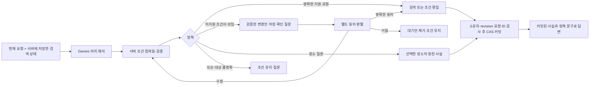

# 시설 대화 실행 정책

PR #417은 #412의 출력 평가를 바탕으로 시설 대화를 **뜻 해석 → 조건 컴파일 → 정책 결정 → 검색/커밋 → 사실 렌더링**으로 분리한다. 앱 UI와 `facility-conversation-v2`의 기존 필드는 유지한다.

## 모델과 서버의 권한

`Interpretation`은 업종 set/add/remove, 주차 필수/선호/해제, 반려동물 전용 조건, 완전한 OR 식, 이름·반경, 질문한 속성과 미지원 속성을 표현한다. 필터 ID, 좌표, 반려견 프로필, 답변 문장은 만들 수 없다. 생략한 조건은 유지한다.

`compiler.py`가 조건 ID를 생성하고 같은 의미의 조건을 중복 제거한다. 기존 `FilterState` 검증이 범위·조건 수·모순을 검사한다. OR 분기의 주차 조건만 제거하면 그 분기의 업종·반려동물 전용 조건은 유지한다. 조건 하나의 변경과 OR 전체 교체를 한꺼번에 내는 모호한 변경안은 실행하지 않는다. 업종을 바꾸면서 기존 OR이 남는 경우에도 분기 의미를 명시적으로 다시 표현해야 한다.

| 상황 | receipt.action | 실제 처리 |
| --- | --- | --- |
| 명확하고 지원되는 검색·편집 | execute | 곧바로 검증한 조건을 적용 |
| 조용함 등 미지원 조건과 지원 조건이 섞임 | await_confirmation | 적용하지 않고 후보 상태를 저장 |
| 조건 모순·대상 불명확 | clarify | 상태 유지 후 질문 |
| 선택 장소의 주차 등 사실 질문 | explain | 검색 조건을 변경하지 않고 저장된 사실 설명 |
| 지역 이동·지원하지 않는 필터만 요청 | unsupported | 상태 유지 후 지도/지원 범위 안내 |
| 대기 제안 거절 | reject | 대기안 제거, 현재 조건과 결과 유지 |

확인 문구는 후보 `FilterState`의 업종, AND/OR 조건, 선호, 이름, 반경으로 서버가 만든다. 모델이 따로 쓴 질문과 실제 적용할 조건이 갈라지지 않는다. 명확한 일반 필터 편집에는 확인 단계를 추가하지 않는다.

## 확인 대기 거래

`ConversationState.pending_proposal`에 다음을 저장한다.

- UUID, 해당 제안이 유효한 revision, 기존 필터 fingerprint
- 원 요청, 사용자에게 보여준 질문, 검증한 **후보 FilterState 전체**
- 실행 목표와 refresh 여부, 제외하는 미지원 속성, 5분 만료 시각

동의 판별 도구는 `accept/reject/revise/new_request/unclear`만 반환한다. 필터 필드는 없다. 수락 시 후보를 다시 생성하지 않고 저장된 상태를 재검증해서 그대로 적용한다. 수정 요청은 저장된 후보를 바탕으로 수정 부분을 해석하고 새 UUID의 제안으로 다시 확인한다. 거절과 새 요청, 수동 검색은 이전 제안을 해제한다. 모호한 답변에는 같은 제안을 유지하되 새 revision에 연결하고 원래 만료 시각을 연장하지 않는다.

실제 평가에서 장소 질문이 accept로 오분류되었다. 따라서 모델의 accept만으로 실행하지 않는다. `응`, `ㅇㅇ`, `네`, `좋아`, `그렇게 해줘`, `적용해줘` 등 질문·인용·추가 조건이 없는 제한된 동의 표현도 만족해야 한다. 그 밖의 발화가 accept로 분류되면 읽기 전용 장소 설명은 허용하고, 필터 실행은 다시 확인한다. 이 제한은 긴 자유 형식 동의의 편의성보다 제안의 정확한 적용을 우선하는 현재 정책이다. 동의 표현 목록은 `policy.py`가 소유한다.

제안이 없는 짧은 동의는 검색하지 않는다. 만료와 revision/fingerprint 불일치는 기존 제안을 실행하지 않는다. 동의 분류가 끝난 뒤에도 실행 전에 만료를 다시 검사한다. 검색 실패 시 현재 조건·결과와 같은 제안을 보존해서 새 revision에서 다시 시도할 수 있다.

Gateway의 Redis `pending`은 실행 중 작업의 lease이고, 사용자 확인 대기와 별개다. 소유자/session은 gateway가 묶고 `base_revision`을 내부 prepare 요청에 전달한다. 기존 CAS가 늦게 도착한 AI/동의와 수동 조작의 경합을 막는다. 같은 요청 ID 재시도는 이미 커밋된 응답을 반환한다. 답변 실패·지연은 커밋된 조건을 되돌리지 않는다.

## 사실과 선택 이유

`receipt.facts`는 질문한 속성별로 `known/unknown/unsupported`, 값, 원천 PlaceRef와 가능한 원천 시각을 기록한다.

- 주차 true와 false는 각각 가능·불가로 설명한다. null은 정보 없음이며 false로 해석하지 않는다.
- 조용함·무료 여부 등 없는 데이터는 확인할 수 없다고 답한다.
- 반려동물 동반 가능의 원천 사실은 설명할 수 있지만 현재 필터로는 지원하지 않는다. 반려동물 전용과 대체하지 않는다.
- 선택 이유는 사실에서 추측하지 않는다. `selection_basis`에 실제 표시 순서·거리 순서·주차 우선 후 거리·사용자의 순번 지정을 기록한다. 이전 선택 근거가 없으면 없다고 말한다.

답변은 커밋된 receipt에서 서버가 렌더링한다. 별도의 자유 문장 생성 호출은 제거했다. `source=fallback`은 기존 wire enum과의 호환을 위해 유지하며, 현재 경로에서는 정상적인 서버 렌더링도 이 값이다. 앱이 읽는 answer.text/revision과 기존 receipt 필드는 유지했고, 추가 정보는 선택적으로 읽을 수 있다.

## 검증과 반복 평가

단위/HTTP 검증은 `backend/tests/place/conversation/test_policy.py`, 기존 conversation 테스트, `backend/tests/place/api/test_conversation_pending.py`에 연결했다. 실제 DB 없이 검색 대역과 두 서비스의 HTTP/CAS 경계를 검사한다. SQL 공간 검색·운영 Redis·Android 기기 검증의 대체가 아니다.

기존 23개 사례와 4개 전이 사례는 그대로 보존한다. `backend/evals/place_conversation/policy.v1.jsonl`에 후속 발화 10개를 추가했다. 정책용 fixture는 이름·ID에 주차 가능/불가 힌트를 넣지 않는다. 저장된 후보와 최종 적용 상태가 같은지도 자동 검사한다. 문장과 요청 의미는 자동 상태 검사와 별도로 검토한다.

새 실행의 variant는 `production-policy-v1`이다. 과거 prompt-only/policy-context 실험은 그 당시 코드인 `ac2b062`에서 재현해야 한다. 과거 관측·리뷰는 수정하지 않는다. 현재 `diagnose --evidence-gap`은 불투명 ID의 true/false/null와 검증되지 않은 문장 생성의 차단을 별도 파일로 기록한다.

실제 모델 평가 명령은 `backend/evals/place_conversation/README.md`를 따른다. 평가 중 실패 사례는 삭제하거나 기대값을 낮춰 통과시키지 않고, 실패 실행과 보완 후 재평가를 별도로 보관한다.
