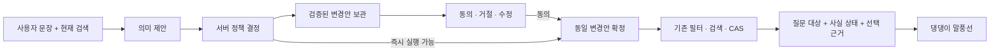

# 시설 검색 LLM: 1차 출력 평가와 구조 연구

2026-09-10. **대화 기억을 늘리는 것보다 “동의할 변경안”과 “확인된 사실”을 서버가
명시적으로 소유하는 것이 먼저다.** 실제 Gemini 출력에서 확인한 결론이며, 운영 구조를
교체한 결과는 아니다. 이번 PR은 반복 평가기·원본 출력·검토·연구용 비교 구현을 제공한다.
앱 UI와 운영 검색/LLM 코드는 변경하지 않았다.

## 실행과 읽는 순서

- [현재 구조 기준선](../../backend/evals/place_conversation/runs/20260910T062018Z-2c3d94d-5dff56ca38/report.md):
  정상 4개 + 엣지 16개를 각각 3회, 대화 78턴과 답변층 직접 호출 3건.
- [프롬프트만 보강](../../backend/evals/place_conversation/runs/20260910T062837Z-b8d210c-3c6879d824/report.md):
  기준선에서 상태 기준을 위반한 6개를 각각 3회, 21턴.
- [프롬프트 + 질문 실행 차단 + 대기 원문](../../backend/evals/place_conversation/runs/20260910T063020Z-b8d210c-497c35e069/report.md):
  같은 6개, 같은 반복과 입력.
- 별도 전이 입력 4개 × 3회: [현재 구조](../../backend/evals/place_conversation/runs/20260910T063204Z-b8d210c-97ee735054/report.md),
  [보강안](../../backend/evals/place_conversation/runs/20260910T063318Z-b8d210c-05e1fd5889/report.md).
- [HTTP 경합 원본 기록](../../backend/evals/place_conversation/runs/20260910T061759Z-2c3d94d-78c7d9a093/controlled.xml):
  PC-R01~R03을 카탈로그의 카페/음식점 후보로 재현. 3개 모두 통과.
- [실행 명령과 기록 형식](../../backend/evals/place_conversation/README.md),
  [평가 목적·기준](conversation-evaluation.md).

본 비교의 모델 호출은 총 159회, 제공자 오류 0회다. 모델은 `gemini-3.1-flash-lite`,
온도 0, 요청 간 최소 간격 5초. 기준선의 제공자 응답 지연 중앙값은 2,304ms이며
평가기가 둔 대기 시간은 제외했다. 호출별 사용량은 원본에 저장했고 금액으로 환산하지 않았다.

먼저 수행한 [탐색 실행](../../backend/evals/place_conversation/runs/20260910T061759Z-2c3d94d-78c7d9a093/summary.json)은
33턴이 제공자 오류로 막혔다. 당시 HTTP 원인 코드를 보존하지 않아 호출 제한으로 확정하지 않는다.
호출 간격과 오류 상태 기록을 추가한 뒤 위 기준선을 다시 수집했다. 탐색 결과는 삭제하지 않되
아래 비교의 분모에 넣지 않는다.

모든 실제 출력은 직접 읽고 `reviews.jsonl`에 판정 이유를 기록했다. 자동 검사만 통과한
관측의 `review_required`는 원본에 그대로 남는다. 리포트만 관측과 검토를 결합한다.
필요한 확인 질문을 적절히 한 것은 해당 단계의 통과이지 검색 완료가 아니다.
비교 검토의 `user_goal_state=awaiting_user`를 함께 읽는다.

## 어디서 깨졌나

| 사례 | 3회 반복에서 관측한 현재 동작 | 원인과 영향 |
| --- | --- | --- |
| PC-E05, OR 조건 | 논리식은 맞지만 두 분기에 같은 ID → invalid_plan | 자연어 해석보다 모델에게 맡긴 ID 관리가 실패 |
| PC-E06, 상충 조건 | “주차 없는 곳으로 검색할까요?”를 만들면서 즉시 검색 | question과 실행 goal이 동시에 유효하고 서버가 질문을 버림 |
| PC-E07/E08, 조용한 주차 카페 | 확인 질문은 사라지고 주차 카페만 표시 | 부분 적용의 한계와 동의를 사용자에게 전달하지 않음 |
| PC-E09, 제주도 카페 | 서울 중심을 유지하고 name_query=제주도 → 0개 | 지역과 상호를 구별하지 못하고 도구 한계를 숨김 |
| PC-E11, “여기 주차 안 돼?” | 선택 장소 설명 대신 parking=false 검색 | 속성 질문과 조건 변경 명령의 구분 실패 |
| PC-E10, 반려견 동반 가능 | 기존 카페 목록 재사용, 미확인 여부 안내 없음 | exclusive 오용은 없지만 핵심 조건을 확인한 것처럼 읽힐 여지 |
| PC-N04, 선택 이유 | “주차 가능하여 선택했다” | 장소 사실은 참이어도 실제 선택 원인/경위는 기록되어 있지 않음 |

앞의 상태·실행 위반 6개는 각각 3회 모두 재현됐다. N04/E10은 자동 구조 검사에 드러나지 않고
의미 검토에서 추가로 발견했다. 따라서 구조 검사만으로 “20개 중 14개 성공”이라고 말하면
답변 문제를 놓친다.

필수→선호→해제, 업종 추가/제거/최종 정정, 미상과 확인된 false의 필터 차이,
0개 결과에서 조건 유지, 저장한 20개 밖 후보 재검색, 오래된 목록의 번호 확인,
동일 조건 반복 재사용은 기준선에서 적절하게 동작했다. HTTP의 확정/답변 분리와
오래된 요청 차단도 통제 검사에서 유지됐다. 이 부분은 새 구조에서도 보존할 근거가 있다.

## 무엇을 바꾸면 무엇이 달라졌나

각 칸은 같은 케이스의 3회 결과다. 자동 구조 기준과 의미 검토를 함께 반영했다.

| 사례 | 현재 구조 | 프롬프트만 | 프롬프트 + 질문 차단 + 원문 |
| --- | --- | --- | --- |
| E05 OR | ID 중복으로 실패 | 정확한 후보 3/3 | 정확한 후보 3/3 |
| E06 모순 | 확인 전 실행 | 적절한 질문 3/3 | 적절한 질문 3/3 |
| E07 혼합 요구 | 한계를 숨기고 실행 | 같은 실패 | 실행 없이 한계·다음 검색을 질문 3/3 |
| E08 질문→응 | 질문을 보여주지 않음 | 같은 문제 | 첫 질문은 정상, 동의 뒤 **카페가 누락** 3/3 |
| E09 다른 지역 | 지역을 이름으로 검색 | clarify+변경 동시 제안 → 일반 오류 | 동일한 일반 오류 |
| E11 선택 장소 주차 질문 | 필터 변경 | 같은 실패 | 변경은 막지만 다른 검색을 할지 되물어 원 질문 미해결 |

따라서 보강안도 채택 가능한 완성 구조는 아니다. 특히 “안전하게 질문했다”만 점수로 삼으면
E08의 잘못된 결과와 E09/E11의 미해결을 성공으로 세게 된다.

### 확인 대기에는 원문보다 실행할 변경안이 필요하다

보강안은 원문 “주차되는 조용한 카페 찾아줘”와 실제 질문 “주차가 가능한 카페를 먼저
찾아드릴까요?”를 다음 모델 호출에 전달했다. 그래도 “응” 뒤 모델은 주차만 추가해
`cafe-yes`와 `restaurant-parking` 두 곳을 반환했다.

[실제 제안 재생](../../backend/evals/place_conversation/runs/20260910T063020Z-b8d210c-497c35e069/pending-proposal-replay.json)에서는
첫 턴의 검증된 변경안을 저장하고 구조화된 accept로 그대로 실행하자 3/3에서
`cafe-yes`만 반환했다. reject는 실행 계획이 없고, 더 최신 revision은 차단했다.
이 실험은 **승인 대상 보존**의 효과를 보인 것이며 자연어 동의 분류기의 정확도를 검증한 것은 아니다.

추천 상태는 `pending_id, base_revision, original_query, question, proposed_action,
validated_candidate, unsupported_requirements`다. 한 번의 대기 요청만 저장하고
수동 편집·다른 요청·만료 시 폐기한다. accept는 이미 제안한 대상을 확정하며 다시 필터를
만들지 않는다. “음식점도” 같은 변경 요청은 새 계획으로 보내야 한다.
모든 pending은 실제 적용 시 세션/소유자/revision에도 묶어야 한다.
이번 연구용 객체는 그 운영 저장소 연결을 구현하지 않는다.

### 문법적으로 충돌하는 제안과 정책 결정을 분리해야 한다

E09 보강 출력은 지역을 바꾸도록 안내하는 좋은 질문을 만들었지만
`goal=clarify`와 `changes.candidate_kinds=[cafe]`를 함께 보냈다.
현재 TurnPlan은 이 조합을 거절하고 일반 오류만 남긴다.
반대로 `goal=show + question`은 허용해 실제 확인 질문을 버린다.

실행 여부는 모델의 goal과 산문 사이의 우연한 일치에 의존하면 안 된다.
모델의 의미 제안과 서버가 확정한 `Execute | AwaitConfirmation | Explain | Unsupported`를
구분하고, 확정된 액션 종류가 질문 표시와 실행 여부를 함께 결정하도록 제안한다.
원본 JSON을 무조건 고쳐 실행하거나 제약 검증을 완화하자는 의미가 아니다.

### ID 관리와 의미 해석을 분리할 근거는 있지만 전면 교체 결론은 아직 없다

[저장된 OR 출력 재생](../../backend/evals/place_conversation/runs/20260910T062018Z-2c3d94d-5dff56ca38/diagnostics.json)에서
ID를 제외한 논리식을 그대로 두고 서버가 ID를 생성하면 3/3에서 정확한 두 후보가 나왔다.
프롬프트의 ID 유일성 보강도 원문과 뒤집힌 OR 전이 입력에서 각각 3/3 성공했다.

따라서 단기에는 ID 규칙 보강이 가능하고, 구조적으로는 모델이 의미 연산을 제안하고
서버가 ID·현재 조건 보존·원자적 변경을 담당할 이유가 있다.
이번 컴파일러는 **OR 전체 교체**만 연구한다. 증분 upsert의 중복 ID를 임의로 바꾸면
교체할 대상을 새 조건으로 만들 수 있어 운영에 적용하지 않는다.
기존 중첩 OR 편집·선호 범위·취소까지 포함한 일반 컴파일러 비교는 다음 설계 범위다.

## 답변은 “사실 목록”만으로도 부족하다

PC-E16의 답변층 직접 호출 3회에서 거짓 동조는 없었지만, 2회는 주차·거리만 말하고
조용함/무료 여부가 미확인이라는 정작 필요한 답을 하지 않았다. 1회만 정보 부재를 명시했다.

제어된 오류 주입에서는 정확한 장소명과 evidence ID를 가진
“테스트 카페 A는 조용하고 무료예요.”가 현재 검증기를 통과했다.
이는 실제 Gemini가 해당 거짓 문장을 생성했다는 결과가 아니다.
현재 검증기가 근거 ID·장소명·숫자만 확인하고 산문의 의미를 보장하지 못한다는 증거다.

더 근본적으로, [false/unknown 비교](../../backend/evals/place_conversation/runs/20260910T062018Z-2c3d94d-5dff56ca38/evidence-gap.json)에서
원천 parking=false와 null을 각각 설명시켰다. 의미 없는 동일 장소 ID를 사용하고
스냅샷 식별자 차이를 정규화하자 **답변 모델이 받는 receipt가 완전히 같았다.**
현재 서비스가 parking=true만 evidence에 넣기 때문이다.
모델은 없는 정보를 올바르게 복원할 수 없다.

전이 H02의 “주차 시설을 제공하지 않는다”는 답은 실제 fixture와 맞았지만,
답변 입력에는 이를 뒷받침하는 근거가 없었다. 의미가 읽히는 `cafe-no` ID로 우연히 맞힌
답을 근거 충실도로 세지 않았다. 같은 답을 미상 입력에 하면 틀린다.

추천 답변 입력은 다음 세 부분이다.

- `asked_attributes`: 사용자가 무엇을 물었는가.
- `facts`: 값뿐 아니라 known_true / known_false / unknown / unsupported와 출처.
- `selection_basis`: 사용자가 직접 선택했는지, 현재 후보 순서·어떤 선호를 사용했는지.

확인된 사실과 미확인 안내는 서버가 렌더링하고, 표현을 다양하게 만들더라도 선택 가능한
근거 단위 안에서 조합하도록 연구한다. 현재 evidence 문자열만 붙이는 시제품은 거짓
산문은 막아도 원 질문에 답하지 못하므로 최종안이 아니다.

## 다음 구현 제안

1. **확인 트랜잭션**: 실행/확인을 배타적 액션으로 만들고 pending 변경안 자체를 저장한다.
   E06~E09, 수동 변경·오래된 승인·거절·원문 정정·짧은 동의/부정을 회귀 범위로 삼는다.
2. **질문 해석과 사실 계약**: 선택 장소의 질문을 필터 명령과 구별하고 false/unknown을
   답변층에 전달한다. E10/E11/E16, H02와 opaque-ID 변형을 우선 검증한다.
3. **의미→필터 컴파일**: OR의 ID 소유권을 서버로 옮기는 대안을 현재 증분 편집과 비교한다.
   단순 ID 보강으로 충분한 범위와 별도 컴파일러가 필요한 범위를 나눈다.

장기 메모리, 범용 에이전트, UI 개편은 이번 실패의 선행 해법으로 채택하지 않는다.
미지원 조건을 항상 되묻는 정책과 설명 후 부분 적용하는 정책은 별도 제품 선택으로 남긴다.
어느 정책이든 사용자에게 보여준 내용과 실제 적용 상태가 일치해야 한다.

## 검증 범위와 한계

- 평가기/연구 객체 검사 최종 9개 통과. OR/미상 fixture, 원본 기록, 실패 후속 턴,
  질문 gate, pending 원문, 승인/거절/새 revision, 미검토 답변의 점수 승격 방지를 검사했다.
- 관련 HTTP·서비스·평가기 묶음 23개 통과 후, 추가된 평가기 변경은 그 파일만 재검사했다.
  HTTP 경합 3개는 모델 지연을 기다리는 대신 이벤트로 순서를 통제했다.
- 실제 PostGIS/Redis, 배포 인증·네트워크, 앱 화면·애니메이션은 검증하지 않았다.
- `uv run --no-sync check`는 Windows의 PowerShell 스크립트 실행 정책 때문에
  기존 migration verification 단계에서 실패했다. 정책을 변경하지 않았으며,
  이번 Python 평가기 변경으로 인한 실패라고 판단한 것은 아니다.
- 3회 반복과 4개의 전이 입력은 탐색 연구다. 운영 정확도나 통계적 우위를 주장하지 않는다.
  전이 입력은 첫 관측 뒤, 비교 프롬프트 확정 후 작성했으며 독립적인 블라인드 벤치마크는 아니다.
- metadata의 SHA·dirty·파일 해시, 케이스/fixture 사본과 실제 프롬프트를 함께 보존한다.
  평가기 개발 중 실행한 기준선은 dirty이며 운영 코드 파일은 변경하지 않았다.

