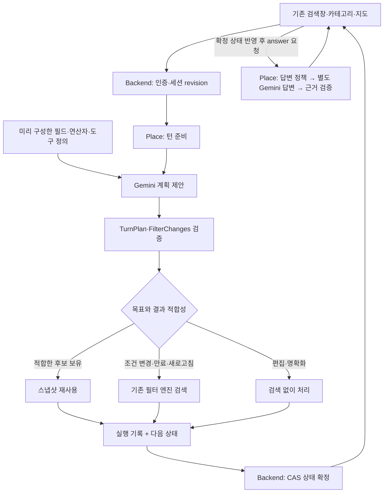

# 시설 검색 대화 워킹 스켈레톤

기존 앱 검색 화면에서 일반 검색과 AI 입력을 하나의 서버 검색 상태에 연결한다.
첫 경로는 쇼핑 선택 → “아무 데나 하나 골라줘” → 저장 후보 선택 → 근거 답변 →
기존 지도·목록에 선택 반영이다. 운영 배포와 기존 AI 경로의 일괄 전환은 하지 않았다.

## 구성

| 구성 | 역할 |
| --- | --- |
| `place/conversation/static_tools.py` | 시작 시 정적 카탈로그와 `propose_facility_turn` 구성. 필드 조회 API 없음 |
| `place/tools/contract.py`, `changes.py` | 명시한 ID의 조건만 변경. 언급하지 않은 조건 유지 |
| `place/providers/conversation_gemini.py` | 계획 함수 호출과 답변 생성의 별도 어댑터. 답변에는 도구 권한 없음 |
| `place/conversation/service.py` | 검증·재사용 판단·필터 엔진 호출·실제 후보 선택 |
| `place/conversation/answer.py` | 확정된 근거로 답변 검증. 실패하면 기본 문구 |
| `backend/services/facility_conversation.py` | 소유자·만료·revision 검사, 예약·확정 CAS, 확정 후 답변 |

LLM은 `goal`, 선택적인 `changes`, 명시적 `refresh`, `reference_index`, 확인 질문을 제안한다.
목표는 `show`, `pick_one`, `explain`, `edit_only`, `clarify`다. 세션 ID·revision·검색 결과·
실행 성공은 모델이 작성하지 않는다. 도구 정의와 현재 상태를 매 요청에 전달하며 필드를 매번
조회하지 않는다. 애플리케이션의 정적 정의 재사용이며 Gemini 명시적 컨텍스트 캐시는 아니다.

## 필터·결과·답변

- 실행 가능한 필수 조건: 업종, 주차 여부, 반려동물 전용 여부. 이름·반경·반려견은 기존 상태를 사용한다.
- 교집합/합집합: `hard.all AND (hard.any[0].all OR hard.any[1].all ...)`.
- `eq false`는 확인된 부정값 요구다. 조건 해제는 ID 제거이며 미상을 false로 바꾸지 않는다.
- 전용 시설과 동반 가능은 다른 사실이다. 조용함·인기 같은 미지원 조건은 확인 질문으로 돌린다.
- Gemini 스키마에는 필드·타입·허용값을 제공하고 일부 개수·길이 제약은 생략한다. 엄격한
  Pydantic 검증은 서버에 그대로 남는다. 실제 API에서 전체 서버 스키마가 거절되는 것을 확인했다.
- 스냅샷은 같은 필터 지문 + 5분 이내일 때 검색/선택에 재사용한다. 이전 결과 설명은 과거
  스냅샷을 사용한다. 조건 변경 시 전체 검색 엔진을 다시 호출한다. 상위 20개만 재필터링하지 않는다.
- 업종별 최대 20개, 최대 6개 업종이다. 잘림 플래그를 보존하며 반환 건수를 전체 개수로 주장하지 않는다.
- “두 번째”는 앱이 보낸 실제 표시 순서를 검증해 해석한다. 이전 순서를 새 결과에 재사용하는
  요청은 확인 질문으로 돌린다. 직접 선택한 카드는 `visible_selected`로 전달한다.
- 답변은 확정된 실행 근거만 받는다. 근거 ID·장소명·수치를 검사하고, 실패·명확화·단순 상태
  안내는 기본 문구를 사용한다. 자유 문장의 모든 의미를 검증하는 구조는 아니다.

## HTTP·상태 저장

공개: `POST /app/places/conversation`, `/conversation/recover`, `/conversation/answer`
(모두 기존 Bearer 인증 및 세션 소유자 검사).
내부: `POST /internal/place/facility-conversation/prepare`, `/answer`.
내부 경로를 공개 nginx 경로에 추가하지 않는다.

첫 요청은 `mode=manual`, `manual=<기존 PlaceSearchRequest>`이며 `session_id`를 생략한다.
후속 수동/AI 요청은 `session_id`, `expected_revision`, UUID `client_request_id`를 보낸다.
AI 요청은 `mode=chat`, `query`, `visible_order`, 선택적 `visible_selected`를 보낸다.
`facility-conversation-v2` 응답은 `filters`, `search`, `selected`, `display_order`, `receipt`,
`answer`, `answer_status`, 확정 revision이다. `conversation`은 상태 확정 직후 응답하며 답변을
기다리지 않는다. 앱이 조건·지도·목록·선택을 반영한 뒤 `answer`에 `session_id`, `revision`,
`client_request_id`를 보낸다. 답변은 그 상태의 근거로만 생성되고 상태 revision을 증가시키지 않는다.

수동 입력도 같은 세션을 쓴다. 지도·반려견은 수동 값을 사용하고 AI 필수 조건은 보존한다.
명시적 수동 카테고리 교체 시 이전 업종 조건을 제거한다. `edit_only`의 결과 불일치는
`result_matches_filters=false`다. 검색 실패는 이전 상태를 보존하고, 답변 실패는 검색을 되돌리지 않는다.

Redis 키는 `facility:conversation:v2:<session_id>`, TTL은 최초 생성부터 15분이다.
새 요청의 예약은 이전 요청의 확정을 막는다. 답변 생성 중 새 요청이 예약/확정되면 이전 답변은
409로 폐기한다. 완료한 동일 ID·본문의 재전송은 재실행하지 않는다. 최신 요청만 저장하므로
그 뒤 다른 턴이 확정된 이전 요청의 재전송은 409이며, 재해석 대신 전체 상태를 복구한다.

- 첫 세션 ID는 소유자와 요청 UUID로 결정한다. 첫 응답이 유실돼 세션 ID를 몰라도 같은 요청을
  재전송하거나 `recover`에 `client_request_id`만 보내 복구할 수 있다. 보장 범위는 세션 TTL 이내다.
- `recover`는 해당 세션의 최신 확정 응답 전체를 반환한다. 진행 중 예약이 있으면 409로 기다리게
  한다. 동일 요청의 중복 실행은 90초 예약 동안 차단한다. 프로세스 종료 뒤 같은 ID로 재시도하면
  예약이 지난 뒤 다시 준비할 수 있다. 앱은 자동 폴링하지 않고 재시도 버튼을 제공한다.
- 앱은 타임아웃·취소 후에도 요청 UUID·본문·기준 revision을 유지한다. 충돌 복구는 조건·목록·
  선택을 함께 반영하며 “두 번째” 같은 이전 문장을 새 목록에 자동 재실행하지 않는다.
- 410이면 `mode=restore`, `restore_filters=<마지막 전체 FilterState>`로 새 세션을 만든다.
  Place가 AND/OR·반려견·정렬·반경을 검증하고 새 결과를 검색한다. 기존 스냅샷·선택·대화 이력은
  복제하지 않는다. 복원 요청도 같은 UUID로 재시도한다. 복원 실패 시 이전 표시를 남기고 오류와
  재시도를 제공한다. 업종별 20개 제한을 우회하는 복원 입력은 거부한다.
- 요청 식별자 보존은 현재 앱 저장소의 생애 안에서 동작한다. 앱 프로세스 종료 후 영속 복원은
  이번 범위에 포함하지 않는다. 서버 역시 TTL이 지난 요청의 영구 중복 제거를 제공하지 않는다.

## 앱 연결과 검증

### 직접 조건 해제

일반/AI 모드 모두 검색창의 필터 아이콘과 조건 요약에서 현재 필수 조건을 확인한다.
카테고리·반경·반려견·주차 우선은 기존 조작부에 남긴다. 필수 조건은 태그로 변환하지 않는다.

- `hard.all`의 각 조건은 ID 하나로 해제한다.
- `hard.any`는 “다음 조합 중 하나”로 표시하고 각 분기의 AND 관계도 보존한다. UI는 모든 OR
  분기의 ID를 한 번에 제거한다. 분기 하나만 삭제해 오히려 검색 범위를 좁히는 조작은 제공하지 않는다.
- 주차 가능 필수 조건과 주차 우선 정렬은 따로 표시한다. 해제해도 정렬·반경·이름·반려견 등
  언급하지 않은 필드는 유지한다.
- `mode=filters`, `remove_filters={remove_all: [...], remove_any: [...]}`를 기존 세션과
  `expected_revision`에 묶어 보낸다. 직접 조작은 계획·답변 LLM을 호출하지 않는다.
- Place의 제한된 `FilterRemoval` → 공통 `FilterChanges` 검증 → 필터 엔진 → CAS 확정 경로다.
  없는 ID·중복 ID·조건 추가·교체 입력은 거부한다. 빈 제거 요청은 현재 필터로 결과를 확보한다.
- 실패하면 조건·목록을 유지한다. 응답 유실 재시도는 같은 요청 ID, 확정된 검색 실패 후 재시도는
  실패 응답의 새 revision을 사용한다. 이전 화면에서 만들어진 해제 조작은 자동 적용하지 않는다.
- `result_matches_filters=false` 안내와 “현재 조건으로 검색”은 AI 모드와 관계없이 제공한다.

### 실행과 검증

Android `feat/place-conversation-skeleton`에서 `-PfacilityConversation=true`로 디버그 빌드한다.
릴리즈와 옵션 없는 빌드는 기존 경로다. `daengs.apiBaseUrl`은 새 Backend + Place + Redis가
연결된 서버여야 한다. 현재 운영 서버에는 배포되지 않았다.

기존 검색창의 AI 모드를 사용한다. 지도·목록을 유지하고 답변은 검색창 아래에 표시한다.
새 디자인 화면이나 팝업은 없다. 로그인하지 않은 일반 검색과 전체 업종 탐색은 기존 경로다.
첫 AI 경로는 로그인 + 최대 6개 업종 카테고리 선택 후 사용한다.

- 두 HTTP 서비스 통합 테스트: 수동 검색 → 함수 계획 → 후보 재사용 → CAS → 답변.
  소유자 격리·재전송·버전 충돌·늦은 AI와 수동 변경을 검증한다.
- 실제 Gemini: `DAENGS_CONVERSATION_LIVE_ENV`에 로컬 키 파일 경로를 지정하고
  `uv run pytest -q -s tests/place/conversation/test_live.py --tb=short`.
  합성 장소를 사용하며 운영 PostGIS는 호출하지 않는다. 일반 테스트에서는 생략한다.
- 실제 Gemini 4개 턴: 최초 검색 1회, 선택·설명 추가 검색 0회, 주차·업종 변경 각각 검색 1회.
  이것은 자연어 전체 정확도를 보증하는 평가셋이 아니다.
- Android: 서버 직렬화 합성 응답으로 기존 ViewModel·Compose 화면·선택 반영·오래된 응답 폐기를 검증한다.
- 실제 폰 설치, 운영 인증/Redis/PostGIS의 배포 검증은 아직 하지 않았다.
- 1단계 보강: 수동·AI 공통 상태 반영, 충돌/유실/만료 복구, 답변 전 상태 전달. 수동 실패 시
  적용되지 않은 반경·이름·카테고리를 목록 위에 남기지 않으며, 복구/실패 안내는 AI를 꺼도 보인다.
- 2단계 보강: 적용 조건 요약·필터 창, AND/OR 묶음과 필수/선호 구분, LLM 없는 직접 해제,
  실패/재시도 및 변경 전 결과에서 현재 조건으로 검색하는 경로.
- 후속 범위: 조건 추가·복합 조건 편집기, 명확화 맥락, 답변의 의미·근거 정책, 전체 업종 AI,
  복합 비교·파생 태그, 폭넓은 자연어 평가셋.

형식 참고: [Gemini 함수 호출](https://ai.google.dev/gemini-api/docs/function-calling),
[Interactions](https://ai.google.dev/gemini-api/docs/interactions-overview).
