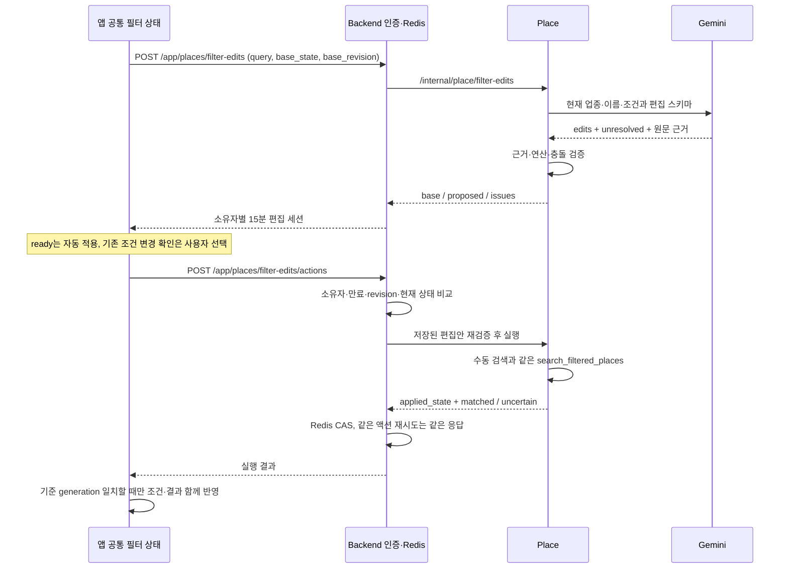

# 자연어로 공통 장소 필터 편집

2026-09-09, 5단계. 서버 PR #362, 앱 [DAENGS_APP#231](https://github.com/SAJOYO/DAENGS_APP/pull/231).
4단계 #358의 `place-filter-v1` 상태와 SQL 엔진을 그대로 사용한다.

## 요청 흐름

## 편집과 적용 경계

- LLM은 전체 상태를 다시 만들지 않는다. 공통 원자·OR 묶음·주차 선호의 추가/교체/삭제, 후보 업종, 장소명만 제안한다. 전체 변경안이 유효해야 적용한다.
- 원문 근거는 Unicode code point `[start,end)`다. 인용문이 정확히 일치하는지 검증하며, 모델이 붙인 `explicit`만으로 기존 조건의 해제를 허용하지 않는다.
- 추가 조건은 기존 상태에 AND로 붙는다. 처음 만드는 여러 OR 묶음은 함께 적용할 수 있다. 기존 OR에 대안을 더하거나 기존 원자를 바꾸는 것은 확인 대상이다.
- `아까 주차 필수는 빼줘`, `주차 상관없어`처럼 전체 입력이 서버의 제한된 해제 패턴과 일치하면 공통 조건을 바로 해제한다. 분기에 같은 속성이 있거나 문장이 더 복잡하면 변경 전후 확인으로 보낸다. 모든 명시적 한국어 수정 표현을 인식하는 것은 아니다.
- `inferred`는 주차=true 선호 추가만 허용한다. 기존 선호의 교체·hard 변경은 허용하지 않는다. 주차=false는 명시적인 불가이며 조건 해제나 정보 미상과 다르다.
- 미지원·모호한 요구가 `unresolved`에 있거나 조합이 모순이면 `proposed_state=null`이다. 확인 버튼으로 강제 실행할 수 없고 기존 조건·결과를 유지한다.
- 위치, 반경, 반려견 값, 정보 미상 정책, 실행 상한은 모델이 변경할 수 없다. 모델 입력에는 위치·반려견 스냅샷을 포함하지 않는다.

## 인증·재시도·상태 소유권

Backend만 로그인/활성 계정 확인과 Redis를 소유하고 Place와 HTTP로 통신한다. Place가 backend 패키지를 import하지 않는다. 키가 없어도 Place 기동·health·수동 검색은 가능하다.

`client_request_id`는 UUID다. 해석 요청은 새 세션을 만들며 해석 자체의 중복 호출 제거는 하지 않는다. 적용 액션은 같은 UUID·내용으로 재시도하면 저장한 결과를 돌려준다. 다른 액션의 오래된 revision, 바뀐 `current_state`는 409, 만료/다른 소유자는 410이다. Redis가 없거나 실패하면 503이며 메모리 대체 저장소는 없다. 원래 만료 시각은 재시도해도 연장하지 않는다.

Redis CAS는 **편집 세션**에 대한 잠금이다. 수동 v3 검색의 전역 서버 revision을 소유하지 않는다. 앱은 수동 편집·위치·반려견·계정 변경에 요청을 취소하고, 적용 직전 공통 컨트롤러의 generation과 전체 기준 상태를 다시 비교한다. 네트워크 취소가 늦어도 이전 응답을 채택하지 않는다. 앱 재시작 뒤 편집 세션 복구는 이번 범위에 없다.

## 구현 확인과 남은 검증

- 신규 편집 compiler/provider/인증 gateway 26개, 기존 필터·검색 API·서비스 경계 68개: 중복 제외 94개 대상 테스트 통과. DB 실행은 모의 처리했고 SQL 엔진을 변경하지 않았다.
- Python 모델의 실제 직렬화 결과 `backend/tests/place/api/filter_edit_wire.json`을 앱 fixture와 동일하게 유지한다. 기존 상태·정확한 액션·revision·반려견·결과 버킷을 검증한다.
- Gemini Interactions의 `store=false`, `response_format.schema`, Pydantic JSON schema는 [공식 Structured outputs 문서](https://ai.google.dev/gemini-api/docs/structured-output)와 [Interactions 문서](https://ai.google.dev/gemini-api/docs/interactions-overview)를 기준으로 연결했다. 새 SDK나 의존성은 추가하지 않았다.
- 실제 Gemini와 운영 Redis/DB를 포함한 왕복은 미검증이다. 기존에 제공된 환경 파일 경로가 현재 없으며 현재 프로세스에도 Gemini 키가 없다. 문장 해석의 정확도, 누락된 요구, 근거 구간 오류율, 지연은 다음 단계의 실호출 평가가 필요하다. 스키마 검증이 의미 해석의 정확성을 보장하지 않는다.
- Backend·Place를 함께 반영한 뒤 앱을 연결해야 한다. 기존 발견 API는 이전 앱 호환을 위해 유지한다. DB 마이그레이션·배포는 수행하지 않았다.
