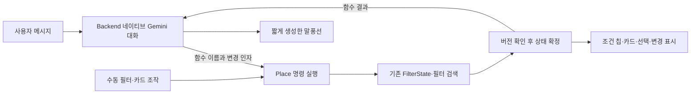

# 시설 네이티브 함수 호출: 첫 실행 경로

기준: `be07cf792a3085b3ca00be3220958540413e7c14`에서 시작한 `feat/facility-tool-conversation`.
2026-09-14 로컬 구현이며, 운영 v2 대화 엔진 교체나 앱 배포를 완료한 상태가 아니다.

시설 도우미의 역할은 사용자가 화면에서 할 수 있는 필터 변경·검색·카드 선택을 대신 실행하는 것이다.
"조건 적용"은 필터를 바꾸고 결과 목록을 조회하는 동작이다. "장소 선택"은 현재 카드 하나를 선택하는
별도 동작이다. 일반 요청마다 확인을 받지 않는다.

## 코드 소유권

| 위치 | 책임 |
| --- | --- |
| `daengs_place/place/commands/contract.py` | 변경 인자, 상태, 제안, 명령 결과 |
| `commands/executor.py` | 기존 `compile_changes`·`search_filtered_places`를 사용하는 결정적 실행 |
| `commands/view.py` | 확정 상태로부터 모델용 요약과 UI 카드·차이 생성 |
| `daengs_backend/services/facility_tools/catalog.py` | 짧은 공통 지침과 Pydantic 설명 기반 도구 정의 |
| `facility_tools/dialogue.py` | 네이티브 함수 호출·결과 회신·자유 답변·중단 재개 |
| `daengs_evals/facility_tools/workspace.py` | 실험용 메모리 버전 비교·실행 ID 재사용 방지 |
| `daengs_evals/facility_tools/playground.py` | 로컬 HTTP와 합성 검색기 연결 |

현재 Gemini transport의 `_call`만 재사용한다. 기존 `plan`·`propose_facility_turn`, 긴 정적 해석 지침,
고정 답변 renderer는 새 대화 경로에서 사용하지 않는다. 운영 연결 시 transport 공개 인터페이스도 정리한다.

## 행동 계약

| 도구 | 사용자 대신 하는 일 |
| --- | --- |
| `search_places` | 명시한 필터만 변경하고 검색. 업종 set/add/remove, 주차 required/forbidden/preferred/clear. 생략은 유지 |
| `next_places` | 조건 유지, 이미 제시한 장소를 제외한 다음 후보 검색 |
| `get_place_details` | 현재 카드의 등록 사실 조회. 필터·목록·선택 보존 |
| `select_place` | 현재 카드 하나 선택 |
| `set_place_excluded` | 명시한 장소 제외 또는 제외 해제 후 검색 |
| `mark_places_known` | 이미 아는 장소로 기록. 제외·찜 해제와 구별 |
| `propose_search_change` | 조건 대안만 표시. 즉시 필터 변경·검색하지 않음 |
| `resolve_search_proposal` | 기존 제안에 대한 새로운 사용자 입력 또는 버튼 처리 |

지원하지 않는 조건은 `search_places.unavailable`로 받고, 지원되는 조건만 실행할지 별도 UI에서 확인한다.
예를 들어 조용함은 등록 사실이나 필터로 확인할 수 없다. 이 확인은 일반 검색·카드 선택마다 요구되는 절차가 아니다.
검색 결과 0개는 `empty`, 검색 오류는 `failed`, 동일 상태·조회는 `unchanged`로 구분한다.
등록 정보 없음은 `unknown`, 조회 자체를 지원하지 않는 속성은 `unsupported`다.

## 실행 경계

- 모델 입력의 현재 목록 참조는 서버가 발급하며 검색 스냅샷에 묶인다. 예전 카드 번호를 새 카드에 실행하지 않는다.
- 수동 조작과 AI가 같은 `expected_revision`·명령 실행 경로를 쓴다. 대기 중 수동 변경이 먼저 확정되면 늦은 AI 행동은 충돌로 종료한다.
- 요청 ID와 실행 순번으로 명령을 식별한다. 재전송·응답 실패·취소 후 재개가 이미 실행한 검색을 중복 실행하지 않는다.
- 새 제안이 만들어진 턴은 모든 추가 행동 도구를 막는다. 같은 응답 묶음 안의 후속 명령도 차단한다. 모델이 자기 제안에 스스로 동의할 수 없다.
- 모델 요청 최대 4회, 명령 시도 최대 6회다. 전체 실험 턴은 90초 제한이며 실행된 상태는 응답 실패 시에도 유지한다.
- 최종 말풍선은 모델이 생성한다. 형식 검사는 줄바꿈 없음·70자 이내만 강제한다. 느낌표로 문장 수를 세지 않는다.
- 상태는 재시작 시 사라지는 메모리다. 이는 운영용 저장소와 찜 멱등성의 구현 완료를 뜻하지 않는다.

## 현재 완료와 남은 연결

검색→조건 변경→상세 조회→카드 선택→다음 후보를 실제 Gemini와 로컬 웹으로 실행할 수 있다.
제안·취소·제외·알고 있는 장소 기록의 명령 경계도 포함한다. 수동 조작과 AI가 같은 실험 상태를 사용한다.

운영 전에는 다음 작업이 필요하다.

1. 회원·화면 소유권, Redis CAS, 명령/턴 영속 기록을 가진 backend 어댑터와 운영 HTTP 연결.
2. 찜 저장의 멱등 명령, B/K/E/P 후보 범위, 화면 복원과 기존 v2 기능 대응.
3. Android의 필터·결과·선택·지도 소비와 수동 조작 공통화. 현재 실험은 지도 영역이 아닌 검색 중심+반경이다.
4. 실제 PostGIS·저장소 통합 검증, 표현 변형을 반복하는 모델 평가와 답변 사실성 검토.

## 검증 해석

`uv run --no-sync pytest -q tests/place/commands`는 새 실행·대화·HTTP 경계 40개를 통과했다.
상태 변경 충돌, 오래된 참조, 알 수 없는 사실, 다음 후보 중복, 제안 만료, 같은 턴 자체 동의,
중복 실행 방지, 취소 후 재개, 실패 후 결과 보존을 포함한다. 전체 backend suite나 실제 DB 검증 결과가 아니다.

실제 Lite 실험에서는 단순 업종·주차 검색과 연속 선택이 가능했지만, 조건 일부 누락,
검색 요청을 상세 조회로 처리, 제안만 했는데 검색 완료처럼 말하는 문제가 관측됐다.
도구 설명·공통 행동 지침과 실행 경계를 수정했다. 같은 턴 자체 동의는 코드로 차단했다.
**도구 스키마 통과가 사용자 조건을 빠짐없이 해석했다는 뜻은 아니다.** 반복 모델 평가와 답변 검토가 남은 출시 기준이다.
Gemini HTTP 429로 응답 단계만 실패한 경우도 관측했으며, 검색 확정과 답변 성공을 구분한다.

마지막 수정본은 실제 Gemini로 기본 연속 조작 7턴, 제안·취소·수락·감사 5턴, 아는 장소 기록 1턴을
나누어 실행해 상태·도구 판정 13/13을 통과했다. 기본 조작은 턴당 모델 2회·약 2.8–3.5초,
제안 시에는 검색 미실행과 지원 가능한 조건에 대한 확인 질문도 원문으로 확인했다.
이는 작은 합성 세트의 한 차례 통과이며 앞선 누락·사실성 실패 기록을 없애거나 운영 품질을 보증하지 않는다.

실행 방법은 [코드 README](../../backend/src/daengs_evals/facility_tools/README.md)를 따른다.
