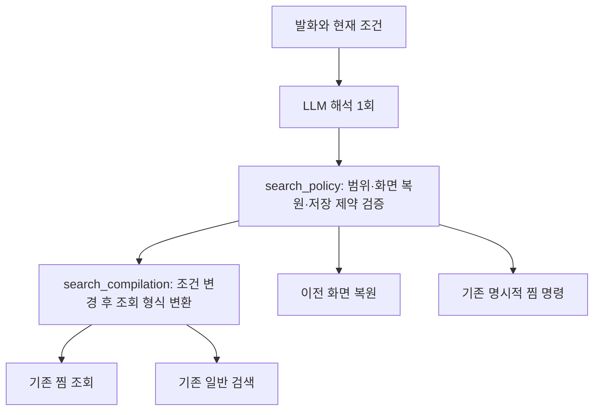

# 검색 집합과 조건 변경 공통화 — 1단계

서버 [#451](https://github.com/SAJOYO/DAENGS_dev/pull/451), 앱
[#323](https://github.com/SAJOYO/DAENGS_APP/pull/323).
2026-09-11, 서버 dev 7dd2fdc와 앱 dev 1f161144에서 착수했다.

## 이번 동작

찜 화면의 “찜 제한 풀고 주차 되는 카페”는 현재 조건을 바탕으로 일반 장소를 조회한다.
“이전 검색 화면으로 돌아가”는 이전 화면을 복원한다. 두 요청을 같은 return_search로
처리하거나, 집합 변경과 시설 조건 변경이 함께라는 이유로 되묻지 않는다.

| 요청 | 집합 | 조건 | 찜 쓰기 |
| --- | --- | --- | --- |
| 찜하지 말고 주차 되는 카페 | 현재 집합 유지 | 카페·주차 필수 | 없음 |
| 찜 여부 상관없이 주차 되는 카페 | 전체 장소 | 카페·주차 필수 | 없음 |
| 찜한 곳 중 주차 되는 카페 | 찜 | 카페·주차 필수 | 없음 |
| 이전 검색 화면으로 돌아가 | 변경 계산 없음 | 이전 화면 복원 | 없음 |
| 여기 찜 해제해줘 | 변경 없음 | 변경 없음 | 기존 명시적 해제 경로 |

마지막 행의 자연어 단일 찜 명령은 기존 일반 검색의 지원 범위를 유지한다.
찜 화면의 장소 지칭·쓰기를 이번 작업에서 새로 연결하지 않는다.

## 공통 규칙과 어댑터



현재 집합은 호출 화면/어댑터에서 공통 정책에 전달한다. 이번 단계에서는 새 검색 상태
저장소를 만들지 않는다. 일반·찜 조건의 물리적 자료형과 탭별 스크롤·카메라는 유지한다.
기존 compile_filter_data 위에서 같은 AND/OR 변경을 계산하고 변환 가능성을 검증한다.
일반 검색의 위치·반경 필수와 최대 6업종, 찜의 최대 18업종은 각 기존 계약을 따른다.
조건 변경 후 형식을 변환하므로 “카페만, 반경 5km로”처럼 변환 제약을 해소하는 요청도 가능하다.
업종별 선호를 전체 선호로 넓히거나 좌표·반려견·반경을 임의로 채우지 않는다.
별도 미확인 결과 분리 같은 표현 불가능한 조건도 조용히 잃지 않는다.

검색 변경은 search_scope=keep/bookmarks/all_places, 화면 복원은 navigation=restore_search,
저장 금지는 forbid_save=true로 표현한다. keep은 전체가 아니다.
저장 금지와 save 명령이 동시에 오면 쓰기 명령을 준비하지 않는다.
새 후보·찜 제외는 의미 enum만 인식하고 candidate_pool_unavailable로 현재 상태를 보존한다.
실제 후보 집합 구현은 2단계다.

### 집합 변경의 근거

실제 모델은 forbid_save를 맞히고도 S07의 집합을 바꾸는 출력을 냈다.
집합 전환에는 search_scope_quote라는 최신 원문 구절을 받고 존재 여부와 집합 지칭을
검사한다. 저장 금지만 있고 집합 지칭이 없으면 과도한 범위 변경을 유지로 해석한다.
저장 금지가 있어도 “찜 여부 상관없이”처럼 별도 집합 지칭이 있으면 전환할 수 있다.
같은 집합을 다시 명시한 것은 실제 전환이 아니므로 추가 근거를 요구하지 않는다.

이것은 제한된 한국어 집합 지칭에 대한 실행 전 검사다. 모든 한국어 표현을 이해하거나
원문 인용이 의미의 정답을 증명한다는 보장은 없다. 지원 표현 밖의 전환은 명확화를
요청할 수 있으며, 고정 사례와 실제 출력은 함께 평가한다.

## HTTP와 앱 완료

찜 interpret 요청에 search_policy: "v1"을 협상한다.
기존 search/filters, return_search, clarify/explain은 유지하고 다음 응답만 추가한다.

```json
{
  "action": "search_places",
  "message": "",
  "filters": null,
  "search_filters": {"contract_version": "place-filter-v1"}
}
```

위 search_filters는 모양 설명용으로 생략한 예시이며 실제 응답은 완전한 FilterState다.
각 조회 동작은 자신의 조건 필드만 포함할 수 있다. 기능 미협상 클라이언트에는
search_places를 반환하지 않고 업데이트를 안내한다. 회원·인증 정보는 Place 해석으로
전달하지 않는다.

앱은 좌표·반려견·AND/OR·조회 한도를 검사하고 기존 conversation의 restore 모드로
조건을 전달한다. 이 모드는 저장된 검색 결과를 복원하는 것이 아니라 새 서버 세션에서
필터를 검증하고 실제로 조회한다. 모델은 다시 호출하지 않는다.
응답의 요청 ID·필터 전체·새 세션·성공 여부를 확인한 다음 일반 검색 상태와 반려견 선택을
갱신하고 탭을 전환한다. 찜 화면 조건은 그대로 남는다.

이 조회는 기존 찜 쓰기와 독립적이다. 실패·취소·응답 불일치 시 두 화면의 결과를 유지한다.
탭·찜 조건·계정·일반 검색 의도가 바뀌면 늦은 결과가 현재 화면을 덮어쓰지 않는다.
완료하지 않은 읽기를 재시도하면 새 검색 세션이 생성될 수 있지만 찜 쓰기는 발생하지 않는다.

## 검증

대상은 공통 컴파일/정책, 기존 일반 대화·찜 명령, 회원→Place HTTP,
앱 API·조건 전달·ViewModel·Compose 연결이다. DB·SQL·의존성·지도 디자인은 변경하지 않았다.
명령과 실제 실행 결과는 PR의 확인한 것과 [출력 평가](search-policy-evaluation.md)에 기록한다.
전체 스위트, 실제 운영 회원·DB, 기기 설치·종단 검증은 실행하지 않는다.

서버 고유 94개 대상 테스트가 통과했다. 최초 84개 이후 집합 근거 5개, HTTP 협상 4개,
짧은 찜 지칭 1개를 추가하고 변경된 경계만 재실행했다. uv run check와 변경 Python
17개 파일의 Ruff 검사·포맷 검사를 통과했다. 실행 순서별 합계를 중복해서 더하지 않았다.

## 다음 단계

찜 B·정정 K·명시적 제외 E·제시 P로 새 후보를 계산하고, 피드백과 명시적 검색 요청을
함께 처리하는 정책은 2단계다. 현재 피드백 조기 반환과 찜 화면의 지칭 제한은 남는다.
새 후보 엔진·친숙도 저장소·긴 대화 기억·사전 조회 캐시·범용 제안 엔진을 추가하지 않는다.
