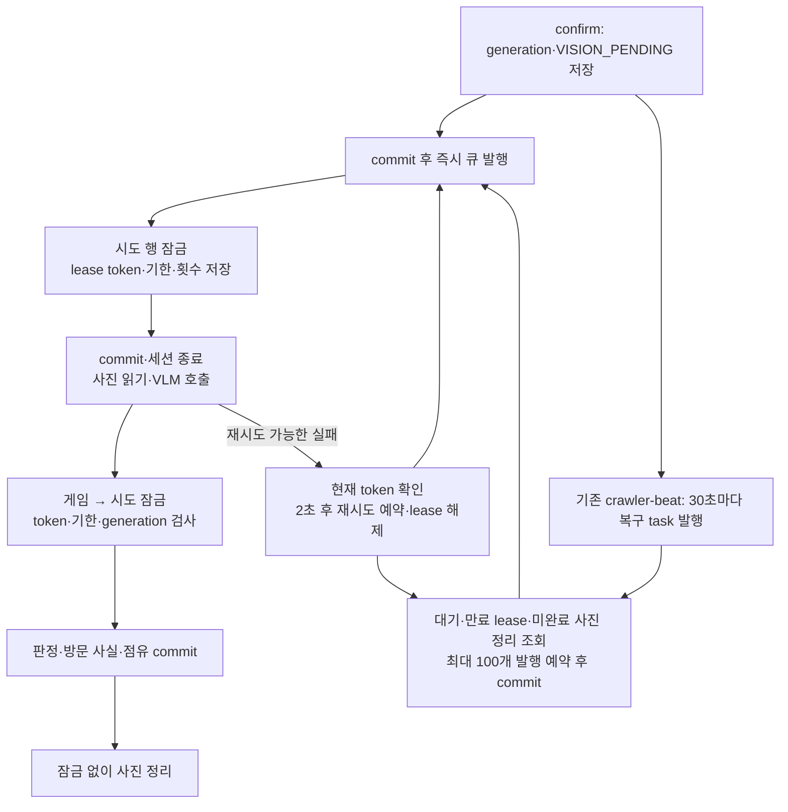

# 점령지 사진 판정 워커

이 문서는 사진 판정의 처리권·복구·완료 경계를 기록한다. 사진은 산책 화면에서 촬영된
방문 증거이며, VLM은 **사진에 실제 강아지가 보이는지**만 판정한다. VLM 통과는
`VerifiedVisit`을 만든다. [게임 시도에 연결한 사진](ownership-api.md)은
별도 점유 어댑터가 같은 트랜잭션에서 우선권·버전을 검사한다. 방문 인증 성공이 반드시
점유 성공을 뜻하지는 않는다. 연결하지 않은 기존 방문 인증은 소유권을 만들지 않는다.

## 처리 흐름

1. 앱이 `POST /app/territory/attempts`로 10m 위치 증거를 고정하고 create-only URL에
   사진을 직접 업로드한다.
2. confirm은 크기·MIME·object generation을 고정해 DB를 `VISION_PENDING`으로 먼저
   commit한다.
3. commit 뒤 `territory-vision` 큐에 attempt id만 발행한다. confirm 재호출도 가능하며,
   발행 실패·프로세스 중단으로 메시지가 없어진 대기는 서버의 주기적 재발행이 복구한다.
4. worker가 시도 행을 잠그고 token·기한·처리 횟수를 저장한다. commit하고 세션을 닫은 뒤
   고정 generation의 바이트를 읽어 `TerritoryVisionPort`로 판정한다.
5. `dog_visible`은 `VERIFIED`, `no_dog_visible`과 `uncertain`은 `REJECTED`, 기술 실패는
   한 차례 재시도 뒤 `FAILED`로 기록한다. 앱은 기존 단건 GET을 polling한다.
6. 게임 공통 잠금 → 시도 행 잠금 순서로 token·기한·generation을 재검사한다. 현재 처리권이
   있을 때 판정·방문 사실·연결 점유를 함께 commit하고 lease를 해제한다.
7. 잠금을 푼 뒤 원본을 0바이트 tombstone으로 치환한다. 정리 실패도 주기적 재발행으로
   복구하며 이미 저장한 결과를 재사용한다.



## 비동기·중복 정책

- 웹은 모델을 호출하지 않는다. confirm의 동기 저장소 stat·broker 발행과 완료 후 사진
  정리는 스레드에서 실행해 요청 이벤트 루프를 막지 않는다. confirm의 stat 동안에는
  해당 시도 행 잠금을 유지하고, broker 호출 전에는 commit한다.
- Celery는 late ack, worker-lost 재큐잉, prefetch 1을 사용한다.
- 유효한 lease를 가진 작업이 있으면 중복 전달은 모델을 호출하지 않는다. 만료·교체된
  token은 성공뿐 아니라 실패 판정·재시도 예약도 반영할 수 없다. 활성 lease가 있는 행은
  token 없는 내부 호출로도 종결할 수 없다.
- 이미 종결된 행은 결과를 바꾸지 않으며, 미완료 사진 정리만 재개한다. cleanup에는
  모델 시도 횟수를 추가하지 않는다. 저장소의 generation 충돌도 다른 객체를 지우지 않는다.
- broker 발행 실패 시 confirm은 503을 반환하지만 DB는 `VISION_PENDING`으로 남는다.
  앱 재호출 없이도 `territory.recover_photos`가 복구한다. 복구는 `SKIP LOCKED`로 최대
  100개를 골라 30초 뒤까지 발행을 예약하고 commit한 다음 큐를 호출한다. broker 실패 시
  배치를 중단하고 미발행 행은 예약 만료 후 다시 찾는다. 발행 예약 직후 프로세스가
  중단돼도 영구적으로 제외되지 않는다.

## DB에 남는 작업 수명

`territory_attempts` 자체가 복구 원장이다. 공개 `status`와 APP 응답은 그대로 유지한다.

| 컬럼 | 의미 |
| --- | --- |
| `vision_lease_token`, `vision_lease_until` | 현재 처리권과 기한. 두 값은 함께 존재하거나 함께 NULL |
| `vision_attempts` | 처리권을 얻은 횟수, 최대 2. 모델 호출 전 중단도 이 예산을 소비 |
| `vision_available_at` | 기술 실패 뒤 다음 처리를 허용하는 시각 |
| `vision_dispatch_after` | 복구 발행의 다음 허용 시각. worker의 즉시 전달 처리를 막지는 않음 |
| `vision_retry_reason` | 재시도 중 보관하는 정제된 실패 코드 |

두 번째 처리도 중단돼 lease가 만료되면 모델을 다시 호출하지 않고 `FAILED`로 종결한다.
유효한 판정을 저장한 뒤 정리만 실패한 경우에는 결과를 유지한다. 새 메시지·Celery retry
횟수·워커 재시작으로 DB 예산이 초기화되지 않는다.

lease는 `max(60초, provider timeout × 3 + 30초)`, 기본 66초다. 사진 읽기+분류의 async
대기는 기본 17초(provider timeout + 5초)로 제한한다. 이 async 시간 초과가 나면 첫 시도의
lease를 기한까지 남겨 빠른 재전달을 막고, 회수 시점에 두 번째 처리를 허용한다.
동기 SDK의 이미 시작한 원격 호출은
취소만으로 철회되지 않을 수 있다. 만료 뒤 회수는 외부 호출의 exactly-once를 보장하지
않으며, 저장 결과는 token/generation 검사로 보호한다. 복구는 DB·broker·Beat·워커가
가용해지고 해당 작업을 처리할 때 진행되며, 30초 주기는 완료 SLA가 아니다.

## 판정 계약과 운영값

- 현재 adapter: Gemini (`google-genai`), 기본 모델 `gemini-3.1-flash-lite`
- 판정 계약: `territory-dog-presence-v1`
- provider timeout: 기본 12초
- 처리 예산: 2초 뒤 1회 재시도, DB 기준 총 2회. Celery retry는 빠른 전달 경로
- 복구 스케줄: 기존 `daengs_life.tasks.celery_app` Beat → `territory-vision` 큐의
  `territory.recover_photos`, 30초 주기·25초 메시지 만료
- 원 공급자 오류/응답 본문은 DB·앱 응답에 남기지 않고 안정적인 reason code만 저장한다.

필수 배포값은 `GEMINI_API_KEY`, 저장소 설정(`GAIT_STORAGE` 및 GCS/LocalBridge 값),
DB·Redis 연결이다. 새 환경 변수나 패키지는 없다. 기동은 기존 `territory-vision-worker`와
공통 `crawler-beat`를 사용한다. 별도 Beat 인스턴스를 추가하지 않는다.

## 적용 순서

1. 구형 사진 워커를 중단하거나 진행 중 작업을 마친 뒤 내린다. 구형 코드는 lease를
   검사하지 않으므로 신형 워커와 동시에 처리하지 않는다.
2. 코드 배포 전에 [2026-09-12_territory_vision_jobs.sql](../../db/migrations/2026-09-12_territory_vision_jobs.sql)과
   [verify](../../db/migrations/verify_2026-09-12_territory_vision_jobs.sql)를 적용한다. 기존
   대기·미정리 종결 행은 즉시 복구 대상이 되고, 재적용은 이미 존재하는 lease·횟수를 보존한다.
   빈 DB의 원본은 `db/init/08_territory_visits.sql`이다.
3. 웹 backend와 사진 worker를 신형 코드로 기동하고, 기존 `crawler-beat`도 재시작해
   스케줄을 반영한다. migration 없이 신형 ORM을 올리면 없는 컬럼 조회로 실패한다.
4. 아래 상태와 복구 task의 `selected/published/failed` 반환 로그를 확인한다. `failed`는
   broker 오류로 발행하지 못한 행과 배치 중단으로 다음 예약에 남긴 행의 수다.

```sql
SELECT status, count(*), min(vision_available_at), min(vision_dispatch_after)
FROM territory_attempts
WHERE status = 'VISION_PENDING'
   OR (status IN ('VERIFIED','REJECTED','FAILED') AND photo_redacted_at IS NULL)
GROUP BY status;
```

```bash
docker compose ps territory-vision-worker
docker compose logs --tail=100 territory-vision-worker
docker compose exec territory-vision-worker uv run --no-sync celery \
  -A daengs_backend.tasks.territory inspect ping
```

실제 배포·운영 SQL 실행과 외부 모델 부하는 구현 검증과 별도다. 이 변경의 PostgreSQL
회귀는 `tests/territory/visits/test_territory_vision_jobs_db.py`, migration 변조 검증은
`tools/check_migration_verification.py`의 `territory_vision_jobs` 항목에 있다.

## Docker·CI 없는 Windows 검증

GitHub Actions나 self-hosted runner 없이 PowerShell 7에서 실행할 수 있다. 서비스 설치
없이 PostgreSQL과 Redis 실행 파일을 별도 작업 폴더에 풀고, 폐기용 데이터를 loopback의
비기본 포트에만 연다. 팀 DB·Redis 연결값이나 서버용 compose 설정을 사용하지 않는다.

2026-09-12 검증에 사용한 파일은 아래와 같다. Redis와 pgvector는 커뮤니티 Windows
빌드이며 운영 Linux 이미지와 같은 바이너리는 아니다. 두 zip은 다운로드 뒤 GitHub
release asset의 SHA256과 비교했다. pgvector의 `lib/vector.dll`과 `share/extension/*`를
**폐기용 PostgreSQL 배포 폴더**의 같은 경로에 복사한다.

| 구성 | 다운로드 | SHA256 |
| --- | --- | --- |
| PostgreSQL 17.11 x64 | [EDB zip 배포](https://www.enterprisedb.com/download-postgresql-binaries) | 배포본별 확인 |
| Redis 8.2.9 MSYS2, 서비스 없는 zip | [release](https://github.com/redis-windows/redis-windows/releases/tag/8.2.9) | `dcff676e861a4ae0a9854556239398e77a7469c9379af64a4a76798d166d1aa0` |
| pgvector 0.8.6 / PG17 | [release](https://github.com/andreiramani/pgvector_pgsql_windows/releases/tag/0.8.6_17) | `420388e9e9f05d92f06d6967ce8772483629b27a66ca9255925fa0fdd445438e` |

서로 다른 PostgreSQL Windows 배포본의 확장이 호환된다고 가정하지 않는다. 실제
`CREATE EXTENSION vector`가 성공해야 전체 migration 검사를 실행할 수 있다.

```powershell
# 아래 세 경로는 자신이 압축을 푼 폴더와 새 폐기용 데이터 폴더로 설정한다.
$pgRoot = 'C:\daengs-test-tools\pgsql'
$redisRoot = 'C:\daengs-test-tools\Redis-8.2.9-Windows-x64-msys2'
$testData = 'C:\daengs-test-tools\photo-pgdata'

# initdb/createdb는 처음 한 번만 실행. trust는 아래 loopback 전용 폐기 DB에만 사용한다.
& "$pgRoot\bin\initdb.exe" -D $testData -U postgres -A trust --encoding=UTF8 --locale=C
& "$pgRoot\bin\pg_ctl.exe" -D $testData -l "$testData.log" -o '-h 127.0.0.1 -p 55439' -w start
& "$pgRoot\bin\createdb.exe" -h 127.0.0.1 -p 55439 -U postgres claims_test

@'
bind 127.0.0.1
protected-mode yes
port 56379
save ""
appendonly no
'@ | Set-Content "$redisRoot\test-local.conf" -Encoding utf8NoBOM
$redisProcess = Start-Process "$redisRoot\redis-server.exe" -ArgumentList 'test-local.conf' `
  -WorkingDirectory $redisRoot -WindowStyle Hidden -PassThru
& "$redisRoot\redis-cli.exe" -h 127.0.0.1 -p 56379 ping
```

다음 명령은 DEV의 `backend/`에서 실행한다. 테스트는 DB에 고유 스키마, Redis에 고유
키 접두사를 사용하고 종료 시 자기 프로세스·스키마·키를 정리한다. Redis 환경 변수를
생략하면 runtime 3건이 skip되므로 `-rs` 결과를 확인한다.

```powershell
$env:PYTHONUTF8 = '1'
$env:TERRITORY_TEST_DATABASE_URL = 'postgresql+asyncpg://postgres@127.0.0.1:55439/claims_test'
$env:TERRITORY_RUNTIME_TEST_REDIS = 'redis://127.0.0.1:56379/15'
uv run pytest -q -rs tests/territory/visits tests/territory/ownership tests/territory/certification --tb=short
uv run pytest -q -rs tests/activity/test_vision_lease_db.py --tb=short

$env:PATH = "$pgRoot\bin;" + $env:PATH
$env:PGHOST = '127.0.0.1'
$env:PGPORT = '55439'
$env:PGUSER = 'postgres'
$env:PGDATABASE = 'claims_test'
$env:PGCLIENTENCODING = 'UTF8'
uv run python ../tools/check_migration_verification.py sql

# check가 호출하는 Windows PowerShell 5.1의 실행 정책만 현재 프로세스에서 설정한다.
$env:PSExecutionPolicyPreference = 'Bypass'
uv run check

# 검증 후 직접 시작한 폐기용 프로세스만 종료한다.
& "$redisRoot\redis-cli.exe" -h 127.0.0.1 -p 56379 shutdown nosave
& "$pgRoot\bin\pg_ctl.exe" -D $testData -m fast -w stop
```

`test_territory_vision_runtime.py`는 실제 Redis·PostgreSQL·별도 Celery `solo` 프로세스로
중복 전달, 실제 broker 연결 거부 뒤 재confirm 없는 복구, 모델 대기 중 worker 강제 종료
뒤 복구를 확인한다. 실제 Beat `Scheduler`에 운영의 사진 복구 항목만 넣어 tick한다.
lease 만료 시각은 테스트 DB에서 앞당기며, 사진 저장소와 모델은 결정적 대역이다.
이는 Linux prefork·상주 Beat 프로세스 재시작·실제 VLM·운영 부하 검증을 대체하지 않는다.
