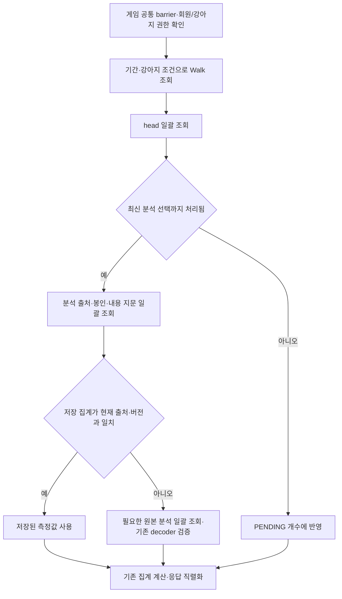

# 산책 활동 요약의 일괄 조회와 저장 집계

`GET /app/activity/walks/summary`는 회원·종료 시각 범위·선택한 강아지로 산책을 제한한 뒤,
head와 분석 출처를 각각 일괄 조회한다. 유효한 `head.contribution`의 측정값을 사용하고,
기존 형식이나 출처가 달라진 집계만 원본 분석을 일괄 조회해 보완한다.



## 출처와 최신성 검증

- head의 `processed_revision == revision`, `processed_analysis_id == analysis_id`를
  확인한다. head·집계·처리된 분석 ID가 없거나 최신 선택을 처리하지 않았으면 `PENDING`이다.
- 분석 ID와 Walk 연결, 현재 `derived` 상태와 Capsule 존재를 확인한다. 잘못된 연결이나
  봉인 해제는 집계값이 있더라도 오류로 유지한다.
- 저장된 분석 버전과 통계 버전·generation을 현재 값과 대조한다. 유효한 정수 측정값과
  원본 요약 컬럼·관측 가능 여부도 대조하며, 제외 사유는 기존 순수 계산으로 확인한다.
- 같은 세션에 예전 ORM 객체가 남아 있어도 Walk·참여견·head를 현재 DB 값으로 갱신한다.
  회원/참여견을 집계 JSON에서 읽지 않으므로 참여견 삭제와 회원 경계가 유지된다.

`process_pending()`은 기존 분석 decoder와 projection 검증을 통과한 뒤 contribution에
`source_fingerprint`를 추가한다. PostgreSQL의 JSONB 표현을 UTF-8로 변환해 SHA-256으로
계산한 내용 지문이다. 분석 ID·Walk ID·입력 지문·버전·요약 컬럼·manifest·Facts·Receipt·
이벤트·관측·Capsule ID/버전을 포함한다. GPS 입력의 `WalkAnalysis.input_fingerprint`와는
다른 용도이며 API 응답에 추가하지 않는다.

요약 조회에서 내용 지문이 달라지면 기존 `decode_analysis_model()`로 원본을 다시 검증한다.
따라서 집계 후 원본 payload가 손상되거나 버전/요약 컬럼과 달라져도 예전 집계로 숨기지 않는다.
유효한 원본 변경은 최신 값으로 계산하고, 지원되지 않는 분석 버전은 기존 projection 규칙의
`unsupported_analysis_versions`로 제외한다. 처리된 분석 선택 자체가 다르면 `PENDING`이다.

## 기존 데이터와 트랜잭션

기존 contribution에 지문이 없거나 형식·세대·측정값·제외 사유가 맞지 않으면 원본 조회로
보완한다. 보완 대상도 ID 500개 이하 단위로 조회하며 산책마다 SQL을 호출하지 않는다.
읽기 요청은 저장된 contribution을 수정하거나 새 작업을 예약하지 않는다. 기존 rebuild와
worker를 실행하면 처리 과정에서 새 지문이 저장되지만 배포 시 강제 전체 재집계는 필요 없다.
구형 worker가 지문 없는 JSON을 쓰는 혼합 배포도 같은 보완 경로를 사용한다.

공통 barrier와 기존 commit/rollback 경계, 처리 revision 갱신의 원자성은 유지한다.
API 구조·집계 계산·기간의 `[from_ms, to_ms)` 기준·평균 속도·미관측 `null`·출처 목록을
유지하며, 스키마·마이그레이션·새 큐·Redis 캐시는 추가하지 않는다.

## 조회 비용과 검증

회원 전체 요약의 유효한 집계 1개/8개 사례에서 기존 SELECT 수는 8회/43회였고, 변경 후에는
둘 다 5회다. 지문 없는 기존 집계 8개를 보완하는 경우는 7회다. 강아지별 조회에는 권한 확인
쿼리가 추가된다. 대상이 많아지면 500개 단위로 배치 수가 증가하며 전체 작업량이 상수라는
뜻은 아니다.

PostgreSQL은 지문 계산을 위해 원본 JSONB를 여전히 읽고 해시한다. 줄인 것은 반복 SQL,
큰 payload의 애플리케이션 전송과 반복 Python decoder 실행이다. 운영 지연 시간·DB CPU·
부하 감소율은 측정하지 않았다. decoder의 검증 대상 필드가 추가되면 지문 구성도 함께 검토한다.

`backend/tests/activity/test_walk_summary_queries_db.py`는 실제 SQL 수, 캐시 미사용 원본
검증, 기존/혼합 집계 보완, 배치 경계와 rebuild, 원본 손상·유효한 수정, 봉인/분석 연결,
같은 세션의 처리 상태 변경, 회원·강아지·기간·삭제와 미관측 값을 검증한다.

```powershell
# backend/ — 별도 loopback PostgreSQL의 claims_test만 사용
$env:TERRITORY_TEST_DATABASE_URL = 'postgresql+asyncpg://postgres@127.0.0.1:55439/claims_test'
uv run pytest -q -rs tests/activity/test_walk_summary_queries_db.py
```

2026-09-12 PostgreSQL 17.11/Windows에서 실행했다. 환경 변수가 없으면 DB 테스트가
skip하므로 `-rs`를 확인한다. 전체 관련 회귀와 머지 게이트의 수행 범위는 PR에 기록한다.
