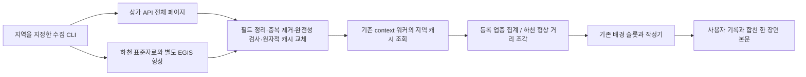

# 산책 일기에 상권 구성과 하천 배경 공급

2026-09-09, [Dev #390](https://github.com/SAJOYO/DAENGS_dev/pull/390).
[SGIS·공원 공급 #387](public-context.md)에 이어, 사용자 기록 위치 주변의 등록 업종 구성과
하천 형상까지의 거리를 기존 context → 스탬프 → Gemini 작성 → 일기 본문에 연결한다.

## 구성과 현재 범위



**현재는 설정된 지역 카탈로그를 공급하는 구현이다. 전국 자동 수집은 아직 없다.**
상권·하천 각각 설정 파일 한 개가 지역 한 곳을 담당한다. CLI에 중심과 반경을 지정하고,
새 지역을 같은 경로에 발행하면 그 파일의 커버리지가 교체된다. 여러 지역이 필요하면
카탈로그 목록/공간 인덱스와 갱신 스케줄을 후속 단위에서 붙여야 한다.
범위 밖 사용자의 기록도 생성되지만, 이번 두 제공자의 배경은 `unavailable`로 남는다.

- API의 여러 페이지 수집은 CLI만 한다. context 워커는 네트워크 조회 없이 캐시를 읽는다.
- 원천 조회 시각과 과거 산책 시각은 구분한다. 조회한 등록 자료를 당시 현장 상태로 만들지 않는다.
- 기존 Place 제공자는 `space.facility`로 유지한다. 업종 구성은 별도 `space.commerce`에 넣는다.
- 사용자 기록을 고르는 정책과 원문 조립은 유지한다. 앱에 출처별 UI 영역을 추가하지 않는다.
- `space_slots=3` 안에서 기존 거리 정렬을 사용한다. 점 거리가 없는 상권 집계는 125m의
  집계 반경을 정렬 값으로 쓴다. 이것은 슬롯 선택용 기준이며 거리 관측값이나 중요도 확률이 아니다.
  모든 제공자가 항상 한 슬롯씩 배정받는 정책은 아니다.

## 상권 조각

`storeListInRadius`를 중심 반경 500~3,000m로 조회한다. 최대 30페이지 × 1,000행이며,
페이지 수집 중 전체 건수가 달라지거나 반복/누락/상한 초과가 생기면 발행하지 않는다.
기존 캐시는 그대로 남는다.

- 상가업소번호·중분류 코드/명·좌표만 남긴다. 상호·상세 주소·연락처는 저장하지 않는다.
- 같은 업소번호의 같은 행은 한 번만 센다. 서로 다른 행은 해당 업소번호를 제외한다.
- 기록 좌표에서 125m 안의 등록 업소 수, 상위 5개 중분류 집계와 나머지 건수를 만든다.
  분류 합계가 전체 건수와 맞지 않으면 배경에 넣지 않는다.
- `registered_business_composition`, `registration_only_not_visit_open_or_crowding`을 전달한다.
  업종 수는 등록 자료의 구성이며 현재 영업, 혼잡도, 이용·방문을 뜻하지 않는다.

## 하천 조각

두 출처를 합쳐 같은 하천 데이터라고 부르지 않는다.

| 출처 | 사용하는 내용 | 사용하지 않는 해석 |
| --- | --- | --- |
| 전국하천표준데이터 | 하천 코드·이름·자료 기준일 | 시점과 종점을 이은 선을 실제 하천으로 취급 |
| EGIS `me:adm_river` WFS | 유효한 Polygon/MultiPolygon 형상 | 실제 물가·산책로·방문·진입 판정 |

표준자료는 최대 30페이지로 받아 정리한다. EGIS는 지정 지역을 WFS 2.0 BBOX로 조회한다.
`numberMatched`/`numberReturned`/실제 개수가 일치하고 300개 미만이어야 발행한다.
응답은 8MB로 제한하고 CRS가 3857인지 확인한다. Shapely/pyproj로 실제 형상을 5179로
변환하고 지역 사각형으로 자른다. 유효하지 않은 형상은 수정해서 추정하지 않고 제외한다.

기록점부터 폴리곤까지 250m 이내의 거리와 최근접점을 계산해 최대 3개를 저장한다.
배경 투영 때 저장된 기록점·최근접점 간 거리를 다시 확인한다. 원본 폴리곤의 해시도 보존하되,
스탬프 투영이 그 해시만으로 최근접점의 폴리곤 소속을 다시 증명하는 것은 아니다.
실제 최근접점 계산은 수집기의 캐시 조회 단계에서 수행한다.

표준자료에서 같은 이름을 찾은 결과는 개체 ID 결합이 아니다. 최대 5개와 전체 일치 개수만
봉투에 보존하고, 일치하지 않아도 EGIS의 유효한 형상은 독립적으로 쓴다. 표준자료 기준일을
EGIS 형상의 기준일로 옮기지 않는다. 현재 형상 기준일은 미확인(null)이다.

거리 0은 폴리곤과 겹친다는 계산 결과이며 물에 들어갔거나 하천변 길을 걸었다는 뜻이 아니다.
`geometry_distance_not_bank_path_or_visit`로 전달한다. 건물과 하천이 기록점 주변에 있다는
것만으로 서로 건너편/뒤/너머에 있다는 배치는 알 수 없으므로, 작성 딕셔너리에
`relative_layout=unknown`도 함께 전달한다.

## 캐시와 상태

- 각 파일은 15MB 이하, 전체 해시·형식·지역·조회 시각을 확인한다. 조회 후 30일이 유효기간이다.
- 검색 원 전체가 카탈로그 지역 안에 들어와야 한다. 좌표계 차이를 위한 5m 여유도 둔다.
- 파일 없음/만료/손상/범위 밖은 `unavailable`, 설정이나 flag가 없으면 `not_requested`다.
- 유효한 전체 범위에서 결과가 없을 때만 `empty`다. 제외 행 또는 결과 상한이 있으면 `partial`이다.
  어떤 상태도 실제 주변에 해당 대상이 없다는 서술로 바꾸지 않는다.
- 모든 HTTP 요청은 기존 키 비노출 transport를 쓴다. 원문 응답·키는 Git에 추가하지 않는다.

## 적용 순서

이 작업은 공유 서버에 배포하거나 그 DB에 migration을 적용하지 않았다.
로컬 migration 검증 성공과 운영 반영은 별개다.

1. #387의 `2026-09-09_walk_public_context.sql` 적용 후
   `2026-09-09_walk_public_context_commerce.sql`과 짝 verifier를 실행한다.
   새 DB는 init 27 다음 28을 실행한다. 마지막 검증은 **6개 태그를 보는 commerce verifier**다.
   이후 옛 5개 태그 제약 SQL을 다시 적용하지 않는다.
2. `uv sync`로 갱신된 lock의 pyproj·Shapely를 반영한다. backend 운영 시 기존 `ml` 그룹 보존
   규칙은 루트 CLAUDE.md를 따른다.
3. 웹·워커가 같은 flag를 보게 하고, CLI와 워커가 같은 지속 파일을 보도록 경로/마운트를 설정한다.

```dotenv
DAENGS_WALK_PUBLIC_CONTEXT_ENABLED=true
DAENGS_WALK_AREA_CONTEXT_ENABLED=false
DAENGS_WALK_PUBLIC_DATA_KEY=
DAENGS_WALK_COMMERCE_CATALOG_PATH=/persistent/walk-public/commerce.json
DAENGS_WALK_RIVER_CATALOG_PATH=/persistent/walk-public/river.json
```

4. `backend/`에서 명시한 지역을 수집한다. 예시는 검증에 사용한 합성 시나리오 지역이다.

```bash
uv run python -m daengs_backend.cli.walk_area_catalog commerce --lat 37.4878 --lng 127.052 --radius 1200
uv run python -m daengs_backend.cli.walk_area_catalog river --lat 37.4878 --lng 127.052 --radius 1200
```

5. 캐시 읽기를 확인한 뒤 `DAENGS_WALK_AREA_CONTEXT_ENABLED=true`로 활성화한다.
   전체 context 워커 활성화 등 부모 단위의 설정도 필요하다. public/area 두 flag가 켜졌을 때만
   새 `space.commerce` 작업을 예약한다. 기존 `space.river`는 같은 area flag로 공급한다.

이미 완료된 `not_requested` 작업이나 과거 일기를 자동 재수집하지 않는다. 캐시 갱신만으로
기존 기록의 봉투가 바뀌지도 않는다. 자동 갱신/지역 확장/명시적 backfill은 후속 작업이다.

## 실제 확인 결과

로컬 API 인증·DB·outbox·입력 어댑터·실제 Gemini를 연결한 합성 산책(20분, 좌표 121개,
행동 1개·메모 2개)을 사용했다. 물리 폰 대신 에뮬레이터 확인으로 진행했다.

| 항목 | 결과 |
| --- | --- |
| 상가 카탈로그 | 중심 37.4878, 127.052 / 1.2km, 6페이지, 5,057개, 제외 0 |
| 중심 주변 집계 | 125m 내 164개, 이용·미용 21 / 한식 18 / 부동산 서비스 18 등 |
| 하천 표준자료 | 3페이지, 원본 2,558행 → 1,519개, 충돌·무효 1,038행 제외, 동일 행 1개 중복 |
| EGIS | 지역 조회 2개 중 유효하지 않은 한강 형상 1개 제외, 양재천 사용. partial 유지 |
| 중심 주변 하천 | 양재천 형상까지 247.8m, 표준자료 이름 일치 없음 |
| 기존 outbox | 18개 처리, 주소·상권 known / 공원·하천 partial |
| 모델 1차 | 1회, 4.0초, 입력 2,087 / 출력 215토큰 |
| 배치 미확인 보완 후 | 1회, 2.484초, 입력 2,161 / 출력 213토큰 |
| 최종 응답 | ready / accepted, 3개 장면, generation 2, semantic_status=not_evaluated |
| 반복 조회 | 생성 결과 동일, 추가 모델 호출 없음 |
| 앱 | 별도 preview APK의 실제 parser·Room 수락. 응답의 세션 ID·generation과 설치 APK 해시 대조 |

1차는 “거리 너머로 양재천”이라는 확인되지 않은 배치를 썼다. 입력에 배치 미확인을 명시한
다음 응답에서는 “의원과 의류 매장이 자리한 곳이었으며 양재천이 인근에 있었다.”로 나왔다.
한 사례의 보완 확인이며, 의미 검증기가 모든 문장의 사실성을 보증한다는 결과는 아니다.
원천 행정 업종명을 자연스러운 일기 어휘로 옮기는 품질도 더 볼 여지가 있다.

에뮬레이터의 장면 2에서 이 배경과 “두부가 한참 냄새를 맡길래 잠깐 기다렸다.”가 한 본문으로
나온 것을 확인했다. 앱 제품 코드를 바꾸지 않고, 로컬 응답 파일을 production parser/Room에
넣은 확인이다. 앱에서 원격 서버 HTTP를 호출한 검증과 구분한다.

검사는 새 지역 수집기와 기존 context·projection·stamp·writer의 명시적 파일에서 89개 통과,
보완 후 지역/작성기 34개 재실행(신규 2개 포함), 로컬 PostgreSQL context 7개,
기존 입력 어댑터 `context or input_reader` 10개가 통과했다. 중복을 빼면 **108개**다.
변경 Python Ruff와 migration 이름·짝/등록 검사(41개 migration)도 통과했다.
전체 pytest는 실행하지 않았다. Windows workflow 검사는 #387에서 확인한 실행 정책 문제가
남아 있어 이번에 반복 실행하지 않았으며, 전체 `uv run check` 통과로 기록하지 않는다.

## 공식 원천

- [소상공인시장진흥공단 상가(상권)정보 API](https://www.data.go.kr/data/15012005/openapi.do)
- [전국하천표준데이터](https://www.data.go.kr/data/15139206/standard.do)
- [환경공간정보서비스 Open API 안내](https://aid.mcee.go.kr/api/intro.do)
- [환경주제도 API 안내](https://aid.mcee.go.kr/api/envi.do)
