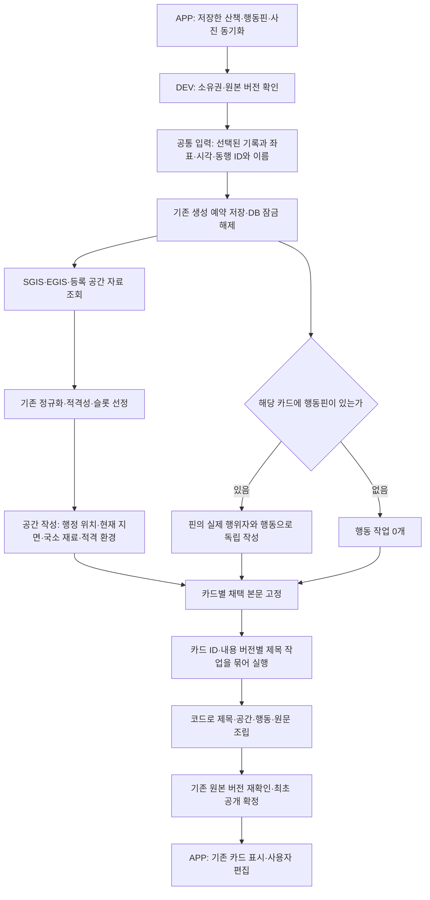

# 실제 산책 카드 작성 경로

남은 공간 관계·슬롯 정책·실제 서술 검증과 그 대화 경위는 [산책 일기: 대화의 경위와 남은 기획](diary-remaining-plan.md)을 따른다. 아래 실행 연결 완료를 전체 일기 기획의 완료로 해석하지 않는다.

착수할 때는 [실제 호출 분기와 혼동 방지](diary-remaining-plan.md#handoff-paths)를 함께 읽는다. 아래 도식은 보드 형식으로 새 작성이 필요한 기본 경로다. 과거 저장 형식 보존·공개본 재사용, 슬롯 미리보기, 명시적 `write_legacy_slot_board`는 구별해야 한다. `write_board`는 `generate`·`collector`를 주입해도 같은 카드 그래프를 실행한다(2026-09-14, #504의 호출자·회귀 검증 기준).

`POST /app/walks/{walk_id}/storyboard`의 `walk-diary-board-v1` 작성기는 DEV `orchestration/runtime.py:build_diary_orchestrator`를 통해 일기 LangGraph를 실행한다. 기존 어시스턴트 LangGraph와 **같은 `execution.py:JobExecutor`**를 사용한다. APP의 기존 `WalkDiarySync → ServerDiaryBoard → Room → WalkDiaryReader`가 이 응답을 소비한다. 별도 실험 서버나 일기 저장 테이블은 없다.

## 책임과 실제 코드

| 책임 | 코드 |
| --- | --- |
| 소유권과 입력 읽기, 접근 가능한 동행 이름 | `walk_diary_input.py:read_input` |
| 예약·공통 공개 마감·원본 변경 검사 | `walk_diary_generation.py:generate_diary`, `walk_diary_publication.py:within_budget` |
| 실제 보드 작성 진입점 | `walk_diary_board_slot_writing.py:write_board` |
| 런타임 진입과 일기 그래프 | `orchestration/runtime.py:build_diary_orchestrator`, `orchestration/diary.py` |
| 채팅·일기가 공유하는 제한 실행·시간 초과·오류 격리 | `orchestration/execution.py:JobExecutor` |
| 작성용 입력·응답 검증·카드 부분 투영 | `walk_diary_card_writing.py` |
| 공간/행동/제목의 개별 작성 지시 | `walk_diary_card_prompts.py` |
| SGIS·공원·상권·EGIS 수집 | `walk_diary_space_collection.py:configured_collection` |
| 원래 SGIS 변환·선정 | `walk_sgis.py`, `diary_public_background.py`, `diary_slots.py` |
| 카드 부분과 내용 버전 계약 | `diary_card_narrative.py`, `diary_board_output.py` |
| 독립 작업의 요청·채택 결과 저장 | `walk_diary_card_receipt.py`, `walk_diary_board_storage.py` |

제목의 문체·단어 선택 정책은 제목 전략의 책임이다. 오케스트레이터는 제목만 받아 카드 ID와 내용 버전을 검사하며, 본문 수정 권한을 주지 않는다. 제목은 세션 전체 제목이 아닌 **각 카드의 `title`**이다.

## 기존 오케스트레이션과의 연결

기존 `OrchestrationEngine._execute_requests`도 `JobExecutor.run`을 호출한다. 채팅은 기존 순차 실행·capability 계약·집계 진리표를 유지한다. 일기는 같은 실행 계층 위에 `space || actions → freeze_card_content → titles → assemble` 그래프를 두고, 실행 동시성을 4로 제한한다. 자료 조회는 작성 슬롯을 점유하지 않으므로 SGIS가 늦어도 행동은 실행된다.

일기 작업을 기존 산책 적합도 `walk`로 등록하거나 `AssistantResponse`로 포장하지 않는다. 자연어 의미 라우터는 호출하지 않는다. 일기 그래프의 입력은 저장된 산책과 준비된 보드이며, 출력은 기존 일기 영수증이다. `walk_diary_card_writing.write_cards`에는 독립 실행 루프가 없고 런타임 호출만 남는다.

발행 서비스가 예약을 저장한 뒤 그 마감을 `within_budget`으로 전달한다. 그래프는 남은 시간에서 본문·제목·최종 반환 여유를 나눠 사용하며 대기열 진입이나 개별 호출 때 시계를 다시 시작하지 않는다. 실행 계층은 늦은 값을 채택하지 않고, 최종 원본·생성 시도 확인과 저장 권한은 계속 기존 발행 서비스에 있다. 그래프에는 별도 DB·발행 큐·체크포인터가 없다.

동시성 제한은 채택을 기다리는 작업 기준이다. 취소를 무시하는 공급자가 실행 슬롯을 계속 점유해 후속 작업을 막지는 않는다. 이미 전송한 외부 요청의 물리적 종료까지 보장하는 것은 아니며, 그 실행 상한은 기존 공급자 타임아웃이 담당한다.

`freeze_card_content`는 성공 결과와 필요한 기본 표현, 그때의 위치 정보를 선택해 카드별 내용을 고정한다. 제목 노드는 이 카드 목록만 읽으며 본문과 위치를 갱신하지 않는다. 작성 입력 고정·본문 고정·공개 확정은 서로 다른 단계다.

제목의 재사용 키는 카드별 입력에서 만든다. 같은 묶음의 다른 행동핀이 바뀌어도 나머지 카드 제목은 재사용한다. 실제 생성 요청은 미확보 제목만 최대 12개씩 묶는다. 읽을 수 있는 응답의 누락·잘못된 버전·중복 ID·잘못된 제목은 해당 카드만 기본 제목으로 처리한다. JSON 전체를 읽을 수 없으면 그 묶음은 기본 제목으로 마무리한다.

`content_revision`은 제목이 읽는 공간·행동·위치·기록 기준을 나타내고 별도 보존 원문은 제외한다. 원문 변경의 공개 정합성은 기존 source revision이 검사한다. 원문까지 해시에 넣었던 이전 저장본도 그대로 읽는다. 저장 작업 영수증의 `reused: true`는 모델을 다시 호출하지 않은 결과이며, 실제 요청 묶음과 혼동하지 않도록 구분한다.

## 요청 경계

- 공간 요청은 공통 동행 맥락, 기록 좌표·시각, SGIS/EGIS/환경 상태, 적격 공간·환경 재료를 받는다. `scene_structure`는 행정 위치와 현재 지면을 구별하고 나머지 재료의 참조를 유지한다. 행동핀·원문·이전 본문·관측 주체의 행동 해석은 보내지 않는다.
- 행동 요청은 공통 맥락, 카드 ID·시각, 해당 핀의 행위자 ID/확인된 이름과 행동만 받는다. 동행 목록만 보고 행위자를 선택하지 않는다. 공간 자료 조회 중에도 시작한다.
- 제목 요청은 **채택한** 공간/행동 부분, 확인된 위치와 시각, 카드 ID·내용 버전을 받는다. 사용자 원문과 미채택 후보는 보내지 않는다. 카드 12개씩 묶으며 응답 순서로 배치하지 않는다.
- 사용자 원문은 코드가 마지막에 원래 공백·개행 그대로 붙인다. APP는 조립된 본문 하나를 기존 편집기에서 편집한다. 원래 부분은 발행 근거로 보존한다.

SGIS는 기존 `sido / sigungu / dong` 정규화를 재사용한다. **APP 표시값은 기존과 동일하게 `dong`**이다. 제목 생성 여부와 별개로 `place_reference`에 저장된다. 시·구를 새로 합쳐 표시하지 않는다.

EGIS는 기존 WMS 좌표 피복 조회가 기본 경로에 포함된다(`walk_diary_space_enabled` 기본값 true, 명시적 false는 유지). 기술 분류와 출처는 보존하고 작성용 투영에서 도로→길, 자연/기타초지→풀밭, 하천→물길 등의 일상 어휘를 적용한다. 날씨는 기존 저장 관측의 시간·위치 적격성을 통과한 경우에만 사용한다.

## 관측 카드의 확정 설명 — DEV #503 · APP #395

독립 작성으로 전환하면서 관측 코어는 남았지만 관측 때문에 고른 카드의 본문·제목에서는
그 의미가 빠졌다. 새 관측 카드는 기존 기본 보드와 같은 확정 문구를
`writing.observation`으로 보존한다. 기기 동선의 모임·상대 저속·상대 고속만 설명하며
강아지의 행동이나 정지를 추론하지 않는다. 공간·행동 작성 요청에는 보내지 않는다.

본문은 관측 설명 → 공간 본문 순서로 조립하고 제목은 채택한 관측 설명도 읽는다.
관측 종류와 코어 참조·버전이 내용 버전에 포함되므로 관측만 바뀌면 공간 요청을 재사용하면서
해당 카드 제목은 다시 작성한다. 관측 설명은 새 LLM 결과나 슬롯 후보가 아니다.
시작·종료·경로 보충 카드의 문장과 사용자 원문 정책은 변경하지 않았다.

발행과 영수증은 설명·관측 코어·제목 입력의 일치를 검사한다. 새 완료 결과에서 관측 설명을
빼면 거절하지만, 과거 저장본에는 이 필드를 보충하지 않는다. 필드가 없는 기존 JSON과
내용 해시를 그대로 읽고 기존 발행·사용자 편집을 자동으로 교체하지 않는다.

**적용 순서:** [APP #395](https://github.com/SAJOYO/DAENGS_APP/pull/395)의 수신 지원을 먼저 반영한 뒤
[DEV #503](https://github.com/SAJOYO/DAENGS_dev/pull/503)으로 새 관측 카드를 생성한다.
이전 APP의 엄격한 본문 조립 검사는 새 관측 문장이 포함된 응답을 거절한다. 과거 저장본을
새 앱에서 읽는 호환과, 이전 앱이 새 응답을 읽는 호환은 다르다. 이 변경은 배포하지 않았다.

공유 표본은 [observation-card-v1.json](../../backend/evals/walk-diary/observation-card-v1.json)이다.
`test_diary_observation_content.py::test_http_observation_meaning_is_published_once_and_exports_app_contract`가
기본 HTTP 작성·발행·GET·재요청을 통과한 응답을 출력했다. DB/공급자/모델은 대역이며,
APP의 `diary-observation-card-v1.json`과 같은 바이트다. 기존 표본도 그대로 남긴다.
관측 보존 작업에서는 `context_pending` 대기를 유지했고, 뒤이은 #505에서 아래처럼 분리했다.

## 최초 요청의 그래프 진입 — #505

기존 entry-context job이 `pending/running`이라는 이유로 기본 카드 작성을 미루지 않는다.
원본 확인·기존 발행/예약 재사용 검사 후 예약을 저장하고 commit한 뒤 그래프에 들어간다.
공간 조회가 미완료여도 준비된 행동을 실행하며, 공간 작업은 기존 본문 마감으로 제한한다.
늦게 끝난 entry-context 작업에는 이미 발행된 내용을 교체할 권한이 없다.

이전 10분 유예가 필요한 내부 호환 호출만 `legacy_context_wait=True`를 명시한다.
모델 주입·writer 직접 전달·partial·래퍼로 대기를 추론하지 않으며, `legacy_collector`도
유예를 자동 활성화하지 않는다. 공개 요청/응답과 APP은 변경하지 않는다.
세부 조건은 [보드 API의 첫 생성 정책](diary-board-api.md#첫-생성과-기존-배경-수집--505)을 따른다.

## 실행·재사용·공개

하나의 공개 마감 안에서 작업을 제한적으로 병행한다. 본문 작성에 내부 마감을 두고 제목 시간을 남긴다. 각 작업의 실패/시간 초과는 해당 부분의 기본 결과로 끝내고, 성공한 다른 부분을 버리지 않는다. 취소를 무시한 늦은 공급자 응답에도 발행 권한은 없다.

작업 요청 지문은 그 전략의 입력·모델·프롬프트에 의존한다. 보드 전체 버전은 공간 작업의 키에 넣지 않는다. 핀의 행동 종류만 변경하면 공간 요청은 같고 행동·제목 요청만 달라진다. 기존에 저장한 독립 작업 영수증에서 **요청이 일치하는 채택 결과만** 재사용한다. 새로운 요청에는 현재 근거를 다시 연결한다.

새 작성 영수증은 기존 저장 v2 안에서 별도 형식으로 구별한다. 과거 슬롯 영수증과 공개 JSON은 그대로 읽으며, 새 필드가 없는 과거 자료의 해시도 바뀌지 않는다. 공개 이후 자동 교체와 사용자 편집 덮어쓰기를 추가하지 않았다.

## 검증 범위와 남아 있는 한계

테스트는 실제 HTTP 생성 경로에서 외부 공급자만 대체한다. SGIS는 인증→좌표 변환→행정동 조회를, EGIS는 WMS 응답→기존 정규화→슬롯→실제 작성 요청을 통과한다. 이 HTTP 응답을 APP의 공유 표본으로 사용해 동기화·Room 재개방·카드 제목/본문/행정동·편집 보존을 확인한다.

이 변경은 공급자 관계 선정기를 새로 만든 작업이 아니다. 운영 공간 입력은 현재 기존 WMS 점 피복·공원 등록점·상권 범위를 사용한다. 이전 수변 실험의 WFS 도형 간 초지/물길 인접·명명 관계를 전국 자동 선정기로 이식한 것은 아니다. 그 미구현 관계를 만들어 입력하지 않는다.

공간 조회는 공개 마감과 최대 12개 서로 다른 좌표 범위를 따른다. 나머지 위치는 미확보 상태를 남기며, 카드 수가 12개를 넘었다는 이유로 전체 작성을 중단하지 않는다. 문장 의미의 정확성·자연스러움은 형식/참조 검사가 보장하지 않는다. 이번 검증은 오케스트레이션·자료 전달·발행 보존 검증이다.
