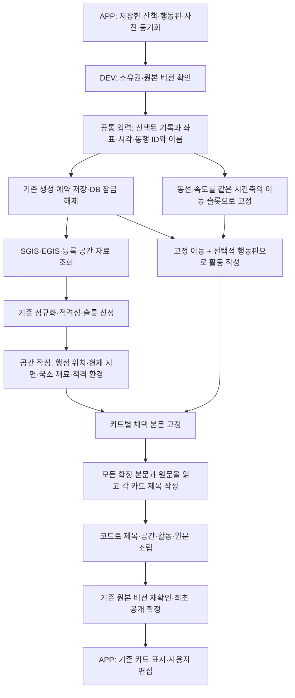

# 실제 산책 카드 작성 경로

2026-09-14 #508 후속: 동선·속도 통합과 전체 맥락 제목의 정책·근거는
[활동 서술](diary-activity.md)에 기록한다. 아래는 이 변경을 포함한 신규 기본 작성 경로다.

서비스 코드는 #512에서 `services/walk_diary/`로 묶었다. 현재 진입점·의존 방향과
이전 파일별 이동표는 [일기 서비스 패키지](diary-service-package.md)를 따른다.

남은 공간 관계·슬롯 정책·실제 서술 검증과 그 대화 경위는 [산책 일기: 대화의 경위와 남은 기획](diary-remaining-plan.md)을 따른다. 아래 실행 연결 완료를 전체 일기 기획의 완료로 해석하지 않는다.

착수할 때는 [실제 호출 분기와 혼동 방지](diary-remaining-plan.md#handoff-paths)를 함께 읽는다. 아래 도식은 보드 형식으로 새 작성이 필요한 기본 경로다. 과거 저장 형식 보존·공개본 재사용, 슬롯 미리보기, 명시적 `write_legacy_slot_board`는 구별해야 한다. `write_board`는 `generate`·`collector`를 주입해도 같은 카드 그래프를 실행한다(2026-09-14, #504의 호출자·회귀 검증 기준).

`POST /app/walks/{walk_id}/storyboard`의 `walk-diary-board-v1` 작성기는 DEV `orchestration/runtime.py:build_diary_orchestrator`를 통해 일기 LangGraph를 실행한다. 기존 어시스턴트 LangGraph와 **같은 `execution.py:JobExecutor`**를 사용한다. APP의 기존 `WalkDiarySync → ServerDiaryBoard → Room → WalkDiaryReader`가 이 응답을 소비한다. 별도 실험 서버나 일기 저장 테이블은 없다.

## 책임과 실제 코드

| 책임 | 코드 |
| --- | --- |
| 소유권과 입력 읽기, 접근 가능한 동행 이름 | `walk_diary/preparation/input.py:read_input` |
| 입력 준비·생성 버전·저장 응답 복원 | `walk_diary/lifecycle/snapshot.py:snapshot`, `generation_revision`, `result` |
| 예약·재사용·완료 시 원본 변경 검사 | `walk_diary/lifecycle/reservation.py:reserve_diary`, `complete_diary` |
| GET 복구·외부 작성·공통 공개 마감 | `walk_diary/lifecycle/generation.py:get_diary`, `generate_diary`, `walk_diary/lifecycle/publication.py:within_budget` |
| 실제 보드 작성 진입점 | `walk_diary/runtime.py:write_board` |
| 런타임 진입과 일기 그래프 | `orchestration/runtime.py:build_diary_orchestrator`, `orchestration/diary.py` |
| 채팅·일기가 공유하는 제한 실행·시간 초과·오류 격리 | `orchestration/execution.py:JobExecutor` |
| 원 동선·속도와 장면별 통합 이동 슬롯 | `diary/route/movement.py`, `diary/slots/movement.py` |
| 실제 이동 입력·구간별 인용·관측 중복 | `diary/board/activity.py` |
| LLM 입력·참조 복원 계약 | `walk_diary/model_input.py`, `walk_diary/model_materials.py` |
| 작성 결과·작업·공급자 응답의 데이터 계약 | `walk_diary/contracts.py` |
| 현재 모델·예산·버전 지문 | `walk_diary/writing/policy.py` |
| 작성용 작업 입력·응답 검증 | `walk_diary/writing/jobs.py` |
| 채택한 카드 부분 조립·완료 검증 | `walk_diary/writing/assembly.py` |
| Gemini 전송 | `walk_diary/writing/provider.py:generate_card_prose` |
| 그래프 호출·기존 import 호환 | `walk_diary/runtime.py:write_cards` |
| 공간/행동/제목의 개별 작성 지시 | `walk_diary/writing/prompts.py` |
| SGIS·공원·상권·EGIS 수집 | `walk_diary/collection/service.py:configured_collection` |
| 요청별 수집 진행·마감 고정·자료별 적용 격리 | `walk_diary/collection/progress.py`, `walk_diary/collection/application.py` |
| 원래 SGIS 변환·선정 | `walk_sgis.py`, `diary/space/public.py`, `diary/slots/service.py` |
| 카드 부분과 내용 버전 계약 | `diary/contracts/narrative.py`, `diary/board/output.py` |
| 독립 작업의 요청·채택 결과 저장 | `walk_diary/storage/card_receipt.py`, `walk_diary/storage/board.py` |

제목의 문체·단어 선택 정책은 제목 전략의 책임이다. 오케스트레이터는 제목만 받아 카드 ID와 내용 버전을 검사하며, 본문 수정 권한을 주지 않는다. 제목은 세션 전체 제목이 아닌 **각 카드의 `title`**이다.

## 기존 오케스트레이션과의 연결

기존 `OrchestrationEngine._execute_requests`도 `JobExecutor.run`을 호출한다. 채팅은 기존 순차 실행·capability 계약·집계 진리표를 유지한다. 일기는 같은 실행 계층 위에 `space || actions → freeze_card_content → titles → assemble` 그래프를 두고, 실행 동시성을 4로 제한한다. 자료 조회는 작성 슬롯을 점유하지 않으므로 SGIS가 늦어도 행동은 실행된다.

일기 작업을 기존 산책 적합도 `walk`로 등록하거나 `AssistantResponse`로 포장하지 않는다. 자연어 의미 라우터는 호출하지 않는다. 일기 그래프의 입력은 저장된 산책과 준비된 보드이며, 출력은 기존 일기 영수증이다. `walk_diary.runtime.write_cards`에는 독립 실행 루프가 없고 런타임 호출만 남는다.

### 저장 판독과 작성 실행의 의존 방향 (#507)

`walk_diary.runtime.write_cards → orchestration.runtime → orchestration.diary`가 실행 입구다.
그래프는 계약·정책·작업·조립 모듈을 직접 사용하고 일기 runtime이나 모델 provider를
역참조하지 않는다. 공급자 함수는 입구에서 주입한다. #512에서 옛 작성 입구의 광범위한
재노출을 제거했으며 계약·작업·정책을 각각 해당 소유 모듈에서 가져온다.

`walk_diary.storage.board.load_board/read_board → walk_diary.storage.card_receipt → walk_diary.contracts`는 작성 실행과 별개다. reader는 저장된 writer 지문과 근거로 영수증을 검증하며 현재 모델·프롬프트를 불러오지 않는다. 새 영수증을 만드는 `store_board`만 호출 시 `walk_diary.storage.provenance`를 가져온다. 과거 슬롯 영수증과 저장 v1/v2 판독은 유지한다. 과거 bundle의 정책 비교·영수증 보완은 기존 `walk_diary.storage.bundle` 책임 그대로다.

2026-09-14, #507은 변경 전 dev `e718e08`에서 고정 원본·SGIS/공간 조회 시각·외부 대역으로 기준을 캡처했다. [기준 해시](../../backend/evals/walk-diary/writing-boundary-v1.json)와 [회귀 검사](../../backend/tests/walk/diary/test_diary_writing_boundaries.py)는 정상 카드, 캐시 재사용, 공급자 실패, 기본 보드, 슬롯 영수증, 저장 v1의 공개/저장 JSON 및 응답과 9개 스키마를 대조한다. `reused=false` 등 생략 필드와 과거 해시도 그대로 비교하므로 실패 시 기준을 자동 교체하지 않는다.

별도 Python 프로세스의 import 차단 검사는 reader에 현재 정책·작성기·그래프·모델 SDK가 필요 없고, 그래프가 작성 입구/provider를 참조하지 않는지 확인한다. 실제 읽기와 변조 거부까지 검사하며, 테스트 프로세스에 미리 import된 모듈 때문에 통과하는 것을 허용하지 않는다.

#508의 새 활동 정책은 예전 생성 결과와 스키마를 의도적으로 바꾼다. #507의 기준 해시는
바꾸지 않고, `081aa0ba`의 고정 대역 실행에서 기준과 일치한
[과거 저장 표본](../../backend/evals/walk-diary/writing-boundary-records-v1.json.gz)을 확보했다.
현재 판독기는 과거/현재 표본 모두 작성 실행을 import하지 않고 읽으며 변조를 거절한다.

발행 서비스가 예약을 저장한 뒤 그 마감을 `within_budget`으로 전달한다. 그래프는 남은 시간에서 본문·제목·최종 반환 여유를 나눠 사용하며 대기열 진입이나 개별 호출 때 시계를 다시 시작하지 않는다. 실행 계층은 늦은 값을 채택하지 않고, 최종 원본·생성 시도 확인과 저장 권한은 계속 기존 발행 서비스에 있다. 그래프에는 별도 DB·발행 큐·체크포인터가 없다.

동시성 제한은 채택을 기다리는 작업 기준이다. 취소를 무시하는 공급자가 실행 슬롯을 계속 점유해 후속 작업을 막지는 않는다. 이미 전송한 외부 요청의 물리적 종료까지 보장하는 것은 아니며, 그 실행 상한은 기존 공급자 타임아웃이 담당한다.

`freeze_card_content`는 성공 결과와 필요한 기본 표현, 그때의 위치 정보를 선택해 카드별 내용을 고정한다. 제목 노드는 이 카드 목록만 읽으며 본문과 위치를 갱신하지 않는다. 작성 입력 고정·본문 고정·공개 확정은 서로 다른 단계다.

제목의 재사용 키는 모든 확정 본문·원문·순서와 대상 카드에서 만든다. 다른 카드의 본문이 바뀌어도 제목 맥락이 바뀐다. 대상은 최대 12개씩 묶되 각 요청에 전체 맥락을 제공한다. 읽을 수 있는 응답의 누락·잘못된 버전·중복 ID·잘못된 제목은 해당 카드만 기본 제목으로 처리한다. JSON 전체를 읽을 수 없거나 전체 맥락이 입력 예산을 넘으면 그 묶음은 기본 제목으로 마무리한다.

`diary-card-narrative-v2`의 `content_revision`에는 공간·활동·위치·관측·원문과 관측 중복 표시 여부를 넣는다. 원문 변경의 공개 정합성은 기존 source revision도 검사한다. 과거 v1 내용 해시는 그대로 읽는다. 저장 작업 영수증의 `reused: true`는 모델을 다시 호출하지 않은 결과다.

## 배경 수집의 부분 성공 보존 — #511

기본 카드 그래프는 수집 진행을 요청별 메모리에 보관한다. 표준 수집기가 자료를 정규화하고
현재 보드의 근거와 대조한 즉시 해당 공급자·좌표의 결과를 기록한다. SGIS·상권·공원·토지
피복은 각각 동시 1개씩, 합계 최대 4개를 실행한다. 한 공급자의 대기가 다른 공급자의
실행 자리를 모두 차지하지 않는다. 전체 수집 4초와 그래프의 수집 상한 4.5초, 본문 마감 중
해당하는 가장 이른 시각 이후에는 새 자료를 채택하지 않는다.

수집기는 취소·연결 정리 전에 결과를 고정한다. 바깥 수집 작업이 실패하거나 마감되어도
그래프는 이미 확보한 자료를 읽어 작성 입력에 적용한다. 취소를 무시한 늦은 응답은 고정한
스냅샷을 수정하지 못한다. 실행 중 마감된 자료는 `collection_timeout`, 대기하다 시작하지
못한 자료는 `collection_not_started`, 실행 중 공급자 오류는 `source_unavailable`로 남긴다.
좌표 없음·조회 범위 초과의 기존 사유도 유지한다.

수집 원본과 작성용 적용 결과는 별개다. 전체 적용이 실패하면 자료를 순서대로 적용해
문제를 일으킨 자료를 제외한다. 수집 작업의 실패·시간 초과 또는 적용 실패가 있는 작성은
내부 `collection_receipt`에 전체 수집 스냅샷, 수집 상태·실패 코드, 적용 상태·제외 자료 ID를
보존한다. 작성에 적용된 부분은 기존 `scene_backgrounds`에 남긴다. 공급자별 실패 상태는
배경 항목에 남으며, 수집 작업 자체의 `completed`가 모든 공급자의 자료 확보를 뜻하지는 않는다.
예외 메시지·인증 정보는 영수증에 넣지 않는다.

진단은 기존 저장 v2의 선택 필드이며 공개 API·DB 스키마는 바꾸지 않는다. 정상 실행은
진단 필드를 생략해 기존 저장 바이트와 해시를 유지하고, 필드가 없는 과거 영수증도 읽는다.
중간 진행은 요청 메모리에만 있으며 최종 작성 결과와 함께 저장된다. 서버 재시작 복구나
이미 공개한 일기의 교체를 제공하지 않는다. 기존 `collector(board)` 주입 계약은 유지한다.
표준 수집기를 호출하는 래퍼도 진행을 공유하지만, 별도 구현의 원자적 수집기가 반환하지
않은 내부 결과까지 복구하지는 않는다. 명시적 legacy 수집의 바깥 실행 수명주기는 그대로다.

[진행·마감 회귀 검사](../../backend/tests/walk/diary/test_diary_collection_progress.py)는 공급자별
실행 분리, 부분 성공, 늦은 응답 차단, 적용 실패 격리와 요청 간 분리를 확인한다.
[저장 검사](../../backend/tests/walk/diary/test_diary_collection_db.py)는 임시 PostgreSQL에서
진단의 JSONB 저장, 새 연결의 조회와 재요청 시 재수집 방지를 확인한다. 외부 공급자와 모델은
대역이며, 이 검사가 운영 공급자의 장애 원인이나 모델 호출 성공을 입증하지는 않는다.

## 요청 경계

- 내부 작업은 원자료·버전·캐시 의존성을 보존한다. 실제 모델 요청은 `diary-prose-input-v4`로 별도 정규화하며 원 좌표·원자료 ID·해시·진단값·이동 시각 숫자를 보내지 않는다. [활동 재료 조립](diary-movement-materials.md)은 카드 범위에 맞춰 동선과 속도를 결합한다.
- 공간은 적격 재료의 역할·분류·관계·값만 받는다. 행동핀·원문·동선은 공간 작성기에 보내지 않는다.
- 활동은 같은 시간축에 놓인 경로 형태·상대 속도, 선택적 행동핀의 이름과 행동을 받는다. 이동만 있어도 작성한다. 이동이 없으면 행동만, 둘 다 없으면 작업이 없다. 공간 수집 중에도 시작한다.
- 제목은 사용자 원문을 포함한 모든 확정 본문·순서·시각·동 정보를 읽는다. 대상 카드만 최대 12개씩 나누고 본문은 요청 안에 한 번씩만 넣는다.
- 사용자 원문은 코드가 마지막에 원래 공백·개행 그대로 붙인다. APP는 조립된 본문 하나를 기존 편집기에서 편집한다. 원래 부분은 발행 근거로 보존한다.

SGIS는 기존 `sido / sigungu / dong` 정규화를 재사용한다. **모델의 행정 위치 입력과 APP 표시값은 `dong`만** 사용한다. 동이 없을 때 전체 주소를 대신 보내지 않는다. 제목 생성 여부와 별개로 내부 `place_reference`에 출처를 보존한다.

EGIS는 기존 WMS 좌표 피복 조회가 기본 경로에 포함된다(`walk_diary_space_enabled` 기본값 true, 명시적 false는 유지). 기술 분류와 출처는 보존하고 작성용 투영에서 도로→길, 자연/기타초지→풀밭, 하천→물길 등의 일상 어휘를 적용한다. 날씨는 기존 저장 관측의 시간·위치 적격성을 통과한 경우에만 사용한다.

## 관측 카드의 확정 설명 — DEV #503 · APP #395

아래는 #503 당시 관측 보존 경위다. #508의 새 작성은 관측 코어를 계속 보존하며,
활동이 인용한 같은 속도 근거가 원 관측 구간 전체를 덮을 때만 별도 관측 문장을 숨긴다.
새 상대 속도 기본 문구는 감속·가속을 뜻하지 않게 바뀌었다. 과거 문구는 그대로 읽는다.

독립 작성으로 전환하면서 관측 코어는 남았지만 관측 때문에 고른 카드의 본문·제목에서는
그 의미가 빠졌다. 새 관측 카드는 기존 기본 보드와 같은 확정 문구를
`writing.observation`으로 보존한다. 기기 동선의 모임·상대 저속·상대 고속만 설명하며
강아지의 행동이나 정지를 추론하지 않는다. 공간·행동 작성 요청에는 보내지 않는다.

본문은 관측 설명 → 공간 본문 순서로 조립하고 제목은 채택한 관측 설명도 읽는다.
관측 종류와 코어 참조·버전이 내용 버전에 포함되므로 관측만 바뀌면 공간 요청을 재사용하면서
해당 카드 제목은 다시 작성한다. 관측 설명은 새 LLM 결과나 슬롯 후보가 아니다.
시작·종료·경로 보충 카드의 문장과 사용자 원문 정책은 변경하지 않았다.

발행과 영수증은 설명·관측 코어·제목 입력의 일치를 검사한다. 새 완료 결과에서 관측 설명을
빼면 거절하지만, 과거 저장본에는 이 필드를 보충하지 않는다. 필드가 없는 기존 JSON과
내용 해시를 그대로 읽고 기존 발행·사용자 편집을 자동으로 교체하지 않는다.

**적용 순서:** [APP #395](https://github.com/SAJOYO/DAENGS_APP/pull/395)의 수신 지원을 먼저 반영한 뒤
[DEV #503](https://github.com/SAJOYO/DAENGS_dev/pull/503)으로 새 관측 카드를 생성한다.
이전 APP의 엄격한 본문 조립 검사는 새 관측 문장이 포함된 응답을 거절한다. 과거 저장본을
새 앱에서 읽는 호환과, 이전 앱이 새 응답을 읽는 호환은 다르다. 이 변경은 배포하지 않았다.

공유 표본은 [observation-card-v1.json](../../backend/evals/walk-diary/observation-card-v1.json)이다.
`test_diary_observation_content.py::test_http_observation_meaning_is_published_once_and_exports_app_contract`가
기본 HTTP 작성·발행·GET·재요청을 통과한 응답을 출력했다. DB/공급자/모델은 대역이며,
APP의 `diary-observation-card-v1.json`과 같은 바이트다. 기존 표본도 그대로 남긴다.
관측 보존 작업에서는 `context_pending` 대기를 유지했고, 뒤이은 #505에서 아래처럼 분리했다.

## 최초 요청의 그래프 진입 — #505

기존 entry-context job이 `pending/running`이라는 이유로 기본 카드 작성을 미루지 않는다.
원본 확인·기존 발행/예약 재사용 검사 후 예약을 저장하고 commit한 뒤 그래프에 들어간다.
공간 조회가 미완료여도 준비된 행동을 실행하며, 공간 작업은 기존 본문 마감으로 제한한다.
늦게 끝난 entry-context 작업에는 이미 발행된 내용을 교체할 권한이 없다.

이전 10분 유예가 필요한 내부 호환 호출만 `legacy_context_wait=True`를 명시한다.
모델 주입·writer 직접 전달·partial·래퍼로 대기를 추론하지 않으며, `legacy_collector`도
유예를 자동 활성화하지 않는다. 공개 요청/응답과 APP은 변경하지 않는다.
세부 조건은 [보드 API의 첫 생성 정책](diary-board-api.md#첫-생성과-기존-배경-수집--505)을 따른다.

## 실행·재사용·공개

생성 수명주기는 #506에서 준비·응답(`walk_diary.lifecycle.snapshot`), 예약·완료(`walk_diary.lifecycle.reservation`), GET·외부 작성(`walk_diary.lifecycle.generation`)으로 분리했다. `reserve_diary`는 재사용 응답을 commit하고 반환하거나, 새 예약을 commit한 뒤 `ReservedDiary`로 준비 입력·revision·ticket·수집 스냅샷을 반환한다. 작성기는 이 경계 뒤에서 실행되며, `complete_diary`는 원본을 새로 읽고 만료 발행·generation·원본 revision을 확인한 뒤 완료와 응답을 commit한다. 작성 중 ORM 생성 행을 전달하지 않는다.

GET은 상태 변경을 포함한다. 마감이 지난 예약은 저장된 기본 보드로 완료하고, 원본이 일치하는 과거 bare bundle은 reader가 영수증을 보완할 수 있으므로 `result` 뒤의 commit을 유지한다. 원본이 바뀌면 옛 기본 보드를 발행하지 않으며, GET이 먼저 완료했거나 다른 요청이 새 generation을 예약했으면 늦은 작성 결과로 덮어쓰지 않는다. 요청 시작 시각·마감과 각 판정의 시계 조회 순서는 그대로다.

`legacy_collector`를 명시한 호환 경로는 수집 전에 첫 transaction을 commit하고, 수집 뒤 원본·기존 결과·예약을 다시 확인한다. 기본 카드 수집은 예약 뒤 그래프 안에서 실행한다. 2026-09-14, #506의 선별 pytest와 독립 PostgreSQL 연결 검증은 취소 후 GET 복구, 영수증 보완의 commit, 늦은 결과 차단, 수집 중 다른 요청의 예약/완료 재사용을 확인한다.

하나의 공개 마감 안에서 작업을 제한적으로 병행한다. 본문 작성에 내부 마감을 두고 제목 시간을 남긴다. 각 작업의 실패/시간 초과는 해당 부분의 기본 결과로 끝내고, 성공한 다른 부분을 버리지 않는다. 취소를 무시한 늦은 공급자 응답에도 발행 권한은 없다.

작업 요청 지문은 그 전략의 입력·모델·프롬프트에 의존한다. 보드 전체 버전은 공간 작업의 키에 넣지 않는다. 핀의 행동 종류만 변경하면 공간 요청은 같고 행동·제목 요청만 달라진다. 기존에 저장한 독립 작업 영수증에서 **요청이 일치하는 채택 결과만** 재사용한다. 새로운 요청에는 현재 근거를 다시 연결한다.

#509의 **저장 요청 지문을 현재 모델·전략 프롬프트와 대조하는 검사**는 #508의 전체 맥락 제목에도 유지한다. 과거 제목을 새 정책의 키로 재등록하지 않는다. 공간 프롬프트만 달라지고 확정 본문·원문·순서가 같다면 제목을 재사용할 수 있다. 원문을 포함한 전체 맥락이 달라지면 제목을 새로 쓴다. 이미 발행한 보드는 정책 변경만으로 재작성하지 않는다. [회귀 검사](../../backend/tests/walk/diary/test_diary_title_cache.py)는 처음 생성/재사용한 배치, 원문 수정 여부, 모델/프롬프트 변경, 실패 시 기본 제목과 HTTP 공개본 보존을 확인한다. 모델과 외부 수집은 대역이다.

새 작성 영수증은 기존 저장 v2 안에서 별도 형식으로 구별한다. 과거 슬롯 영수증과 공개 JSON은 그대로 읽으며, 새 필드가 없는 과거 자료의 해시도 바뀌지 않는다. 공개 이후 자동 교체와 사용자 편집 덮어쓰기를 추가하지 않았다.

## 검증 범위와 남아 있는 한계

#508 활동 연결의 이번 검증은 선별 pytest·저장된 공공자료 오프라인 재생이며 외부 호출은 0회다.
APP의 기존 2,400자 본문 수신 계약은 유지했고 코드 경계를 확인했다. 이번에 앱 실행·Room 검사를
다시 한 것은 아니다. 아래 공유 표본과 APP 검증은 이전 오케스트레이션 작업의 기록이다.

테스트는 실제 HTTP 생성 경로에서 외부 공급자만 대체한다. SGIS는 인증→좌표 변환→행정동 조회를, EGIS는 WMS 응답→기존 정규화→슬롯→실제 작성 요청을 통과한다. 이 HTTP 응답을 APP의 공유 표본으로 사용해 동기화·Room 재개방·카드 제목/본문/행정동·편집 보존을 확인한다.

이 변경은 공급자 관계 선정기를 새로 만든 작업이 아니다. 운영 공간 입력은 현재 기존 WMS 점 피복·공원 등록점·상권 범위를 사용한다. 이전 수변 실험의 WFS 도형 간 초지/물길 인접·명명 관계를 전국 자동 선정기로 이식한 것은 아니다. 그 미구현 관계를 만들어 입력하지 않는다.

공간 조회는 공개 마감과 최대 12개 서로 다른 좌표 범위를 따른다. 나머지 위치는 미확보 상태를 남기며, 카드 수가 12개를 넘었다는 이유로 전체 작성을 중단하지 않는다. 문장 의미의 정확성·자연스러움은 형식/참조 검사가 보장하지 않는다. 이번 검증은 오케스트레이션·자료 전달·발행 보존 검증이다.
