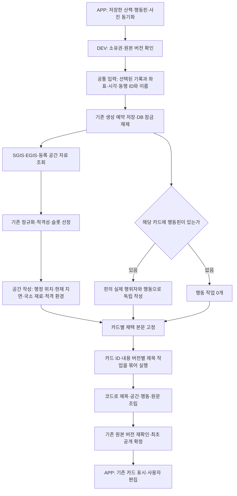

# 실제 산책 카드 작성 경로

`POST /app/walks/{walk_id}/storyboard`의 `walk-diary-board-v1` 작성기는 공간·행동·제목 작업을 실행한다. APP의 기존 `WalkDiarySync → ServerDiaryBoard → Room → WalkDiaryReader`가 이 응답을 소비한다. 별도 실험 서버나 일기 저장 테이블은 없다.

## 책임과 실제 코드

| 책임 | 코드 |
| --- | --- |
| 소유권과 입력 읽기, 접근 가능한 동행 이름 | `walk_diary_input.py:read_input` |
| 예약·공통 공개 마감·원본 변경 검사 | `walk_diary_generation.py:generate_diary`, `walk_diary_publication.py:within_budget` |
| 실제 보드 작성 진입점 | `walk_diary_board_slot_writing.py:write_board` |
| 작업 분기·병행 실행·본문 고정·제목 묶음 | `walk_diary_card_writing.py:write_cards` |
| 공간/행동/제목의 개별 작성 지시 | `walk_diary_card_prompts.py` |
| SGIS·공원·상권·EGIS 수집 | `walk_diary_space_collection.py:configured_collection` |
| 원래 SGIS 변환·선정 | `walk_sgis.py`, `diary_public_background.py`, `diary_slots.py` |
| 카드 부분과 내용 버전 계약 | `diary_card_narrative.py`, `diary_board_output.py` |
| 독립 작업의 요청·채택 결과 저장 | `walk_diary_card_receipt.py`, `walk_diary_board_storage.py` |

제목의 문체·단어 선택 정책은 제목 전략의 책임이다. 오케스트레이터는 제목만 받아 카드 ID와 내용 버전을 검사하며, 본문 수정 권한을 주지 않는다. 제목은 세션 전체 제목이 아닌 **각 카드의 `title`**이다.

## 요청 경계

- 공간 요청은 공통 동행 맥락, 기록 좌표·시각, SGIS/EGIS/환경 상태, 적격 공간·환경 재료를 받는다. `scene_structure`는 행정 위치와 현재 지면을 구별하고 나머지 재료의 참조를 유지한다. 행동핀·원문·이전 본문·관측 주체의 행동 해석은 보내지 않는다.
- 행동 요청은 공통 맥락, 카드 ID·시각, 해당 핀의 행위자 ID/확인된 이름과 행동만 받는다. 동행 목록만 보고 행위자를 선택하지 않는다. 공간 자료 조회 중에도 시작한다.
- 제목 요청은 **채택한** 공간/행동 부분, 확인된 위치와 시각, 카드 ID·내용 버전을 받는다. 사용자 원문과 미채택 후보는 보내지 않는다. 카드 12개씩 묶으며 응답 순서로 배치하지 않는다.
- 사용자 원문은 코드가 마지막에 원래 공백·개행 그대로 붙인다. APP는 조립된 본문 하나를 기존 편집기에서 편집한다. 원래 부분은 발행 근거로 보존한다.

SGIS는 기존 `sido / sigungu / dong` 정규화를 재사용한다. **APP 표시값은 기존과 동일하게 `dong`**이다. 제목 생성 여부와 별개로 `place_reference`에 저장된다. 시·구를 새로 합쳐 표시하지 않는다.

EGIS는 기존 WMS 좌표 피복 조회가 기본 경로에 포함된다(`walk_diary_space_enabled` 기본값 true, 명시적 false는 유지). 기술 분류와 출처는 보존하고 작성용 투영에서 도로→길, 자연/기타초지→풀밭, 하천→물길 등의 일상 어휘를 적용한다. 날씨는 기존 저장 관측의 시간·위치 적격성을 통과한 경우에만 사용한다.

## 실행·재사용·공개

하나의 공개 마감 안에서 작업을 제한적으로 병행한다. 본문 작성에 내부 마감을 두고 제목 시간을 남긴다. 각 작업의 실패/시간 초과는 해당 부분의 기본 결과로 끝내고, 성공한 다른 부분을 버리지 않는다. 취소를 무시한 늦은 공급자 응답에도 발행 권한은 없다.

작업 요청 지문은 그 전략의 입력·모델·프롬프트에 의존한다. 보드 전체 버전은 공간 작업의 키에 넣지 않는다. 핀의 행동 종류만 변경하면 공간 요청은 같고 행동·제목 요청만 달라진다. 기존에 저장한 독립 작업 영수증에서 **요청이 일치하는 채택 결과만** 재사용한다. 새로운 요청에는 현재 근거를 다시 연결한다.

새 작성 영수증은 기존 저장 v2 안에서 별도 형식으로 구별한다. 과거 슬롯 영수증과 공개 JSON은 그대로 읽으며, 새 필드가 없는 과거 자료의 해시도 바뀌지 않는다. 공개 이후 자동 교체와 사용자 편집 덮어쓰기를 추가하지 않았다.

## 검증 범위와 남아 있는 한계

테스트는 실제 HTTP 생성 경로에서 외부 공급자만 대체한다. SGIS는 인증→좌표 변환→행정동 조회를, EGIS는 WMS 응답→기존 정규화→슬롯→실제 작성 요청을 통과한다. 이 HTTP 응답을 APP의 공유 표본으로 사용해 동기화·Room 재개방·카드 제목/본문/행정동·편집 보존을 확인한다.

이 변경은 공급자 관계 선정기를 새로 만든 작업이 아니다. 운영 공간 입력은 현재 기존 WMS 점 피복·공원 등록점·상권 범위를 사용한다. 이전 수변 실험의 WFS 도형 간 초지/물길 인접·명명 관계를 전국 자동 선정기로 이식한 것은 아니다. 그 미구현 관계를 만들어 입력하지 않는다.

공간 조회는 공개 마감과 최대 12개 서로 다른 좌표 범위를 따른다. 나머지 위치는 미확보 상태를 남기며, 카드 수가 12개를 넘었다는 이유로 전체 작성을 중단하지 않는다. 문장 의미의 정확성·자연스러움은 형식/참조 검사가 보장하지 않는다. 이번 검증은 오케스트레이션·자료 전달·발행 보존 검증이다.
