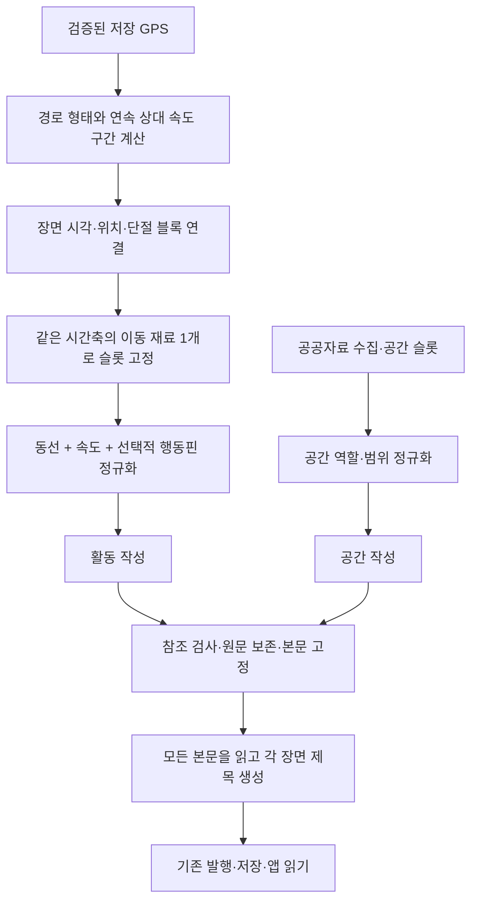

# 동선·속도를 결합한 활동 서술

2026-09-14, DEV #508·#520. 기존 카드 그래프의 실제 작성·저장·재조회 경로에 연결했다.
이 문서는 구현과 정책 선택의 이유를 기록한다. 실제 Gemini 출력 품질을 확인했다는 기록은 아니다.

## 왜 바꾸는가

이전 동선 슬롯은 관측과 개별 경로 형태가 용량 1개를 놓고 경쟁했다. 기본 카드의
`action` 작성기는 행동핀만 읽었기 때문에, 슬롯에 동선이 있어도 활동 문장으로 전달되지 않았다.
단순히 속도 후보 하나를 더 넣으면 이 단절과 경쟁이 그대로 남는다.

지금은 **같은 시간 구간의 경로 형태와 상대 속도를 한 이동 재료로 만든다.**
행동핀이 있으면 그 시점의 기록으로 함께 제공하고, 없으면 이동만으로 활동을 작성한다.
메모·사진 카드도 검증된 동선에 연결될 수 있다. 장면 선택은 기존 보드 선정기를 그대로 사용한다.



## 속도와 동선 정책

| 항목 | 현재 구현 | 결정 근거 |
| --- | --- | --- |
| 상대 저속 | 기준 속도의 0.5배 **미만** | 사용자 지정 |
| 상대 고속 | 기준 속도의 1.5배 **초과** | 사용자 지정 |
| 지속 시간 | 연속 10초 이상 | 사용자 지정 |
| 기준 속도 | canonical 구간 중 0.5m/s 이상인 구간이 5개 이상일 때 그 속도 중앙값 | 기존 계산기를 재사용한 초기 정책 |
| 기준 없음 | 속도 수식 생략, 유효한 경로 형태는 유지 | 자료 없음과 보통 속도를 구별 |
| 경계값·중간 속도 | 특별한 속도 재료를 만들지 않음 | 매번 '정상'을 덧붙이지 않음 |

기준 속도 산식은 사용자가 확정한 .5/1.5/10 조건과 구별한다. 구간별 중앙값이며
시간 가중 중앙값은 아니다. 제외한 저속 구간과 포함/제외 시간·개수를 내부 진단에 남긴다.
산책 전체가 느리면 기준이 없을 수 있다. 그때 다른 기준을 임의로 채우지 않는다.

속도 에피소드는 **장면 경계로 자르기 전에** 원래 연속 구간에서 판정한다.
12초 에피소드가 두 카드에 6초씩 걸쳐도 양쪽 적용 구간을 유지한다.
GPS 단절 양쪽의 6초를 합쳐 12초로 만들지는 않는다.
기존 관측 풀과 자동 장면 선정의 임계값은 변경하지 않았다. 새 10초 정책은
이미 선택된 장면에 제공할 재료를 늘리며, 자동 관측 카드를 더 만드는 정책은 아니다.

현재 활동은 [이동 재료 판별과 조립](diary-movement-materials.md)을 사용한다.
[기존 GEO 경로 판별기](route-patterns.md)는 과거 실험용 계약으로 유지한다.
반전만으로 되짚기를 추론하지 않고, 상대 저속을 정지나 휴식으로 바꾸지 않는다.
주체는 기록 기기의 동선이며 강아지 자체의 속도 측정이 아니다.

## 장면에 붙이는 단위

장면의 기록 시각과 위치를 같은 canonical 단절 블록에 연결한다. 낡은 위치,
임시 위치, 해당 시각의 경로에서 먼 위치, 여러 블록에 걸친 불명확한 연결은 제외한다.
같은 좌표를 왕복해도 시각이 다르면 서로 다른 진행 구간을 받는다.

장면 설명 범위는 같은 블록의 이웃 장면 시각 사이 중간점을 경계로 나눈다.
블록의 첫/마지막 장면은 해당 블록 끝까지 사용한다. 같은 시각의 장면들은 범위를 공유한다.
이는 산책 종료 후 전체 자료를 읽는 초기 정책이다. 실시간 TTL이나 장소 도착 시점을 뜻하지 않는다.
회전은 카드가 설명하는 범위에 속하는 꼭짓점으로 연결한다. 전후 지지 범위와 실제 전환
시점을 내부에서 구별하며, 전환 시각을 구간 경계로 사용한다. 시간 숫자는 모델에 보내지 않는다.

경로 형태와 속도의 시작/끝을 기준으로 이 설명 범위를 다시 나눈다. 각 `phase`에는
그 구간 전체에 유효한 근거만 들어간다. 예컨대 귀로 마지막 20초만 저속이면
앞선 귀로까지 '느리게 돌아왔다'로 확대할 재료를 만들지 않는다.
직선과 되짚기가 같은 구간에 성립하면 둘 다 제공할 수 있다.

모두 `scene_movement` 슬롯 1개에 들어가며 형태와 속도가 용량으로 경쟁하지 않는다.
늦은 공간 수집 때는 이미 고정한 이동을 다시 계산하지 않고 재사용한다.
전체 슬롯 예산에서는 이 이동 자리를 먼저 확보한다. 수집 속도 때문에 활동 입력이 바뀌지 않게 한 선택이다.

## LLM에 실제로 보내는 것

내부에는 원본 근거·판별 정책·원래 지지 구간·장면 적용 구간·해시를 보관한다.
작성 입력은 `diary-prose-input-v5`의 허용 필드로 새로 만들고, 짧은 별칭으로 연결한다.

```json
{
  "movement": {
    "materials": [{
      "id": "m1",
      "meaning": "앞서 지나온 구간을 역순으로 따라가며 오른쪽으로 완만하게 휘어 이동",
      "extent": "원래 이동 전체",
      "changes": [{"id": "m2", "scope": "이 이동의 끝부분", "meaning": "위 이동을 이번 산책의 기준보다 상대적으로 느리게 이어감"}]
    }]
  },
  "recorded_action": {"id": "a1", "actor": "보리", "action": "냄새 맡기", "connections": [{"movement_id": "m2", "relation": "이 속도가 적용되는 부분의 기록 시각"}]}
}
```

가상 예시다. 원 좌표·측정 배열·시각·지속시간·m/s·임계값·해시·탈락 사유는 보내지 않는다.
같은 원본 흐름을 한 번 적고 속도가 적용되는 부분을 연결한다. 카드 범위로 자른 뒤 의미를 조립한다.
행동핀이 없으면 `recorded_action` 자체가 없다. 동선이 없고 행동만 있으면 기존
`actor/action → text` 계약으로 작성한다. 둘 다 없으면 활동 작업이 없다.

전송 직전 선택된 이동 근거와 실제 payload·참조표의 일치를 검사한다.
정규화에서 재료를 누락하면 외부 호출 전에 `invalid_input`으로 끝내고 기본 표현을 사용한다.
전달한 모든 근거를 문장에 쓰도록 강제하지는 않는다.

응답은 `text/evidence_ids`다. 별칭을 **장면 적용 구간별 근거 목록**으로 복원하고,
다른 구간·알 수 없는 ID·중복 ID를 거절한다. 행동핀이 있으면 그 행동의 참조를 요구한다.
활동만 있는 카드에 가짜 행동 ID나 행위자를 만들지 않는다.
참조 검사는 연결의 유효성을 확인하며, 모델이 실제 문장에서 그 의미를 지켰음을 증명하지는 않는다.

## 본문·제목·호환

- 공간과 활동은 기존 그래프에서 병행한다. 저장 단계명 `action`과
  `writing.actions` 필드명은 유지하지만, 새 책임에는 이동만 있는 활동도 포함된다.
- 상대 저속/고속 관측의 새 기본 문구는 상태 관측으로 쓴다. 감속·가속을 뜻하지 않는다.
  관측 코어는 보존한다. 활동이 인용한 같은 속도 근거가 원 관측 구간 전체를 덮을 때만
  본문의 별도 관측 설명을 숨긴다. 경로 형태만 인용하거나 일부만 덮으면 숨기지 않는다.
- 사용자 원문은 공백·개행까지 보존한다. 생성 실패도 원문이나 행동 기록을 지우지 않는다.
  APP 수신 계약의 본문 2,400자 제한을 유지하며, 원문+활동 때문에 초과하면 선택적 공간 부분을 생략한다.
- 마지막 제목 작업은 원문을 포함한 **모든 확정 본문을 순서대로 읽고 각 장면의 제목을 만든다.**
  전체 산책 제목 하나를 만드는 기능이 아니다. 제목 후 본문을 합치는 LLM 호출도 없다.
- 제목 재사용은 전체 맥락에 의존한다. 다른 카드의 본문·원문·순서가 바뀌어도 제목 입력이 바뀐다.
  작성 대상은 최대 12개씩 나누지만 각 요청은 전체 맥락을 받는다. 입력 32KB 제한은 유지하며
  넘치면 일부 맥락을 잘라 보내지 않고 기본 제목으로 끝낸다.
- 생성 부분의 문체는 간결한 과거형으로 맞춘다. 행정 위치의 작성/표시 입력은 **동만** 제공하고,
  동이 없으면 전체 주소를 대신 보내지 않는다. 원문에 사용자가 쓴 주소를 수정하는 기능은 아니다.
- 공간 role은 위치 표시·지도 피복·공간 관계·조회 영역 통계·지역 관측을 구별한다.
  상권 분포는 조회 원 전체의 등록 분포이지 현재 골목의 생김새가 아니다.
- 새 내용 형식은 `diary-card-narrative-v2`, 공개 보드는 기존 `walk-diary-board-v1`이다.
  과거 v1 내용·해시는 기존대로 읽는다. 명시적 과거 슬롯 정책의 기본 동작도 유지한다.
  기본 신규 준비에는 이동 정책을 붙인다. 예전 경로 패턴 설정 플래그가 꺼져 있어도 새 이동의
  형태 판별은 기본 정책을 사용한다. 과거 공개본을 자동 재작성하지 않는다.

기존 발행 마감·동시성 4·본문/제목 예산·발행 중 원본 변경 차단은 유지한다.
활동 작업 수는 증가할 수 있으므로 이전 1개 행동 호출 실험의 지연을 새 구조의 지연으로 인용하면 안 된다.

## 코드와 확인

| 경계 | 구현 |
| --- | --- |
| 원 동선·속도 구간 계산 | `diary/route/movement.py`, `diary/route/movement_policy.py` |
| 활동용 형상·카드별 의미 조립 | `diary/route/movement_geometry.py`, `diary/board/activity_materials.py` |
| 장면 연결·통합 슬롯 | `diary/slots/movement.py`, `diary/slots/service.py` |
| 짧은 입력·세부 근거·관측 중복 | `diary/board/activity.py` |
| 실제 작업·원문·전체 제목 | `walk_diary/writing/jobs.py`, `writing/assembly.py`, `orchestration/diary.py` |
| 전송·복원 | `walk_diary/model_input.py`, `walk_diary/model_materials.py` |
| 저장·읽기 검사 | `diary/contracts/narrative.py`, `diary/board/output.py`, `walk_diary/storage/card_receipt.py` |

표는 #512·#514 리팩토링을 합친 현재 경로다. 이동 정책·슬롯 자료형·작성 실행은 분리하며
과거 저장 판독에 현재 프롬프트나 모델 SDK를 가져오지 않는다.

초기 구현 `2998a93b`에서는 관련 14개 테스트 파일의 서로 다른 185개 사례를 선별 실행해 통과했다.
마지막 회전 시각·진단 기록 변경 뒤 활동/경로 연결 사례를 다시 확인했다.
임계값과 단절, 재방문, 메모·행동, 실제 wire 누락 차단, 인용 실패,
늦은 공간 수집, 원문 길이, 저장·재조회·재사용·전체 제목 의존성을 포함한다.
외부 공급자와 DB 경계는 대역이다. 전체 저장소 스위트와 운영 DB·앱 실행은 하지 않았다.

후속 충돌 해결에서는 `081aa0ba`의 서비스/도메인 패키지와 수집·캐시 수정을 합쳤다.
관련 18개 파일의 서로 다른 233개 사례가 통과했다(97 + 19 + 116, 운영 점검 실패 1개 수정 후 통과).
예전 고정 표본은 별도 원본 커밋에서 기존 golden과 대조하여 확보했고, 과거/현재 표본의
판독 격리를 함께 확인했다. 새 패키지로 8장면을 오프라인 재생한 슬롯·결과·저장 JSON과
요약은 아래 `activity-offline-03`과 모두 일치했다. 외부 호출은 0회다.

[activity-offline-03](../../backend/evals/diary_route_scenario/activity-offline-03/summary.json)는
이전에 수집한 `public-02` 공공자료와 가상 GPS를 재생한 결과다.
8개 카드 모두 활동 작업을 거쳤고 이동+행동 1개, 이동만 7개, 전체 맥락 제목 요청 1개다.
저장 후 재조회가 일치한다. **모델 응답은 고정 대역이고 Gemini·공공 API 호출은 0회다.**
[디버그 화면](../../backend/evals/diary_route_scenario/activity-offline-03/preview.html)은
그 사실과 실제 활동 payload를 표시한다. 이 결과로 문장 품질이나 운영 지연을 주장하지 않는다.

다음 실제 출력 확인은 새 호출을 사용하기로 했을 때 진행한다. 이번 구현의 완료와
기준 속도 정책 보정·자연스러운 문장 품질·실기기 발행 확인은 구별한다.
