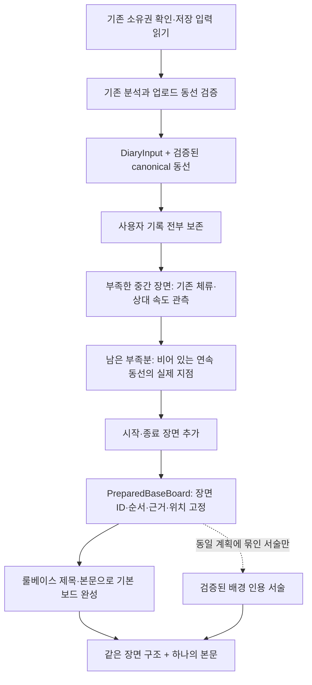

# 산책 기본 보드 — 내부 준비·조립 계약

2026-09-10, DEV `feat/walk-diary-base-board`에서 코드와 로컬 실행으로 확인했다.
이 단위는 **AI 없이도 본문이 있는 기본 보드를 만들고, 생성 전 장면 구조를 고정**한다.
기존 공개 API·저장 결과를 이 형식으로 전환하는 작업은 포함하지 않는다.

## 선택과 조립



`prepare_saved_base_board`는 기존 `read_input`과 분석 재검증을 재사용하는 내부 진입점이다.
읽기 트랜잭션은 호출자가 소유하며, 이 함수는 DB 쓰기·생성 예약·외부 호출을 하지 않는다.
`ObservationSource.evidence`는 이미 계산한 canonical 자료를 재사용하기 위한 비공개 필드다.
`DiaryInput`이나 공개 응답에 전체 GPS 배열을 추가하지 않는다.

현재 `PreparedSavedBaseBoard.slots`에는 장면 선정·조립 직후 적용한 공간·환경·동선
스탬프도 포함된다. 장면마다 같은 규칙으로 근거를 고정하고 서비스 서술 단계에 전달하는
비공개 준비 자료다. [파트 슬롯의 서비스 연결 범위](diary-part-slots.md#서비스-연결-1단계-장면별-근거-고정)를 따른다.
현재 기본 보드의 API writer는 이 파트 스탬프를 사용한다. 고정 근거의 인용과 원문 보존,
마감 처리까지의 연결은 [서술 단계](diary-part-slots.md#서비스-연결-2단계-고정-근거로-서술)에 있다.

## 장면의 중심과 장수

| 중심 종류 | 근거와 보존 규칙 | 장수 정책 |
| --- | --- | --- |
| `user_record` | 원본 액션·메모·사진, 위치·시각·수정 버전 그대로 | 목표보다 많아도 모두 보존 |
| `movement_observation` | 기존 검증된 체류·상대 저속/고속 관측 | 사용자 기록으로 부족한 중간 장면만 보충 |
| `route_checkpoint` | canonical 연속 동선 안의 실제 관측 좌표 한 점 | 관측까지 넣고도 부족한 중간 장면만 보충 |
| `session_boundary` | 저장된 시작/종료 시각 | 중간 목표 장수와 별도로 시작 1장·종료 1장 |

예를 들어 중간 목표가 5라면 일반 산책은 중간 5장 + 시작·종료 2장이 된다.
사용자 기록이 8개라면 기록 8개 + 시작·종료 2장이며, 기록을 합치거나 버리지 않는다.
사용자 기록·유효 관측·동선 지점이 모두 없다면 시작·종료 2장을 만든다.
중간 목표를 채우기 위해 가상의 행동·위치나 요약 메모를 만들지 않는다.

시작·종료가 같은 시각인 세션도 두 경계의 역할을 구분한다.
장면 수가 모자랐다는 내부 `limits`는 이용자 본문으로 출력하지 않는다.

## 동선 지점 선택

GEO에서 논의한 `distance_fill`의 연속 구간·실제 관측점 선택을 적용한다.
기존 `route_nodes`와 `uncovered` 계산을 재사용하며, 과거 selector의 8개 조회 예산이나
행동 병합 규칙은 장면 정책으로 가져오지 않는다.

1. 이미 선택한 기록·관측과 위치가 확인된 시작·종료 주변을 덮인 동선으로 잡는다.
2. 남은 **연속 구간 중 가장 긴 구간**을 찾는다.
3. 그 구간의 거리상 중점에 가장 가까운 **실제 GPS 관측점**을 선택한다.
4. 중간 목표를 채우거나 더 선택할 유효한 지점이 없을 때 멈춘다.

- 기본 간격은 동선을 따라 100m다. 지도 직선거리 100m 격자를 찍는 방식이 아니다.
- 기록을 동선의 어느 방문에 대응시킬지는 기록의 위치 시각과 연속 구간을 먼저 확인한다.
  마지막 확인 위치는 그 위치의 관측 시각을 사용한다. 실제 점과 30m 이내인 경우만
  덮임 계산에 반영한다. 이 대응으로 원본 핀의 좌표·시각을 바꾸지 않는다.
- GPS 단절·일시정지로 나뉜 블록은 따로 계산한다. 공백에 거리를 더하거나 점을 보간하지 않는다.
- 같은 장소를 다른 시각에 재방문한 것은 시간상 다른 방문으로 취급한다.
- 짧은 경로나 듬성듬성한 관측은 중간 목표보다 적을 수 있다.
- 100m/30m는 버전이 기록되는 초기 제품 매개변수이며, 통계적 신뢰도 수치가 아니다.

## 시작·종료 위치

경계 시각은 반드시 저장된 세션 시각이다. 해당 시각에 정확히 일치하는 유효 관측점이
하나일 때만 경계에 좌표를 붙인다. 늦은 첫 GPS·빠른 마지막 GPS를 경계 위치로 복사하지 않는다.
위치가 없어도 장면은 유지하고 `point: null`로 둔다. 같은 시각의 위치가 여러 개라면
한 지점을 임의로 고르지 않는다.

따라서 `출발 09:00:00 / 첫 관측 09:00:10`이면 시작 장면은 09:00:00, 위치는 없음이다.
09:00:10의 실제 동선은 경로 자료로 계속 사용할 수 있다.

## 계약·서술과 기존 결과 보존

- 계획: `walk-diary-base-plan-v1`, 결과: `walk-diary-base-board-v1`.
  기존 `walk-diary-bundle-v1`과 별개인 **내부 형식**이다.
- 기존 기록·관측의 장면 ID와 `MaterialRef`를 그대로 사용한다.
  새 지점 ID는 세션과 원본 fix, 경계 ID는 세션과 start/end에 묶는다.
  화면 번호와 AI 문장이 바뀌어도 이를 새 ID로 만들지 않는다.
- 조립 시 source·policy·canonical route로 계획을 재검증한다.
  다른 입력이나 변조된 위치·배경을 가진 계획은 조립하지 않는다.
- 모든 종류의 장면이 `title`과 하나의 `body`를 갖는다.
  메모 본문은 공백·줄바꿈까지 원문을 유지하고, 행동 코드는 기본 문장으로 표시한다.
  관측은 속도·동선 특성만 말하며 냄새 맡기·휴식 의도 등으로 추정하지 않는다.
- 선택적 `WritingReceipt`는 해당 계획 리비전에 묶인다. 현재 보유한 정확한 장면의
  배경 인용만 받아 기본 본문과 한 본문으로 조립한다. 장면 추가·삭제·이동은 할 수 없다.
  실제 LLM 호출을 이 새 계약에 연결하는 것은 다음 단계다. 인용 검사는 의미 검증과 다르다.
- 새 동선·경계 장면의 공공 배경 조회는 아직 연결하지 않았다. 현재는 기본 문장이 나오며,
  배경이 없거나 API가 실패해도 이 장면의 존재 여부가 달라지지 않는다.
- 기존 v1 API, 저장 형식, scene/writing policy, 15초 writer 설정, 리텐션 계산은 바꾸지 않는다.
  따라서 이 단위를 넣었다고 공개된 기존 보드가 무효화되거나 자동 재작성되지 않는다.

## 실행 결과

[실제 생성한 예시 JSON](examples/base-board.json)은 실제 사용자 기록이 아닌 고정 합성 산책이다.
DB 연결 없이 저장 청크·분석 모델을 만들고, 재검증 → 저장 입력 어댑터 → 기본 보드 조립을 실행했다.
LLM·공공자료 API 호출은 0회다. JSON은 검토용 장면 요약이며 전체 공개 API 응답은 아니다.

```powershell
cd backend
uv run --no-sync python -m daengs_evals.walk_base_board --output ../docs/walk/examples/base-board.json
```

| 입력 | 기대하는 결과 |
| --- | --- |
| 2km 일정 속도, 사용자 기록 없음 | 동선 지점 5장 + 시작·종료 |
| 같은 경로의 중간에 메모 1개 | 메모 1장 보존 + 빈 구간 지점 4장 + 시작·종료 |
| 늦게 잡힌 첫 GPS와 큰 관측 단절 | 시작 좌표 없음, 연속 구간별 실제 지점, 공백 보간 없음 |
| GPS 없음, 3분 세션 | 시각이 확인된 시작·종료 2장, 가상 위치·행동 없음 |

검증은 새 선택·조립 2개 파일과 기존 `test_diary_stamps.py`, `test_diary_observations.py`,
`test_diary_retention.py`로 한정했다. 총 93개 통과, 변경 파일 Ruff 통과,
`uv run --no-sync check`의 마이그레이션 이름·짝·Windows 바이트 검사도 통과했다.
전체 테스트·실제 DB·실제 LLM·폰 표시 검증은 이 단위에서 실행하지 않았다.

Windows 바이트 검사는 임시 PowerShell 스크립트를 실행한다. 로컬 실행 정책으로 차단되어
검사 프로세스에만 `PSExecutionPolicyPreference=Bypass`를 설정했다. 시스템 정책은 변경하지 않았다.

## 다음 단위

1. 새 네 종류의 장면을 보존하는 API·저장·APP 형식 협상과 같은 카드/편집기 연결.
2. 새 지점의 배경 조회와 서술 연결. 기본 장면 계획을 서술 성공 여부로 바꾸지 않는다.
3. 산책 종료 직후 준비를 시작하고, 전체 예산 안에 한 결과를 확정하는 공개 수명주기.
   초기 10초는 이 단계에서 다룬다. 현재 writer의 timeout만 먼저 바꾸지 않는다.
4. 확정 후 늦은 AI 응답 차단, 새로고침은 같은 작업 조회, 기존 공개·수정 보드 보존.

이번 함수는 내부에서 언제든 기본 보드를 조립할 수 있게 한다. 사용자에게 임시 보드를 먼저
보여준 뒤 자동 교체하겠다는 의미가 아니다. 공개 시점과 편집 허용은 후속 수명주기에서 결정한다.
