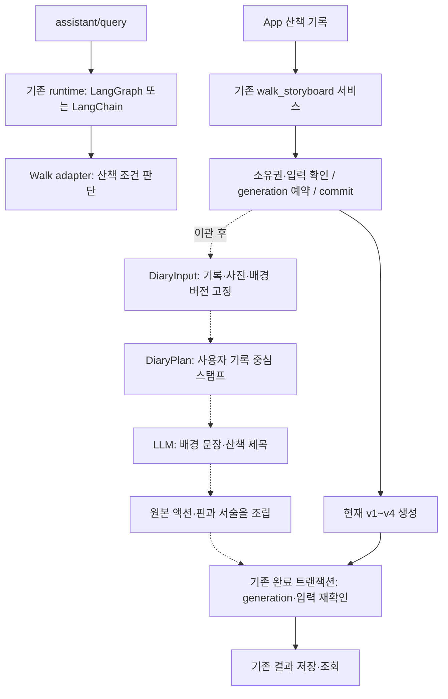

# 산책 일기 입력·출력 계약

이 문서는 이관 1단계의 계약을 설명한다. 후속 [생성 연결](diary-generation.md)이
기존 HTTP API와 LLM 작성을 연결하며 새 형식의 기본 활성화 값은 false다.
기준: Dev `01a7bbe`, Geo `walk-input-v1` 실험. 관련 작업은 [Dev #370](https://github.com/SAJOYO/DAENGS_dev/pull/370).
합성 자료로 계약을 검사했으며 실제 산책·공공데이터·LLM 품질을 평가한 결과는 아니다.
후속 구현은 [저장 입력](photo-metadata.md), [장면 선택·스탬프](diary-stamps.md),
[확정 동선 관측 공급](diary-observations.md)에 정리한다.

## 기존 오케스트레이션에 붙이는 위치

공통 오케스트레이션의 `WalkCapabilityAdapter`는 **산책 전 조건 판단**이다. 일기 생성은
기존 `services/walk_storyboard.py`의 **종료 산책 생성 수명주기**를 확장한다.
별도 LangGraph, 중복 작업 큐, 두 번째 generation 테이블을 만들지 않는다.



점선은 다음 이관 단계에서 연결한다. 이번 PR은 라우터, DB, 공개 응답 union,
`CapabilityName`, `WalkPayload`, 상태 집계 또는 두 오케스트레이터의 라우팅을 바꾸지 않는다.
향후 assistant에서 일기를 호출해도 공유 adapter가 같은 도메인 서비스에 위임해야 한다.
새 capability·권한·라우팅을 승인하기 전에는 `requested_capability=walk`를 일기로 해석하지 않는다.
공통 규칙은 [오케스트레이션 계약](../orchestration/contracts.md), 도메인 생성 흐름은
[현재 스토리보드](storyboard-live.md)가 정본이다.

## 코드의 책임

| 파일 | 구현한 경계 |
| --- | --- |
| [`diary_input.py`](../../backend/src/daengs_walk/diary_input.py) | 인증 후 도메인 입력, 원본 시각·위치·버전, 저장 배경의 근거 연결과 입력 해시 |
| [`diary_output.py`](../../backend/src/daengs_walk/diary_output.py) | 준비된 스탬프·딕셔너리·모델 응답·앱용 결과 계약, 근거 범위 검사와 원본 조립 |
| [`walk_diary_contract.py`](../../backend/src/daengs_backend/services/walk_diary_contract.py) | 기존 `PrincipalContext` 재사용, 생성 예약 바인딩, 완료 시 버전 검사 |

`daengs_walk`는 HTTP·DB·provider를 모른다. 서비스의 `require_owner()`는 기존
repository `owned()`를 대체하지 않는다. 이미 인증되고 소유권을 조회한 입력을 받는 추가 검사다.
`ADMIN`의 산책 조건 조회 권한으로 개인 일기를 읽을 수는 없다.

## 입력: `walk-diary-input-v1`

| 필드 | 의미 |
| --- | --- |
| `owner_id`, `walk_id`, `client_session_id` | 인증된 소유자, 서버 산책 ID, App 세션 ID. 서로 대체하지 않음 |
| `started_at`, `ended_at`, `pet_ids`, `evidence_origin` | 세션 범위와 참여 동물, device/mock/mixed/unknown 출처 |
| `route` | 확정 분석 ID·입력 fingerprint·계산 버전 또는 unavailable 사유. 원본 GPS는 도메인 서비스가 이 참조로 읽음 |
| `records` | 행동·메모·사진 메타데이터 원본과 삭제 tombstone. 입력 보존 상한 400개이며 표시 목표 장수와 별개 |
| `photos_status` | `complete`: 동기화된 목록(0개 포함), `not_available`: 서버에 사진 목록이 없음, `pending`: 동기화 도중 |
| `observations` | 확정 분석에서 준비한 체류·높은/낮은 속도 관측. 주체는 항상 `recording_device`, 행동 의미는 `not_inferred` |
| `backgrounds`, `selected_background_ids` | 저장한 배경 봉투와 이번 준비에 사용할 봉투 선택 |
| `scene_policy_version`, `writing_policy_version` | 선택·서술 정책을 변경했을 때 이전 결과와 구분하는 버전 |

공통 assistant 모델은 문자열을 trim하므로 메모 원문은 별도 `DiaryContract`로 보존한다.
원본 서버가 이미 trim한 내용까지 복원하지는 않는다. 사진은 `media_ref`와 메타데이터 버전만
받으며 파일 전송·이미지 해석을 구현한 것이 아니다. 저장 revision이 없는 로컬 자료의 `sha256`는
메타데이터 버전이며 사진 바이너리의 무결성 증명이 아니다.

`RecordRef`는 저장소·ID·내용 revision(또는 해시)·`pin_revision`을 분리한다.
`Anchor`는 `event_at`과 `location_at`을 별도 보존한다. 이전 위치를 복사한 핀을 이벤트 시각의
관측으로 바꾸거나, 근처 경로점에 강제로 스냅하지 않는다. 추정 핀은 서로 다른 pause chain을
연결할 수 없다. 위치가 없는 기록은 `point=null`로 남고 카드에서 사라지지 않는다.

행동 핀 v2는 [별도 진행 중인 #357](https://github.com/SAJOYO/DAENGS_dev/pull/357)의
`revision`/`pin_revision` 분리를 확인해 반영했다(확인 head `77ab1db`). 이번 계약이 v2 DB나
어댑터를 가져온 것은 아니다. v2의 전체 추정 이력·불확실성은 원본 pin 저장소의 소유이며,
다음 어댑터가 필요한 표시 정보를 추가로 투영해야 한다. 해당 PR의 storyboard 409 가드는
이 소비자와 런타임이 연결될 때까지 제거하지 않는다.

### 배경과 버전

`SavedBackground`는 provider·payload schema·정책 버전·조회 중심·조회 시각·원본 payload/hash를
함께 가진다. `target`은 내용과 앵커를 포함한 **그 재료 전체의 해시**에 묶인다. 핀 수정 후
예전 위치에서 받은 배경은 현재 봉투로 재사용할 수 없다. 공간/환경 조회 중심은 대상 핀과 같아야
하며, provisional 핀에서는 성공한 공간 배경을 받지 않는다. 시간 태그를 추가해 이 검사를 우회할 수 없다.

앞 장면과 비교한 공간 관계는 `supporting_targets`에 이전 재료의 버전도 묶는다.
현재 핀이 그대로여도 이전 핀이 수정/삭제되면 그 비교 배경을 다시 준비해야 한다.

조회 시점 자료(`lookup_snapshot`)와 사건 시점 관측(`event_observation`)을 구분한다.
후자는 유효 시간 범위가 해당 이벤트를 포함해야 한다. 출발 때 날씨를 하루 전체 장면에 복제하지 않는다.
`empty`는 조회 결과가 비었다는 뜻이며 `unavailable`/`not_requested`와 다르다.
동 주소, 공원·하천 관계는 해당 provider가 실제 지원한 자료만 준비한다.

`DiaryInput.revision()`은 UTC 정규화 후 모든 입력·정책을 해시한다. 기록/봉투의 조회 순서만
바뀌면 같은 revision이다. 내용, 삭제, 핀 버전, 분석, 사진 수집 상태, 배경 선택 또는 정책이
바뀌면 다른 revision이다. 가변 payload를 다시 검사하므로 모델 객체 생성 후 dict 변조도 탐지한다.
이 해시는 인증 서명이나 신뢰하지 않는 외부 입력의 소유권 증명이 아니다.

## 준비된 스탬프와 생성 응답

`DiaryPlan`은 입력 revision에 묶인 순서 있는 `SceneStamp` 목록이다. 현재 단일 사이클은
스탬프 하나에 원본 기록 또는 관측 하나를 둔다. 관련 기록을 하나로 편집하는 정책은 이번에 새로
열지 않는다. 사용자 기록은 전부 보존하고, 목표 장수가 부족할 때만 관측을 보충할 수 있다.
목표 장수보다 기록이 많아도 자르지 않으며, 근거가 부족하면 목표 장수에 못 미쳐도 허용한다.
장면 번호는 이벤트 시간순이고 같은 시각에서는 원본 identity로 정렬한다. 화면 페이지와 생성 요청 분할은 별도다.

`BackgroundPiece`는 시스템이 미리 다진 딕셔너리이며 `place_reference`(동까지의 절대 위치),
`space_relation`(상대 공간 관계), `environment`, `time`으로 구분한다. HOW는 이 딕셔너리에 없다.
체류/속도 관측은 보충 장면의 중심 근거일 수 있지만, 직진·회전 등 동선 HOW 표시가 서술을
마지막에 덮어쓰지 않는다. 이 계약은 준비된 조각이 선택된 봉투/동일 재료에 연결됐는지 검사한다.
**payload에서 facts를 계산하는 투영 알고리즘의 정확성은 별도 어댑터/커널 검증 대상**이다.

모델의 출력에는 다음 필드만 있다.

```json
{
  "title": "산책 전체 제목",
  "scenes": [
    {"scene_id": "scene-0", "text": "공원이 가까이에 있었다.", "evidence_ids": ["bg-0"]},
    {"scene_id": "scene-1", "text": null, "evidence_ids": []}
  ]
}
```

좌표·시각·사용자 액션·HOW·장면 제목을 수정하는 응답 필드는 없다. 장면별 절대 위치는 별도
표시하므로 배경 문장 근거에 포함하지 않는다. 쓰기 대상 장면은 정확히 한 번 응답해야 하며,
장면 간 근거를 섞거나 배경이 없는 장면을 추가할 수 없다. `WritingReceipt.plan_revision`은
모델이 알려주는 값이 아니라 **호출 직전 서버가 붙이는 바인딩**이다.

`assemble_diary()`가 원본 기록/관측과 앵커를 복사하고 LLM 배경만 별도 필드에 넣는다.
완성 계약은 `walk-diary-bundle-v1`이다. `model_status`, `title_origin`, `failure_code`로
미호출·성공·실패를 구분하고, 근거가 없거나 문장을 생략해도 원본 카드는 보존한다.
실패/미호출의 날짜 제목은 시스템이 만든다. `semantic_status=not_evaluated`는 근거 ID 검사만으로
문장이 사실이라고 증명하지 않았음을 뜻한다. 모델이 문장 안에 행동을 섞는 문제까지 스키마가 막지는 못한다.

새 bundle의 명시적 HTTP 형식은 [생성 연결](diary-generation.md)에 등록한다.
기존 v1~v5를 새 형식으로 조용히 바꾸지 않는다.
[기존 v3/v4의 LLM 장면 제목](diary-titles.md)은 그대로이며, 새 일기 형식은 Geo에서 확인한
산책 전체 제목만 사용한다. 개별 장면 제목을 원하면 별도 근거·표시 정책으로 확장한다.

## 생성 예약·재사용·완료

1. 기존 인증/`owned()`와 완료 산책 검사를 통과한 자료를 일관된 snapshot으로 만든다.
2. `pending` 사진 동기화는 예약 전에 기다린다. `not_available`는 누락 상태를 보존한 서버 전용 입력으로 허용한다.
3. 기존 `walk_storyboard`의 input revision 비교·60초 running lease·generation 증가·commit을 재사용한다.
   새로운 경로를 연결할 때는 format과 위 `DiaryInput.revision()`을 기존 fingerprint의 재료에 추가해야 한다.
4. 예약된 generation에 `bind_generation()`으로 ticket을 묶고, 입력과 plan을 고정한 뒤 제공자 호출을 한다.
   DB lock을 잡은 채 LLM을 기다리지 않는다.
5. 완료 시 기존 서비스처럼 잠금을 다시 잡고 최신 입력을 재조회한다. `require_current()`가 소유자·서버/앱 ID·
   generation·입력 revision을 검사한다. 이후 같은 고정 plan에 대한 `assemble_diary()` 결과를 저장한다.
   두 검사 모두 통과해야 하며, 도중 입력이 바뀐 완료는 `StaleDiaryGeneration`으로 버린다.

helper가 직접 DB 예약이나 원자적 저장을 하는 것은 아니다. `walk_diary_generation`이 위 검사를
기존 트랜잭션 안에 넣는다. 공개 pending/running/ready/failed/stale 수명주기는 기존 서비스에 남긴다.
LLM 실패는 사용자 권한 거부와 다르며 공통 오케스트레이션에서도 ERROR/TIMEOUT과 REFUSED를 혼동하지 않는다.
assistant graph/trace에는 raw GPS, 메모 원문, provider 원문을 복사하지 않는다.

## 확인과 다음 단위

검사는 `backend/tests/walk/diary/test_diary_contract.py`와 기존
`tests/walk/storyboard/test_walk_storyboard.py`, `tests/test_orchestration_contracts.py` 범위다.
소유권·세대 경쟁, 메모/사진/삭제 보존, 핀 변경 후 배경 무효화, 시간 범위,
관측의 부족분 보충, 별도 위치 표시, 다른 장면 근거 거부, 모델 실패 시 원본 보존을 확인한다.
외부 API·운영 DB·실제 LLM 호출은 없다. 데이터베이스 통합과 실제 사용자 E2E는 남아 있다.

2026-09-09 최종 실행: 위 세 파일 **72 passed**, 변경 Python 네 파일 Ruff 통과.
기존 FastAPI/Starlette의 httpx 사용 경고 1건이 있었다. 전체 로컬 스위트는 실행하지 않았다.

```powershell
uv run --no-sync python -m pytest tests/walk/diary/test_diary_contract.py tests/walk/storyboard/test_walk_storyboard.py tests/test_orchestration_contracts.py -q
uv run --no-sync ruff check src/daengs_walk/diary_input.py src/daengs_walk/diary_output.py src/daengs_backend/services/walk_diary_contract.py tests/walk/diary/test_diary_contract.py
```

이번 워크트리는 기존 Dev venv를 `UV_PROJECT_ENVIRONMENT`로 재사용하고,
`PYTHONPATH`를 **이 워크트리의 `backend/src` 절대 경로**로 지정해 새 코드를 검사했다.

후속 **App 사진 메타데이터 동기화와 Dev 입력 어댑터 연결**의 구현과 검증은
[photo-metadata.md](photo-metadata.md)에 정리한다. 실제 저장 자료를 연결한 뒤
Geo의 선택·스탬프 계산기를 이식한다.
LLM 딕셔너리·제한된 단일 호출·HTTP 새 format은 [생성 연결](diary-generation.md)에 정리한다.
공공데이터 공급 확장, 여러 호출 분할·의미 검증·App 렌더링은 후속 단위다.
