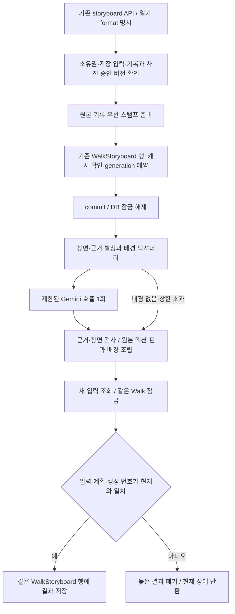

# 산책 일기 배경 작성과 생성 수명주기

[Dev #378](https://github.com/SAJOYO/DAENGS_dev/pull/378).
[스탬프 선택](diary-stamps.md)과 [확정 동선 관측](diary-observations.md)을 기존
`walk_storyboard` API의 명시적인 새 형식에 연결한다.
기본 활성화 값은 false이며 App 표시 전환과 운영 설정 변경은 이번 단위에 포함하지 않는다.

## 실행 경계



`walk_storyboard_state`에 기존 캐시·60초 lease·예약·완료 처리를 추출해 이전 형식과
새 일기가 함께 사용한다. `walk_diary_generation`은 이 API의 일기 분기다.
추가 generation 표, 작업 큐, 공통 assistant capability나 LangGraph를 만들지 않는다.

예약 시 `bind_generation()`, 완료 시 `require_current()`를 실제 저장 트랜잭션 안에서 호출한다.
모델을 기다리는 동안 DB 트랜잭션과 Walk 잠금이 없다.
완료 시 입력 어댑터가 identity map을 비우고 원본을 다시 읽는다.
관측 원본의 디코딩과 재계산 시간은 여전히 준비 단계 비용이다.

## LLM에 전달하는 재료

`daengs_walk.diary_writing.prepare_writing()`이 확정된 선택·투영을 검증한 뒤 만든다.

| 필드 | 역할 |
| --- | --- |
| `session_time` | Asia/Seoul 시간대로 표시한 산책 시작·끝 |
| `title_context` | 시간순 장면의 사용자 기록 또는 기기 관측. 제목 전용 참고 자료 |
| `background_dictionary` | 시설 이름·등록 위치까지 거리·자료 시점·위치 산출 방식/불확실성 |
| `scenes` | 문장을 쓸 장면과 그 장면에 허용된 배경 별칭 |

장면은 `s1`, 근거는 `e1`처럼 짧게 바꾼다. 별칭에서 실제 스탬프·근거 ID로 돌아가는
대응표와 plan revision은 서버에만 둔다. 좌표열, 계정·동물·사진 ID, 파일 위치, 원본 provider
행이나 URL은 별도 필드로 보내지 않는다. 사용자가 메모 본문에 직접 쓴 정보까지 익명화하는
기능은 아니며, 메모 본문은 제목 참고 자료로 보존해 전달한다.

사용자 행동·메모·사진과 관측은 원본 조립기가 화면용 자료로 복사한다. 모델 응답에는
그 원본이나 앵커를 수정하는 필드가 없다. 동선의 직진·회전 HOW는 배경에 포함하지 않는다.
체류·속도 관측은 `recording_device / not_inferred`로 구별하며 사람·동물의 행동으로 바꾸지 않는다.

현재 지원 배경은 이미 투영된 `place-nearby-v1`이다. 등록 위치까지의 거리이며 실제 방문이나
행동 장소의 확정이 아니다. 조회 시각 `retrieved_at`과 위치 샘플 시각 `location_at`을 함께
전달한다. 공원 면·하천 선·동 주소·날씨를 새로 수집하거나 관계를 계산하지 않는다.
관측 중심에 사용자 핀의 배경을 복사하지 않으므로 관측만 있는 산책은 배경이 없을 수 있다.

프롬프트는 짧은 회상형 일기체와 자료 범위에 집중한다. 장면 선택·순서 결정·공간 계산을
모델에게 다시 맡기지 않는다. 반복되거나 쓰기 어려운 배경은 null로 생략할 수 있다.
응답 스키마는 해당 호출의 장면/근거 별칭을 열거하며, 수신 후에도 누락·중복·다른 장면의
근거·추가 필드를 검사한다. 대응표로 복원한 결과는 기존 `assemble_diary()`를 통과해야 한다.

문장에 행동·방문 등의 의미를 잘못 섞었는지는 이 ID 검사만으로 증명할 수 없다.
`semantic_status=not_evaluated`를 유지한다. 실제 모델의 문장 품질 검토는 별도다.

## 호출과 실패 정책

`walk_diary_writing`은 기존 Gemini 키 설정과 async SDK 사용 방식을 따른다.

| 항목 | 현재 상한 |
| --- | --- |
| 모델 | `gemini-3.1-flash-lite` |
| 호출 / SDK 재시도 | 생성 시도당 1회 / 추가 재시도 없음 |
| 응답 대기 | 15초 |
| 입력 JSON | UTF-8 32,000바이트 |
| 배경 작성 대상 | 최대 12장 |
| 출력 | 8,192토큰 / 수신 본문 64,000바이트 |

이 상한은 장면 보존 수와 다르다. 사용자 기록은 목표 장수보다 많아도 모두 남는다.
12장은 LLM이 이번 호출에서 배경을 쓸 장면의 상한이다.
상한을 넘으면 앞부분만 잘라 쓰지 않고 모델 작성을 생략하며 원본 카드를 전부 조립한다.
여러 호출로 분할해 모두 서술하는 기능은 이번 단위에 없다.

- 배경이 전혀 없으면 호출하지 않고 `model_status=not_requested`, 시스템 날짜 제목을 사용한다.
  따라서 사용자 기록만으로 제목 생성만 하는 별도 호출도 현재는 없다.
- 입력 상한 초과는 `budget_exceeded`, 제공자·시간 제한 실패는 `provider_failed`,
  잘못된 응답은 `invalid_response`다.
- 위 선택적 작성 실패는 원본 카드가 있는 ready 결과로 저장하고,
  bundle의 `model_status=unavailable`와 failure_code로 구분한다.
- 같은 입력을 다시 요청해도 자동으로 모델 비용을 쓰지 않는다. 재시도는 `refresh=true`로 한다.
- 요청 취소는 fallback으로 삼키지 않는다. running lease 만료 후 다음 요청이 새 generation을 예약한다.
- 준비/조립 자체가 예기치 않게 실패하면 최상위 상태는 failed와 `diary_generation_failed`다.

요청 캐시 revision은 입력·스탬프 정책·모델·프롬프트 해시·호출 상한을 함께 반영한다.
모델에 입력/plan 해시를 되돌려 달라고 요구하지 않는다.
한 산책에는 기존 생성 행 하나만 있으므로 이전 형식과 일기는 서로 다른 revision이다.
다른 형식의 캐시를 요청하면 stale과 빈 bundle을 반환하며 잘못 변환하지 않는다.
이전 앱과 새 앱이 번갈아 생성을 요청하면 같은 행의 generation이 전진할 수 있다.

## HTTP 사용 계약

`DAENGS_WALK_DIARY_ENABLED=true`인 서버에서만 새 형식의 생성·조회를 허용한다.
기존 v1~v5 경로와 기본 요청 형식은 유지한다.
이 설정을 내리면 새 일기 접근은 닫히지만 기존 기록/사진 저장 데이터를 지우지 않는다.

인증된 `GET /app/walks/storyboard/capabilities`의 `diary_formats`로 지원을 확인한다.

```json
{
  "bundle_format": "walk-diary-bundle-v1",
  "target_scene_count": 5,
  "expected_entries": {},
  "expected_photo_manifest": null,
  "refresh": false
}
```

위 본문을 기존 `POST /app/walks/{walk_id}/storyboard`에 보낸다.
목표 장수는 1~50의 명시적 선택이며 서버가 제품 기본 장수를 정하지 않는다.
행동·메모가 있으면 삭제 tombstone을 포함한 최신 ID/revision을 expected_entries에 보낸다.
사진 manifest가 있으면 승인된 `{publisher_id, revision}`을 전달해야 한다.
서버에 목록이 없는 경우만 null이 일치한다. 기록/사진 버전 불일치는 409다.

클라이언트는 기록과 사진 동기화를 완료한 뒤 요청해야 한다. 서버가 마지막 승인한 버전과
일치한다는 검사가 아직 전송되지 않은 오프라인 편집까지 검증하지는 않는다.
출처·사진 내용은 서버 저장 자료로 준비하며 클라이언트가 LLM용 딕셔너리를 직접 보내지 않는다.

조회는 `GET /app/walks/{walk_id}/storyboard?bundle_format=walk-diary-bundle-v1&target_scene_count=5`다.
새 응답은 `format=walk-diary-response-v1`이며 기존 상태·generation·entry_revisions와 함께
사진 수집 상태/manifest, 목표 장수, 준비 개수/부족 사유, `walk-diary-bundle-v1`을 반환한다.
최상위 input_revision은 생성 캐시용이며 bundle.input_revision은 원본 snapshot용이다.
목표·작성 정책이 캐시 revision에 추가되므로 두 값을 동일시하지 않는다.

## 검증

로컬 테스트 범위는 작성·새 생성·계약·선택·기존 storyboard/핀/제목·설정·가벼운 앱 기동이다.
첫 실행에서 130 passed/12 failed였고, 실패는 새 fixture의 시각과 누락 필드를 수정했다.
수정한 두 파일은 26 passed, 기존 통과 범위와 합쳐 **142개를 확인**했다.
이후 자료 조회/위치 시각과 프롬프트 해시를 추가하고 작성·생성 2개 파일을 다시 실행해
26 passed를 확인했다. 이는 위 142개 안의 회귀 검사이며 추가 26개를 뜻하지 않는다.
전체 로컬 스위트는 실행하지 않는다.

```powershell
uv run --no-sync python -m pytest tests/walk/test_diary_writing.py tests/walk/test_diary_generation.py tests/walk/test_diary_contract.py tests/walk/test_diary_stamps.py tests/walk/test_walk_storyboard.py tests/walk/test_walk_storyboard_titles.py tests/walk/test_storyboard_pins.py tests/walk/test_storyboard_observations.py tests/test_config.py tests/test_main_stays_light.py -q
uv run --no-sync python -m pytest tests/walk/test_diary_writing.py tests/walk/test_diary_generation.py -q
uv run --no-sync python -m pytest tests/walk/test_diary_generation_db.py -q -rs
```

로컬 PostgreSQL 검사는 전용 DSN이 없어 1 skip이다.
기존 `walk entry v2 PostgreSQL` CI에 같은 테스트를 추가했다.
별도 disposable DB에서 모델 대기 중 사진 변경이 commit되는지, 새 입력 generation을
늦은 완료가 덮지 못하는지, JSONB 저장과 계정 삭제 cascade를 검사한다.
원격 결과는 PR의 해당 커밋 검사 상태를 따른다.

작성 테스트의 모델 응답은 대체 응답이고 동선은 합성 좌표다.
실제 Gemini 호출·사용자 GPS·기기 화면·운영 설정 변경을 수행한 결과가 아니다.
App 표시 전환, 실제 생성 품질·긴 동선의 준비 시간, 새 배경 공급자와 여러 호출 분할은 남아 있다.
