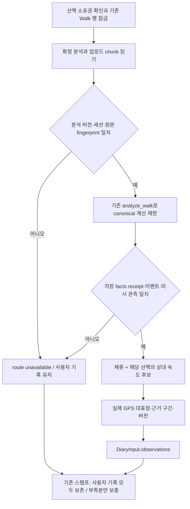

# 확정 동선의 일기 관측 후보

[Dev #377](https://github.com/SAJOYO/DAENGS_dev/pull/377).
[저장 입력](photo-metadata.md)과 [기록 중심 스탬프](diary-stamps.md) 사이에 실제 저장 동선의
관측 공급자를 연결한다. 기존 내부 `prepare_saved_diary()`까지 구현했으며,
이 단위에서는 HTTP 생성·LLM·App 표시를 연결하지 않았다.
후속 서버 생성 연결은 [diary-generation.md](diary-generation.md)에 정리한다.

## 실행 흐름



서비스 어댑터는 `walk_diary_observations.prepare_observation_source()`,
순수 공급자는 `daengs_walk.diary_observations.build_observation_pool()`이다.
기존 `route_nodes()`와 `session_speed_baseline()`을 추출해 양쪽에서 재사용한다.
옛 선택기의 과거 산책 비교·경로 빈 구간 채우기·사용자 행동 선택은 새 공급자가 호출하지 않는다.

입력 읽기는 기존 `walk.get_owned_for_update()`로 points·pets·analysis_state를 함께 읽는다.
호출자가 트랜잭션을 소유하며 기존 flush/identity-map 갱신·소유권 검사는 유지한다.
새 쿼리·스키마·작업 큐·생성 예약은 없다. 원본 디코딩과 계산 재현은 이 준비 호출 안에서
이뤄지며, 외부 API를 기다리지 않는다. 공개 생성 경로에 붙일 때 긴 동선의 준비 시간과
잠금 보유 시간은 실제 운영 입력으로 확인해야 한다.

## 관측의 의미와 기준

`diary-canonical-motion-v1`은 기존 계산 임계값을 사용하는 공급 정책이다.
사용자의 실제 행동을 판정하는 모델이나 통계적 이상 검정은 아니다.

| 후보 | 공급 조건 |
| --- | --- |
| `observed_dwell` | canonical 구간의 속도가 0.5 m/s 미만으로 10초 이상 이어진 기존 체류 이벤트 |
| `observed_slow` | 해당 산책 기준 속도의 0.5배 미만인 연속 구간이 20초 이상 |
| `observed_fast` | 해당 산책 기준 속도의 1.75배 초과인 연속 구간이 20초 이상 |

기준 속도는 0.5 m/s 이상인 구간 속도가 5개 이상일 때 그 중앙값이다. 시간 가중 중앙값이나
과거 개인 기준이 아니다. 표본이 모자라면 상대 속도 후보를 만들지 않는다.
빠른 구간은 달리기, 느린 구간은 냄새 맡기, 체류는 휴식으로 바꾸지 않는다.
모든 후보의 주체는 `recording_device`, 행동 의미는 `not_inferred`다.

위치 정제·관측 공백 경계는 기존 canonical 계산을 따른다.
정확도 50m 초과, 시각 역전, 세션 시간 밖, 200m 초과 점프, 60초 초과 공백,
명시적인 pause chain 변경을 가로질러 구간을 만들지 않는다.
정확도 미상은 기존 계산대로 허용하되 미상으로 유지한다. 이번 단위는 새 GPS 평활화나
잡음 제거 알고리즘을 추가하지 않는다. canonical 허용 관측 상한은 기존 20,000점이다.

체류 이벤트의 평균 좌표는 GPS 원본점과 다를 수 있다. 따라서 해당 이벤트를 구성한
실제 구간을 복원하고, 시간 중간에 가장 가까운 원본점을 대표 위치로 고른다.
속도 후보 역시 기존 선택기가 고른 원본 관측점을 쓴다.
대표점은 행동이 그 시각에 일어났다는 추정이 아니라 구간 표시용 위치다.

각 후보에는 시작·끝 시각, 대표점의 시각·정확도·원본 `client_seq/chain_index`,
분석 ID와 버전 해시가 붙는다. 해시는 정책, 확정 분석 참조, 근거 GPS 구간,
계산 측정값과 앵커를 포함한다. 저장 chunk의 조회 순서만 달라지면 같은 입력이며,
분석이 교체되면 관측 버전과 `DiaryInput.revision()`이 달라진다.
`device/mock/mixed/unknown`은 확정 동선의 출처 표시를 그대로 전달한다.

## 스탬프에 올리는 정책

공급과 선택은 별도다. 입력 풀은 최대 200개이며 체류 우선, 같은 종류 우선순위에서는
긴 구간·대표 시각·ID 순으로 수용한다. 반환은 시간순이다.
`InputAssembly.observation_source.pool`에 전체 후보 수, 상한 제외 수,
기준 속도와 공급 정책 버전을 남겨 잘린 후보가 있었는지 확인할 수 있다.

기존 스탬프 정책이 사용자 행동·메모·사진을 전부 먼저 보존한다.
목표가 부족할 때만 후보를 보며, 기록 시점 주변과 이미 선택된 관측 구간의 기본 20초
여유 범위는 중복 후보에서 제외한다. 체류와 상대 저속이 같은 구간에서 검출돼도
중복 장면으로 채우지 않는다. 기록이 목표보다 많으면 기록을 자르지 않는다.

검사에 사용한 5분 30초 합성 동선에는 체류, 상대 저속, 상대 고속이 따로 있다.

| 입력 / 목표 | 결과 |
| --- | --- |
| 사용자 기록 없음 / 3장 | 관측 3장 |
| 체류 중 메모 1개 / 3장 | 메모 1장 + 다른 구간 관측 2장 |
| 메모 4개 / 3장 | 메모 4장, 관측 보충 없음 |
| 마지막 사진 1개 / 4장 | 사진 1장 + 관측 3장 |
| 쓸 수 있는 관측 없음 / 3장 | 부족분 3을 그대로 보고 |

상한 밖 후보를 스탬프 단계에서 다시 가져오지는 않는다. 상한 안 후보들이 기록과
겹치면 부족분이 남을 수 있으며, 현재는 재검색이나 억지 채우기를 하지 않는다.
관측 주변의 새 Place·공원·하천·동 주소·날씨 조회도 이번 공급자의 책임이 아니다.
기존 사용자 기록에 묶인 배경을 관측 위치로 복사하지 않는다.

## 사용할 수 없는 원본

| route.reason | 의미 |
| --- | --- |
| `analysis_not_finalized` | 분석이 없거나 Walk가 derived 상태가 아님 |
| `unsupported_analysis_version` | 현재 계산 버전으로 재현할 수 없음 |
| `analysis_session_mismatch` | 산책 ID 또는 시작·끝 시각 불일치 |
| `analysis_replay_mismatch` | 유효한 저장 분석이 원본 재계산 결과와 다름 |
| `invalid_analysis_source` | chunk 누락·fingerprint·분석 payload/summary 등 검증 실패 |

이 경우 `route=unavailable`, 관측 풀은 비어 있고 사용자 기록은 유지한다.
검증되지 않은 분석 ID를 ready로 전달하지 않는다. 원본 GPS나 메모를 오류 로그에 넣지 않는다.
확정됐지만 점이 없거나 충분한 후보가 없는 입력은 `route=ready`와 빈 풀을 구별해 반환한다.

`assemble_input()`의 선택적 `observation_source`는 오프라인 계약 자료도 읽기 위한 접점이다.
실제 저장 경로인 `read_input()`은 반드시 위 검증 공급자를 호출한다.
분석 참조만 넣은 순수 fixture를 실제 업로드 동선 검증으로 보고하지 않는다.

## 확인 범위와 다음 연결

로컬에서 아래 6개 파일 **144 passed**. 새 공급자에서 chunk 인코딩·확정 manifest·분석 저장
형식을 실제 코드로 만들고, 저장 형식부터 입력·선택·결과 조립까지 검사했다.
일시정지·관측 공백·불량 좌표·짧은 관측, 변조·미지원 분석, 실제 대표점,
상한과 출처 구분도 포함한다. 공유 함수를 추출한 기존 스토리보드 회귀 검사도 통과했다.
이후 평균 좌표와 실제 대표점이 다른 체류 및 밀리초 시각 보존 케이스 1개를 추가해
해당 케이스만 실행했고 **1 passed**, 합계 145개를 확인했다.

```powershell
uv run --no-sync python -m pytest tests/walk/test_diary_observations.py tests/walk/test_walk_photo_input.py tests/walk/test_diary_stamps.py tests/walk/test_diary_contract.py tests/walk/test_storyboard_observations.py tests/walk/test_walk_storyboard.py -q
uv run --no-sync python -m pytest tests/walk/test_diary_observations.py::test_dwell_anchor_uses_a_real_fix_instead_of_the_average_position -q
```

좌표는 합성 자료이며 DB 조회 경계는 mock이다. 실제 PostgreSQL 경쟁, 실사용자 GPS,
기기 화면, 공공데이터와 LLM 호출은 검증하지 않았다. 기존 Starlette/httpx 경고 1건이 있었다.
전체 로컬 스위트는 실행하지 않는다. 변경 파일 Ruff와 PR CI 결과는 PR에 별도 기록한다.

후속 [배경 작성·생성 연결](diary-generation.md)은 이 스탬프를 배경 딕셔너리와 제목 작성에
넘기고 기존 예약·완료 트랜잭션에서 고정 입력의 버전을 확인한다.
관측을 사용자 행동 서술로 바꾸거나 LLM이 원본 기록을 덮어쓰게 하지 않는다.
