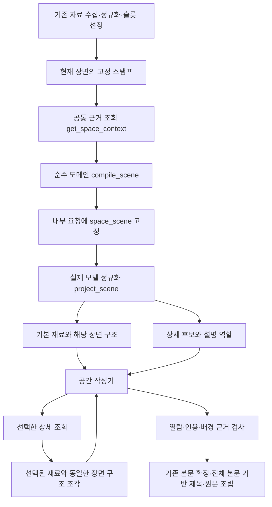

# 선정 근거를 공간 맥락으로 조립하기

**후속 수정:** 사용자 요청으로 공간·행동 프롬프트의 작성 예시와 공통 예시 안내를 모두 제거했다.
작성 정책은 v11이며 공간·행동 프롬프트 지문이 바뀐다. 제목 전략과 입력 계약은 유지한다.
아래 v10 예시·오프라인 화면은 당시 기록이다. 예시 제거 뒤 Gemini는 재호출하지 않았다.

2026-09-14, DEV #520 후속. 기존 슬롯이 선정한 공간·환경 근거에 설명 대상·범위·서술 역할을
붙여 실제 공간 작성기의 첫 입력과 상세 반환까지 전달한다. 공간 작성 경로에 연결한 구현이며,
이번 확인은 저장 자료를 사용한 오프라인 검사다. Gemini와 공공 API는 호출하지 않았다.

## 문제와 결정의 근거

이전 `scene_structure`는 내부 요청에서 피복·주소·나머지 ID를 묶었지만 실제 정규화 입력에서는
빠졌다. 모델은 평평한 재료 목록을 받았고, 기본 공급 재료와 상세 후보의 차이를 서술 우선순위로
읽을 여지가 있었다. 공간 프롬프트의 동 이름만 있는 예시도 동행·위치 소개를 완성 문장으로 가르쳤다.

[남은 기획](diary-remaining-plan.md)의 2.2절은 행정 위치·현재 지면·주변 공간의 성격을 다른
질문으로 구분한다. 2.5절은 계산 근거 다음에 작성용 장면 구조를 두고 대상의 역할과 확인한
관계 범위를 전달하도록 정리했다. 이번에는 그중 **현재 입력으로 확인 가능한 의미 구분**을 구현했다.
이 문서가 SGIS를 포함한 최종 공간 분류 위계나 모든 지형 관계의 구현 완료를 선언하는 것은 아니다.

| 확인된 결정 | 이번 구현 |
| --- | --- |
| 행정 위치와 배경은 서로 다른 설명 | 주소는 `location_context`, 지점 피복은 `background_basis` |
| 두 자료가 같은 기록 위치에 연결돼도 대상끼리 연결된 것은 아님 | 근처 공원·하천은 독립적인 주변 관계, `background_link=unconfirmed` |
| 넓은 영역의 속성을 현재 지점으로 확대하지 않음 | 상권은 조회 영역, 날씨는 지역 관측 범위로 고정 |
| 원자료 계산과 작성용 의미를 구분 | 내부 근거는 보존하고 실제 입력에는 짧은 재료 별칭과 의미만 투영 |
| 공급 방식과 서술 역할을 구분 | 기본 공급·선택 조회는 유지하되 양쪽에 동일한 의미 전달 |

## 실제 연결



`backend/src/daengs_walk/diary/board/space_scene.py`는 입출력·DB·모델에 의존하지 않는다.
현재 스탬프가 선정한 재료만 받고 새로운 후보 선정이나 공간 계산은 하지 않는다.
유한 정책표를 적용한 결과와 정책·재료 지문을 내부 요청에 고정한다. 입력 순서가 달라도
결과가 같고, 알 수 없는 관계나 역할 불일치는 추측해서 통과시키지 않는다.

`writing/context.py`가 실제 작성 작업과 오프라인 확인 모두에 이 결과를 공급한다.
`model_input.py`의 `project_scene()`은 고정 결과가 재료·정책과 맞는지 확인하고 내부 ID를
호출별 `m1` 등의 별칭으로 바꾼다. 정책 버전·원자료 ID·지문·판정 기준값은 모델 입력에서 제외한다.

## 유한 의미 정책

| 근거의 의미 | 설명 대상 | 범위 | 서술 역할 |
| --- | --- | --- | --- |
| 동 주소 | 기록 위치 | 행정구역 | 위치 참조 |
| 기록 좌표의 피복 | 기록 위치 | 조회 지점 | 현재 배경의 근거 |
| 공원 등록점 근접·기존 등록점 거리 | 기록 위치 | 조회 지점 주변 | 독립적인 주변 정보 |
| 하천 형상까지의 거리 | 기록 위치 | 조회 지점 주변 | 독립적인 주변 정보 |
| 상권 분포 | 조회 영역 | 조회 영역 전체 | 영역 통계 |
| 격자 기온 | 관측 격자 | 해당 지역 격자 | 이전 시점의 기온 관측 |
| 기존 지역 환경 관측 | 관측 영역 | 해당 관측 영역 | 지역 환경 |

`background.basis_ids`는 배경을 설명하는 지점 피복의 근거 ID이며, 모든 문장에서 이를
첫머리에 쓰거나 모든 재료를 나열하라는 순위표가 아니다. 공급자 이름·조회 순서·거리값으로
문장의 우선순위를 매기지 않는다. 피복이 없어도 확인된 주변 관계·영역·환경 근거를 쓸 수 있다.

현재 자료에서 확인되는 것은 `기록 위치 → 숲 피복`과 `기록 위치 → 근처 공원`이다.
`숲 → 공원 포함`은 확인되지 않는다. 조립기는 이 미확인 관계를 명시하며, 상세 조회로
공원 자료를 꺼내도 확인된 포함 관계로 바꾸지 않는다. 실제 대상 간 형상 계산·이름 결합·국소
특성 계산은 후속 범위다. 지금의 조립기를 그 계산기까지 완성한 것으로 취급하면 안 된다.

## 첫 입력과 상세 반환

기존 `location_label`, `point_land_cover`, `regional_environment` 기본 공급은 그대로다.
기본 입력의 `space_scene`에는 **실제로 공급한 재료**의 역할만 포함한다. 상세 후보에는
조회 주제와 그 자료의 설명 대상·범위·관계·역할을 안내한다. 후보 안내는 본문 인용 근거가 아니다.

`get_space_details`는 요청한 재료와 해당 재료의 `space_scene` 조각만 반환한다.
이 조각은 처음 조립한 결과에서 잘라낸 것이며 새 공간 추론의 결과가 아니다.
모델 최대 2회·상세 도구 최대 1회·선택 상세 최대 2개인 기존 상한을 유지한다.
반환 변조와 미열람 인용은 기존 실행 기록 검증 경로에서 거절한다.

공간 프롬프트는 의미 선택과 생략 예시로 바꿨다. 동 이름만 있으면 생성 본문을 비우고,
주변 관계만 확인되면 그 관계를 사용하며, 숲과 공원의 연결이 없으면 공원을 생략할 수 있다.
화자·동행을 매번 소개하는 템플릿은 요구하지 않는다. 동 단위 표기와 공원의 일반 배경 표현은 유지한다.

## 채택·캐시·기존 제품 규칙

새 공간 요청에서 비어 있지 않은 본문은 주소 이외의 서술 근거를 인용해야 한다.
이 검사는 실제 모델 응답, 작업 채택, 저장 기록 읽기에 연결했다. **인용 조건 검사**이며,
모델이 근거를 인용하면서 엉뚱한 문장을 쓰는 모든 의미 오류를 검출하는 장치는 아니다.

공간 본문이 비거나 실패했을 때 기존 카드 조립기의 `origin=fallback` 위치 안내는 남는다.
따라서 주소만으로 작성한 생성 본문을 채택하지 않는 것과 카드의 모든 위치 문구를 제거하는 것은
다르다. 이번에는 그 기본 안내나 앱 화면을 변경하지 않았다.

| 계약 | 변경 후 | 과거 자료 |
| --- | --- | --- |
| 공간 맥락 | `diary-space-scene-v1` | 없는 과거 요청은 새 필드를 덧씌우지 않음 |
| 모델 입력 | `diary-prose-input-v8` | v6·v7 읽기 유지 |
| 공간 도구 | `diary-space-details-v3` | v1·v2 실제 공급 기록 읽기 유지 |
| 작성 정책 | `shared-orchestration-card-writing-v10` | 공간 전략 지문에 의미 정책 반영 |

행동의 실제 입력·프롬프트는 같으므로 전략 지문은 v7 기준, 제목은 v6 기준을 유지한다.
유효한 행동 핀에서만 행동을 작성하고 핀 시각의 결합 이동 맥락 최대 하나를 연결한다.
제목은 확정 본문 전체를 읽는다. 메모는 생성·제목 입력에서 제외하고 원문 그대로 조립하며,
메모만 바뀌면 생성 캐시를 재사용한다. 과거 발행본을 자동 재생성하지 않는다.

## 저장된 세 장면으로 확인

[입력 비교 화면](../../backend/evals/diary_route_scenario/space-scene-01/preview.html)과
[고정 결과 JSON](../../backend/evals/diary_route_scenario/space-scene-01/preview.json)에 남겼다.
`public-02`의 공공자료·합성 GPS/행동 핀과 `narration-gemini-01`의 세 카드를 그대로 사용한다.
소스 지문과 재료·동행의 동일성을 확인한 뒤 새 의미 구조를 붙였다.

화면에는 선정 근거 → 조립 결과 → 실제 첫 입력 → 후보별 상세 반환이 있다.
문장은 **사람이 작성한 초안**, 상세 반환은 **모델이 선택한 결과가 아닌 오프라인 선택지**로
표시한다. Gemini 0회, 공공 API 0회, 새 생성 문장 0개다. 서술 품질이 좋아졌다는 증거가 아니다.

backend에서 새 출력 디렉터리로 실행한다. 기존 결과는 덮어쓰지 않는다.

```powershell
uv run --no-sync python -X utf8 tools/preview_diary_space_scene.py --source evals/diary_route_scenario/public-02 --previous evals/diary_route_scenario/narration-gemini-01 --output evals/diary_route_scenario/space-scene-next
```

생성한 화면만 다시 렌더하려면 `--output <결과 경로> --render-only`를 사용한다.

## 검사

직접 영향 경로 137개가 통과했다. 새 의미 정책·관계 변조·주소만의 채택 거절·실제 2회 도구
왕복·과거 입력/기록 판독·행동/제목 전략·메모 캐시·런타임 의존 경계를 포함한다.

```powershell
uv run --no-sync pytest -q tests/walk/diary/test_diary_space_scene.py tests/walk/diary/test_diary_space_tools.py tests/walk/diary/test_diary_context.py tests/walk/diary/test_diary_narration.py tests/walk/diary/test_diary_card_writing.py tests/walk/diary/test_diary_llm.py tests/walk/diary/test_diary_writing_boundaries.py tests/walk/diary/test_diary_title_cache.py tests/walk/diary/test_diary_action_boundary.py tests/walk/diary/test_diary_service_package.py tests/walk/diary/test_diary_domain_package.py
uv run --no-sync pytest -q tests/walk/diary/test_diary_space_scene_preview.py
```

두 번째 명령은 1개 통과. 별도 프로세스에서 네트워크 연결과 모델 런타임 import를 막고
실제 CLI의 세 장면 입력 생성을 확인했다. 변경 Python 14개 파일의 Ruff check/format도 통과했다.
전체 테스트·실DB·배포 검사는 실행하지 않았다. 앞선 작업에서 Windows 실행 정책에 막혔던
`uv run check`를 이번에 통과한 것으로 보고하지 않는다. PR은 초안으로 유지하며 머지하지 않는다.
