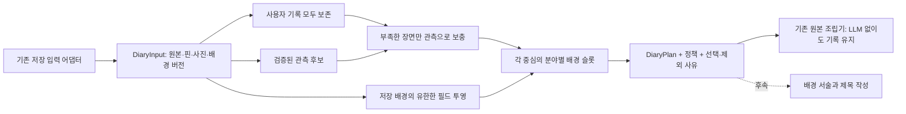

# 사용자 기록 중심 장면 선택과 스탬프

[Dev #374](https://github.com/SAJOYO/DAENGS_dev/pull/374). 계약 #370과 저장 입력 #372 다음의
이관 3단위다. Geo 워크트리의 `scene_core.py`, `scene_pipeline.py`, `dev_context_projection.py`,
`walk-input-v1` 배경 분리 정책을 Dev의 `DiaryInput`에 맞춰 옮겼다.

## 실행 경계



`daengs_walk.diary_stamps.prepare_stamps(source, policy)`는 DB·HTTP·LLM에 접근하지 않는다.
`services.walk_diary_prepare.prepare_saved_diary(session, principal, walk_id, policy)`는
기존 소유권/입력 읽기를 재사용한다. DB 트랜잭션은 호출자가 소유하며 이 함수는 commit이나
generation 예약을 하지 않는다. 결과의 `input.source`가 기존 `bind_generation`과
`require_current`의 입력이며 선택 때문에 입력 해시를 뒤에서 다시 바꾸지 않는다.

새 오케스트레이터·큐·DB 표·공개 format 분기를 추가하지 않았다. 현재 HTTP 생성 경로에서
이 코어를 호출하기 시작한 단계는 아니다. 기존 종료 산책 생성의 짧은 예약/완료 트랜잭션과
LLM 작성 단계 연결이 후속이다.

## 중심 선택 정책

- 목표 장수는 호출자가 명시한다. 화면 페이지 크기나 사용자 기록의 보존 상한이 아니다.
- 살아 있는 행동·메모·사진을 모두 중심으로 둔다. 삭제 표식은 선택 사유에 남기고 장면에는
  넣지 않는다. 현재는 기록 하나당 스탬프 하나이며 여러 기록의 편집상 묶기는 후속 정책이다.
- 부족분은 `max(0, 목표 - 사용자 기록 수)`다. 기록이 충분하면 관측을 추가하지 않는다.
- Geo 기준대로 체류를 먼저, 다음으로 속도 관측을 검토한다. 같은 우선순위에서는 근거 구간이
  긴 것, 대표 시각, ID 순으로 결정한다. 중요도의 통계 추정치가 아닌 명시적 편집 규칙이다.
- 기본 20초 여유 범위 안에 사용자 기록이 있거나, 이미 고른 관측 구간과 겹치는 후보는 뺀다.
  이 시간 근접성은 같은 장소·행동 지속 시간의 증거가 아니다. 세션 전체 메모는 이 제외에서 뺀다.
- 검증된 후보가 부족하면 목표 장수를 채우지 않는다. 일반 이동이나 공간 배경만으로 행동을
  만들지 않으며 관측 주체는 `recording_device`, 행동 의미는 `not_inferred`다.
- 최종 순서는 원래 이벤트 시각, 저장소를 포함한 원본 identity다. 핀·시각을 근처 GPS로 옮기지 않는다.

## 배경 슬롯과 자료 범위

절대 위치 1개, 상대 공간 3개, 환경 1개, 시간 1개가 기본 슬롯 예산이다. 슬롯이 있다고
자료를 만들어 넣지는 않는다. 현재 런타임 자료용 투영은 Dev Place의 v1/v2 저장 봉투만
지원한다. 동 주소·공원 면·하천 선·정규화된 날씨·시간 배경은 해당 공급자 계약/투영이 필요하다.

입력 어댑터의 `selected_background_ids`에는 현재 버전과 맞는 `known/partial` 봉투를
사용 가능한 입력으로 명시한다. `empty`, `unavailable`, `not_requested`도 원본에 보존한다.
스탬프 선택기는 이 후보 봉투에서 실제 슬롯에 들어갈 조각을 고른다. 명시적으로 선택되지 않은
봉투를 외부 입력에서 임의로 다시 활성화하지 않는다.

현재 Place 투영은 등록 위치까지의 서버 보고 거리와 출처 ID를 보존하고 가까운 순서로
공간 슬롯을 채운다. 같은 출처의 같은 시설 ID는 중복 제거하되 이름이나 카테고리가 같다는
이유로 다른 시설을 합치지 않는다. 동 주소인 `place_reference`와 구별해 `space_relation`에 둔다.
핀의 estimated/last_known 방식과 불확실성을 유지한다. 조회 스냅샷을 과거 방문·시설 진입이나
행동 원인으로 바꾸지 않는다.

슬롯은 각 장면의 정확한 중심 참조에 묶인다. 앞 장면에서 쓰던 시설을 다음 장면의 현재 배경으로
넘겨주지 않는다. 두 위치의 비교는 양쪽 원본에 묶인 별도 근거와 투영이 필요하다.
직진·회전 같은 동선 HOW는 서술 딕셔너리에 들어오지 않는다.

각 조각의 ID는 봉투 ID와 투영 facts의 해시로 고정한다. `DiaryPlan.preparation_policy`에는
목표·간격·슬롯 예산까지 담아 정책 변경을 plan revision에 반영한다.
`PreparedDiary.validate_against(source)`는 같은 입력/정책으로 선택과 투영을 다시 계산해
선택·조각 변조까지 비교한다. LLM 주장 검증기가 아니라 순수 계산의 재현 검사다.

## 검증과 보이는 결과

[합성 입력과 결과](../../backend/evals/walk_diary_stamps/README.md)를 보존했다.
실제 저장 형식의 entry/photo/context를 #372 어댑터로 변환했고, 관측 후보는 계약을 만족하는
합성 자료를 명시적으로 넣었다. 실제 사용자 자료·LLM 응답·공공데이터 조회 결과를 뜻하지 않는다.

이 단위에서는 관측을 합성 입력으로 제공했다. 후속 [확정 동선 관측 공급](diary-observations.md)이
`read_input()`에 실제 저장 chunk·분석 검증과 체류/상대 속도 후보를 연결한다.
선택기는 공급자가 검증한 후보를 소비하며, 쓸 수 있는 후보가 없는 입력은
`observation_pool_empty`로 남고 사용자 기록은 그대로 처리한다.

테스트는 새 선택/투영/내부 진입점과 직접 연결된 기존 계약·입력 어댑터 3개 파일에 한정했다.
초기 77개 통과 후 v2 추정 핀 배경의 불확실성 보존 검사 1개를 추가 실행해 통과했다.
4개 합성 예제에서 Geo 원래 선택 함수와 관측별 결정이 모두 일치했다. 비교 범위는
장면 부족분 선택이며 원자료 계산·전체 Geo 파이프라인·서술 품질의 동등성을 뜻하지 않는다.
공통 인증·DB·기존 storyboard 런타임은 변경하지 않았으며 실서버/실기기 검증은 하지 않았다.

```powershell
uv run python -m pytest tests/walk/test_diary_stamps.py tests/walk/test_diary_contract.py tests/walk/test_walk_photo_input.py -q
uv run python tools/preview_diary_stamps.py --input evals/walk_diary_stamps/inputs/mixed.json --target 5 --out ../diary-preview
```

이 워크트리는 기존 Dev venv를 재사용하고 `PYTHONPATH`를 이 워크트리의 `backend/src`로
지정해 검사했다. 프리뷰는 `input.json`, `prepared.json`, `bundle.json`, `preview.md`를 만든다.
실제 개인정보가 든 입력이나 출력은 저장소 밖에서 관리한다.

2026-09-09 리뷰 보완: v1 행동을 v2에서 수정한 legacy sidecar와 그 배경을 입력으로
읽는 경로를 보강했다. 사진 입력 오류의 422/버전 충돌의 409도 구분해 App이 거절 후
편집한 목록으로 복구할 수 있게 했다. 상세 계약은 [사진 메타데이터](photo-metadata.md).
위 3개 테스트 파일을 다시 실행해 **89개 통과**, 변경 Python 4개 파일 Ruff 통과.
이번 실행은 앞선 검사와 겹치는 회귀 검증이며 전체 로컬 스위트·실서버 검증은 아니다.
