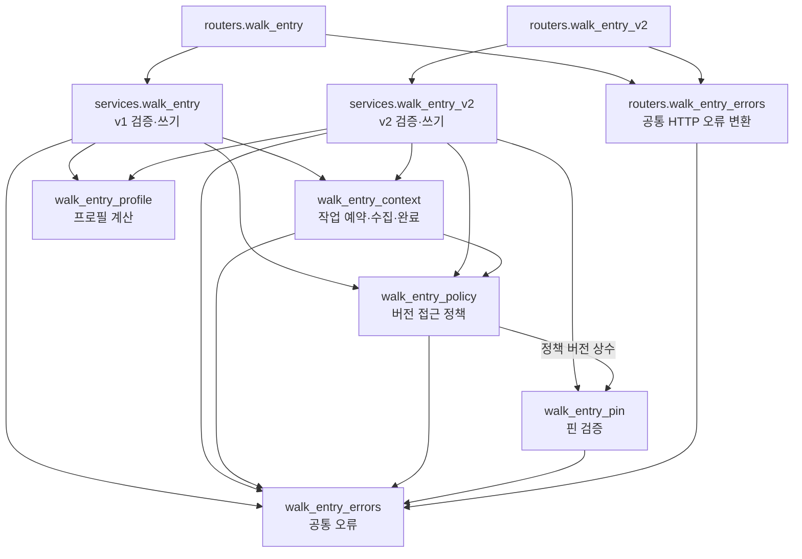

# 행동 기록 서비스 경계

v1/v2 쓰기 서비스와 배경 수집이 공통 오류·버전 검사·프로필 계산을 얻기 위해 서로를
import하던 구조를 정리했다. 요청·응답, 오류 코드, 검증 순서와 트랜잭션은 보존한다.

## 의존 구조

변경 전에는 v1이 context와 v2를, v2가 v1과 context를, context가 다시 v1/v2를 참조했다.
핀 검증도 v1 서비스의 오류를 사용했고, v2 라우터는 v1 라우터의 HTTP 변환을 가져왔다.

변경 후 화살표는 함수 호출 또는 import 방향이다. 모두 기존 backend 프로세스의 모듈이다.



소유권·기록·핀·작업 조회는 기존 repository가 담당한다. context와 pin은 버전별 쓰기
서비스를 import하지 않는다. 스토리보드의 구버전 접근 검사도 `walk_entry_policy`를
사용한다. 버전별 응답 직렬화는 기존 서비스에 남아 있다.

| 모듈 | 책임 |
| --- | --- |
| `services/walk_entry_errors.py` | 조회 불가·충돌·입력 오류·삭제·신규 v2 쓰기 중단·업그레이드 필요의 오류 타입 |
| `services/walk_entry_policy.py` | v2 읽기 허용, capabilities, v1의 v2 기록 접근 차단 |
| `services/walk_entry_profile.py` | 행동 수·산책 수·근거 목록·출처 revision 계산. 입력 타입은 v1/v2가 선택 |
| `routers/walk_entry_errors.py` | 공통 404/409/422/426 변환. v2의 삭제 410·쓰기 중단 409는 v2 라우터가 처리 |
| `services/walk_entry.py`, `walk_entry_v2.py` | 버전별 요청 검증·직렬화·트랜잭션 조정 |
| `services/walk_entry_context.py` | 같은 트랜잭션의 작업 예약, 외부 수집, lease·revision을 검사하는 완료 반영 |

기존 서비스 경로로 import하던 오류·정책·프로필 함수는 동일 객체를 다시 내보내 호환성을
유지한다. 새 소비자는 책임을 소유한 공통 모듈에서 직접 import한다.

## 보존한 쓰기·작업 수명

- v1은 Walk 행 잠금 → 버전·내용 검증 → 변경 적용 → 배경 예약 → commit 순서를 유지한다.
- v2는 소유권 잠금 → 삭제 우선·mutation 영수증 재사용 → revision 비교·내용/핀 검증 →
  기록·핀·배경 예약·영수증 저장 → commit 순서를 유지한다. 신규 쓰기 중단 플래그의 의미도 같다.
- v2의 미확정 핀은 배경 수집을 예약하지 않는다. 핀이 종결되며 증가한 기록 revision으로 예약한다.
- 예약 실패 또는 commit 실패 시 기록·핀·영수증·작업이 함께 롤백된다. 같은 요청을 다시
  보내면 저장할 수 있고, 저장 성공 후 재전송은 같은 응답과 작업을 재사용한다.
- 수집은 예약을 commit하고 DB 세션을 닫은 뒤 실행한다. 완료 시 기존 Walk → 작업 잠금
  순서, lease token·만료·collection round·기록 revision 검사를 유지한다.

스키마·마이그레이션·환경 변수·의존성·APP 계약 변경은 없다. 점령 사진 작업의 복구·lease와
좌표 청크 확인 응답은 별도 작업이다.

## 검증

행동 기록 HTTP/서비스·실제 PostgreSQL 삭제/재전송/경합, 배경 수집 예약·lease·늦은 완료와
직접 소비자인 스토리보드·일기·사진 입력·GPS 기록 테스트를 실행한다. 전체 테스트 수와
실행 환경은 해당 PR의 `확인한 것`에 남긴다.

`tests/walk/entries/test_walk_entry_context_atomicity_db.py`는 v1/v2 각각의 작업 예약 뒤와
commit 직전에 실패를 주입한다. 빈 테이블로의 롤백, 같은 요청 재시도, 재전송 시 작업 ID
재사용을 검증한다. 기존 `WALK_PIN_TEST_DATABASE_URL` fixture를 사용하며 공유 DB에 붙지 않는다.

```powershell
# backend/ — 미리 준비한 폐기용 loopback PostgreSQL
$env:WALK_PIN_TEST_DATABASE_URL = 'postgresql+asyncpg://postgres@127.0.0.1:55439/walk_pin_test'
$env:WALK_CONTEXT_TEST_DATABASE_URL = 'postgresql+asyncpg://postgres@127.0.0.1:55439/walk_context_test'
uv run pytest -q -rs tests/walk/entries tests/walk/context/test_walk_entry_context.py tests/walk/context/test_walk_entry_context_db.py tests/walk/context/test_walk_entry_pin_context.py --tb=short
```
