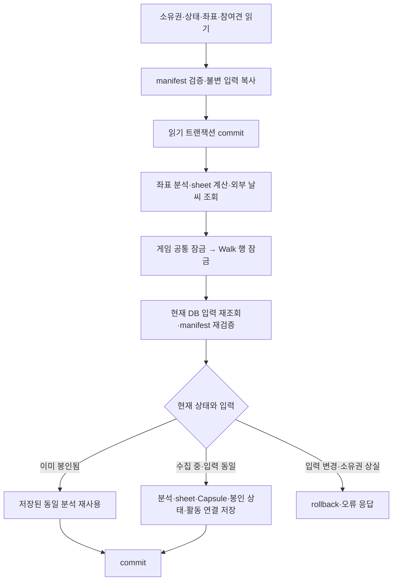

# 산책 봉인의 계산·외부 조회·저장 경계

`POST /app/walks/{walk_id}/finalize`는 읽기 트랜잭션을 끝낸 뒤 좌표 분석과 외부 날씨
조회를 수행한다. 저장 직전에 게임 공통 잠금과 Walk 행 잠금을 순서대로 획득하고 입력을
다시 검증한다. 느린 날씨 조회가 다른 사용자의 같은 게임 잠금이나 해당 Walk의 append를
붙잡지 않도록 하는 경계다.



처음부터 봉인된 기록은 계산과 날씨 조회를 생략하고 잠금 재조회로 이동한다. 외부 호출에
ORM 객체를 넘기지 않으며, 외부 대기 중 `AsyncSession.in_transaction()`은 false다.
DB 세션 객체의 수명은 요청에 연결되어 있지만 열린 읽기 트랜잭션은 유지하지 않는다.

## 입력 재검증과 멱등성

읽기 스냅샷은 Walk ID·시작/종료 시각·앱 날씨 메타데이터·참여견 ID와 검증된 좌표열을
포함한다. 두 번째 조회는 `populate_existing`으로 같은 세션의 identity map에 남은
Walk·좌표·참여견도 현재 DB 값으로 갱신한다. 입력 지문만 비교하지 않고 실제 분석 입력과
Capsule 메타데이터도 비교한다. 기존 분석 v1 identity에 포함되지 않는 `recording_eligible`
영수증은 이 비교에도 포함하지 않는다.

- 날씨 대기 중 append가 완료돼 manifest와 달라지면 기존 `point_count_mismatch` 등의
  입력 오류를 반환한다. 수신된 좌표를 버리거나 오래된 입력을 봉인하지 않는다.
- manifest는 여전히 유효해도 좌표·시각·날씨·참여견이 스냅샷과 다르면 HTTP 409의
  `walk_input_changed`를 반환한다. 호출자는 최신 기록과 manifest를 확인한 뒤 재시도한다.
- 산책이 삭제되거나 소유권이 바뀌면 기존 not-found 응답을 사용한다.
- 다른 finalize가 먼저 봉인했다면 저장된 입력 지문의 분석을 반환한다. analysis ID와
  Capsule을 유지하며, 늦게 도착한 날씨로 이미 저장된 결과를 교체하지 않는다.
- 같은 입력으로 재요청하면 기존처럼 최초 201, 재사용 200이다. 요청·응답의 구조와
  DB 스키마는 바뀌지 않는다.

## 최종 트랜잭션과 구형 기록 복구

잠금 순서는 기존 `activity_game.acquire()` → Walk `FOR UPDATE`를 유지한다.
게임 ON의 시즌 전환·영역 만료 반영도 최종 트랜잭션에 속한다. 새 분석·sheet·Capsule·
봉인 상태·활동 연결은 함께 commit하며 저장 실패 시 함께 rollback한다.

구형 분석에 Capsule이 없으면 기존 분석 ID와 `derived_at`, `legacy_walk_metadata_v1`
출처를 유지해 같은 Walk 잠금 안에서 복구한다. 새 Capsule은 세션에 명시적으로 등록한다.
SQLAlchemy 2에서는 이미 세션에 있는 Analysis의 backref 설정만으로 새 자식이 자동 등록되지
않는다. 다른 세션이 Capsule을 삭제했는데 현재 identity map에 예전 객체가 남은 경우에는
DB에서 부재를 확인한 그 객체만 분리하고 복구한다.

외부 호출에 대한 lease나 중복 실행 차단은 추가하지 않는다. 동시에 시작한 finalize 두 개는
날씨를 각각 조회할 수 있으나 결과 저장은 하나로 수렴한다. 좌표 검증과 최종 저장에는 여전히
잠금이 필요하며, 이번 변경이 모든 게임 지연을 제거하거나 운영 처리량을 보장하지는 않는다.

## 검증

`backend/tests/walk/api/test_walk_finalize_db.py`는 폐기용 PostgreSQL에 실제 SQL을
적용한다. DB URL의 host는 loopback, DB 이름은 `claims_test`여야 한다. 설정이 없으면
skip하므로 `-rs` 결과를 확인한다. 앱의 운영 DB 설정을 대체 URL로 사용하지 않는다.

```powershell
# backend/ — 별도 로컬 PostgreSQL의 claims_test DB
$env:TERRITORY_TEST_DATABASE_URL = 'postgresql+asyncpg://postgres@127.0.0.1:55439/claims_test'
uv run pytest -q -rs tests/walk/api/test_walk_finalize_db.py -W error::sqlalchemy.exc.SAWarning
```

17개 케이스는 게임 ON/OFF의 외부 대기 중 트랜잭션 종료·실제 잠금 획득 가능 여부,
다른 업로드 및 동시 append의 진행, 동시 봉인의 단일 분석, 입력·소유권 변경,
최종 저장 실패·요청 취소 후 재시도, 같은 세션에서의 Capsule 복구를 다룬다.
날씨 호출을 Event로 멈춘 상태에서 다른 DB 세션의 작업 완료를 확인하며, 단순 시간 측정을
동시성 근거로 삼지 않는다. 2026-09-12 Windows의 별도 PostgreSQL 17.11에서 실행했으며,
외부 날씨는 대역을 사용했다. 관련 회귀 묶음과 전체 게이트의 수행 범위는 PR에 기록한다.
