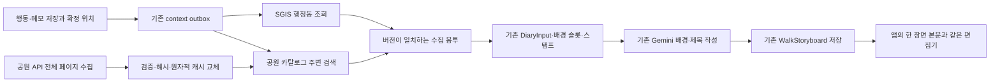

# 산책 일기에 SGIS 행정동과 도시공원 배경 공급

2026-09-09, [Dev #387](https://github.com/SAJOYO/DAENGS_dev/pull/387).
행동·메모의 위치에서 실제 행정동과 가까운 공원 자료를 수집해 기존 일기에 넣는다.
사용자가 남긴 내용을 장면의 중심으로 유지하고, 공공자료는 그 배경만 공급한다.

## 연결 구조



새 오케스트레이터, 장면 선택기, API, 일기 테이블은 만들지 않는다. 웹 요청은 원본 저장과
예약까지만 한다. 기존 전용 워커가 DB 세션 밖에서 수집하며 원본 revision·pin revision·
lease를 재확인해 저장한다. 수정·삭제된 기록에 늦은 응답을 붙이지 않는다.

| 원천 | 시스템이 만드는 조각 | 범위 |
| --- | --- | --- |
| SGIS `space.address` | `place_reference / sgis-dong-v1` | 행정동 이름, 시도·시군구, 원천 코드 부분 |
| 공원 `space.park` | `space_relation / public-park-nearby-v1` | 공원명·구분, 등록 좌표까지 거리, 자료 기준일 |

기존 `place_slots=1`, `space_slots=3` 등 스탬프 정책을 그대로 사용한다.
동 주소는 앱의 시각 옆 주소와 모델의 제목 맥락에 들어간다. 동 주소만으로 모델을 추가 호출하지 않는다.
공원은 기존 배경 딕셔너리에 들어간다. 공급자 원문·좌표·키를 모델에 통째로 넘기지 않는다.
사용자 메모·행동은 기존 assembly가 보존하고, 앱에서는 배경과 합친 한 본문을 읽고 수정한다.

## SGIS 정책

- 공식 신규 호스트 `sgisapi.mods.go.kr`에서 인증 → WGS84(4326)를 5179로 변환 →
  `rgeocode.json?addr_type=20` 순서로 조회한다. 이전 `kostat.go.kr` 호스트는 실제 호출에서
  새 호스트로 302 이동했다. 인증 쿼리를 임의 리다이렉트에 넘기지 않는다.
- 행정동을 사용한다. 법정동·도로명·지번 주소를 대신 생성하지 않는다.
  코드 부분은 길이를 가정하지 않고 보존한다. 실측 `emdong_cd`는 세 자리였다.
- 정확히 같은 좌표와 인증 설정에 한해 1시간, 프로세스당 최대 128건 캐시한다.
  경계 근처 주소를 바꿀 수 있으므로 좌표를 반올림해 캐시 키로 쓰지 않는다.
- 토큰의 실제 만료 시각을 확인하며 인증 만료 응답은 다음 durable 재시도에서 재인증한다.
  외부 수집 전체 제한은 25초로, 기존 45초 lease 안에 끝낸다.
- 조회 시각과 원본 기록 시각은 구분한다. 현재 조회한 행정동이 과거 행정구역을 재현한다는
  뜻은 아니다. 경계 polygon이나 이전/현재 위치 사이의 전환 판정은 이번에 추가하지 않았다.

## 공원 카탈로그 정책

공원 API는 전국 목록을 페이지로 반환한다. 각 행동마다 전국 API를 호출하지 않는다.
별도 CLI가 최대 60페이지 × 1,000건을 받아 전체 건수·페이지 해시를 검사한 뒤 로컬 파일을
원자적으로 교체한다. 중간 실패나 수집 중 건수 변화가 있으면 이전 캐시를 유지한다.

- 이름·공원 구분·관리번호·기준일·유효한 국내 좌표만 남긴다.
- 같은 관리번호의 완전히 같은 행은 하나로 접는다. 내용이 다른 행은 어느 것이 현재인지
  임의 선택하지 않고 해당 관리번호를 제외한다. 제외 이유별 건수를 보존한다.
  다른 기준일만 있는 중복도 현재는 충돌로 취급한다. 최신 자료 우선 선택은 후속 품질 정책이다.
- 유효기간은 조회 후 30일이다. 파일 없음·해시 불일치·만료는 `unavailable`이다.
  워커가 요청 중 전국 목록을 다시 받지 않는다.
- 원본 또는 확정 핀 좌표에서 등록 지점까지 Haversine 거리를 계산해 250m 이내를 고르고,
  거리순 최대 10건을 봉투에 넣는다. 스탬프에 들어가는 수는 기존 슬롯 정책이 다시 제한한다.
- 카탈로그에 제외 행이 있거나 검색 결과가 상한을 넘으면 `partial`이다.
  유효한 캐시에서 결과가 없고 누락도 없을 때만 `empty`이다. 어느 상태도 주변에 공원이
  존재하지 않는다는 증거로 사용하지 않는다.
- 등록 좌표는 공원 경계가 아니다. `registered_point`, `distance_only_not_entry_or_visit`로
  고정한다. 투영 시 같은 기록 좌표에서 거리를 다시 검사한다. 공원 진입·체류·방문이나
  행동의 원인을 추론하지 않는다. 위치 불확실성도 원본 핀에서 함께 전달한다.
- `referenceDate`는 공급 자료의 기준일, `retrieved_at`은 카탈로그 수집 시각이다.
  저장된 카탈로그 해시로 해당 조회 세대를 식별한다. 과거 현장 상태로 바꾸지 않는다.

HTTP 요청은 query key가 포함된 httpx Client INFO URL 로그를 만들지 않는 공개 transport
인터페이스로 수행한다. 상태 코드/안전한 reason만 보관하며 오류 원문·인증 키는 저장하지 않는다.

## 설정과 적용 순서

이 PR은 공유 서버에 적용하지 않았다. 기존 [기록 수집 워커](entry-contexts.md)의 운영 환경에서
다음 순서로 적용한다. 키는 서버 환경에만 넣으며 앱 빌드나 Git에 넣지 않는다.

1. 기존 `24_walk_entry_contexts.sql`이 적용되어 있는지 확인한다.
2. `db/migrations/2026-09-09_walk_public_context.sql`과 짝인 `verify_...sql`을 적용한다.
   새 DB는 `db/init/27_walk_public_context.sql`을 24번 이후 실행한다. 모두 반복 적용 가능하다.
3. 서버 환경에 아래 설정을 채운다. 웹과 수집 워커의 flag를 맞춘다.
4. 워커에서 읽을 수 있고 refresh 프로세스가 쓸 수 있는 **지속되는 캐시 경로**를 정한다.
   컨테이너라면 같은 파일이 보이도록 볼륨/마운트를 별도로 구성한다.
   현재 compose에는 이 캐시 전용 마운트나 자동 갱신 잡을 추가하지 않았다.
5. 카탈로그 CLI 성공 및 같은 경로의 읽기를 확인한 뒤 public flag를 켠다.
6. 이미 운영하는 worker/Beat를 시작하고, 새 기록에서 `space.address`와 `space.park` 봉투를 확인한다.

```dotenv
DAENGS_WALK_ENTRY_CONTEXT_ENABLED=true
DAENGS_WALK_PUBLIC_CONTEXT_ENABLED=false
DAENGS_WALK_SGIS_KEY=
DAENGS_WALK_SGIS_SECRET=
DAENGS_WALK_PUBLIC_DATA_KEY=
DAENGS_WALK_PARK_CATALOG_PATH=/persistent/walk-public/parks.json
```

```bash
# backend 프로젝트의 서버 환경. 경로와 인증 설정은 환경변수에서 읽는다.
uv run python -m daengs_backend.cli.walk_park_catalog
```

공원 키는 인코딩된 키/디코딩된 키를 모두 받아 한 번 정규화한다. 갱신은 배포 전 한 번,
이후 30일 만료 전에 운영 스케줄러에서 수행해야 한다. 갱신 실패 시 기존 유효 캐시는 계속 쓴다.
CLI는 DB·기록·LLM에 접근하지 않는다. SGIS 키는 조회 워커, 공원 키는 refresh 환경에 필요하다.

public flag를 끄면 새 주소 예약은 중단하고 공원 조회는 기존 `not_requested`로 돌아간다.
이미 저장된 봉투와 삭제 트리거를 지우지 않는다. 과거에 완료된 `not_requested` 작업은 자동으로
다시 열지 않는다. 기존 일기를 공공자료로 일괄 갱신하는 backfill은 이번 범위가 아니다.

## 검증 결과

- 공공 HTTP·카탈로그·투영·기존 수집/stamp/writer 대상 테스트 **70개 통과**.
- 기존 입력 어댑터의 context·소유자/버전·pin 관련 선택 항목 **10개 통과**.
  좌표 정규화 보완 뒤 공공자료 테스트 20개를 재실행해 통과했다(중복 집계하지 않는다).
- 격리된 localhost PostgreSQL 17에서 context 테스트 **6개 통과**. 새 migration 두 번,
  신규 DB SQL, verifier, 다섯 태그 예약, provider 저장, 제약 제거 검출을 포함한다.
- 변경한 backend Python 파일 Ruff 검사 통과. 저장소 migration 이름/짝 및 검증 등록 검사 통과.
  Windows workflow 검사 부분은 이 PC의 기존 PowerShell 스크립트 실행 정책 때문에 실패했다.
  전체 `uv run check` 성공으로 기록하지 않는다. 전체 pytest는 실행하지 않았다.

실제 외부 호출은 합성 산책만 사용했다. 사용자 폰의 실제 동선·로그인 데이터는 쓰지 않았다.

| 항목 | 실제 결과 |
| --- | --- |
| 공원 API | 19페이지, 원본 18,202행 |
| 캐시 | 16,167개 채택, 동일 행 중복 244행·내용 충돌 1,790행·유효하지 않은 행 1행 제외 |
| 합성 산책 | 20분, 좌표 121개, 서버 계산 757m, 행동 1개·메모 2개 |
| 기존 outbox | 15개 작업 처리, 동 주소 3개 known·공원 3개 partial |
| 행정동 순서 | 송포동 → 대화동 → 송포동 |
| Gemini | 실제 1회, 약 3.078초, 입력 2,551 / 출력 271토큰 |
| 생성 결과 | ready / accepted, 3개 장면, generation 1; 반복 GET 결과 동일·추가 모델 호출 없음 |
| 앱 | 현재 통합 본문 화면의 parser·Room acceptance 성공, 주소·본문·연필 편집기 확인 |

이 검증은 로컬 API의 실제 인증·라우터·저장·확정 계산·context·일기 생성 경로를 사용했다.
HTTP는 ASGI transport로 호출했고, 날씨와 기존 시설/하천 수집은 검증 대상에서 제외했다.
원문 기록은 합성, SGIS와 공원 API 및 Gemini 호출은 실제다.
사진/기기 관측에 새 배경을 수집하는 동작은 넣지 않았다.

앱은 별도 `com.daengs.app.diarypreview` 확인 APK에서 기존 production parser와 Room의
`acceptPinRemote`/`acceptSceneAnalysis`를 사용했다. 로컬 응답 파일을 전달한 표시 검증이며,
이번에 폰에서 직접 서버 HTTP를 호출한 것은 아니다. 신규 합성 세션만 추가한다.
APK 빌드 성공 및 에뮬레이터 설치 APK 해시 일치, 읽기/편집 화면을 확인했다.
물리 폰은 연결되지 않아 재설치·화면 확인을 아직 하지 못했다.

생성 제목은 **국제전시2단계 인근에서의 산책**이었다. 2번 장면에서는 `18:08 · 대화동` 아래
공원 배경과 “두부가 한참 냄새를 맡길래 잠깐 기다렸다.”라는 합성 메모가 하나의 본문으로
나왔으며, 같은 본문이 연필 편집기에 들어왔다. 출처별 UI 영역은 추가하지 않았다.
행정식으로 긴 공원명이 그대로 노출되고 배경이 비슷하게 반복된다. 연결 성공과 일기 문체의
완성은 구분하며, 지명 표시 정책과 공간 관계의 변화는 다음 단계에서 다룬다.

## 공식 원천

- [SGIS OpenAPI 데이터 API 문서](https://sgis.mods.go.kr/developer/html/openApi/api/data.html)
- [전국도시공원정보표준데이터](https://www.data.go.kr/data/15012890/standard.do)

상권·하천 제공자, 경계 간 이동 관계, 사진/관측 배경 수집, 기존 일기 backfill,
서버 캐시 마운트·갱신 잡 및 실제 활성화는 후속 작업이다.
