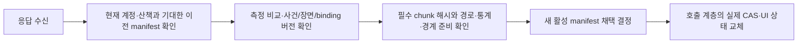

# 산책 동선 집계·시간·조회 전환 계약

상태: **1a 계약과 합성 재현 구현**, 2026-09-12. DEV 기반은 `05d9bf42`다.
이상점을 우회한 연결과 기존 부분 구간의 중복 집계, 위치 없는 시점 선택,
늦은 장면 응답의 덮어쓰기를 계산·조회 경계에서 거부한다.

후속으로 [기존 입력의 그림자 계산](trajectory-shadow.md)이 추가됐다. 아래는 1a 책임 설명이며,
현재 참조는 epoch 제어 ID와 원본/유효 시각 분리를 지원하는 `trajectory-contract-v2`다.

이 코드는 `daengs_walk`의 순수 내부 계약이다. 현재 읽기 전용 그림자 서비스가 사용한다.
기존 motion 입력의 누적 재생·관측/보행 투영은 후속 문서 범위로 구현됐고,
[후보 HTTP 조회](trajectory-api.md)는 후속 #475에서 구현됐다. 새 보행 판정기·DB·Room·
새 측정의 APP 화면 적용은 남아 있다. 기존 motion-v1과 WalkFacts 계산을 변경하지 않았다.

| 파일 | 구현 책임 |
| --- | --- |
| [trajectory.py](../../backend/src/daengs_walk/trajectory.py) | 원본 사건 순서, 점 판정, 최종 집계 구간·대체 근거, 거리/시간/확보 상태 요약 |
| [trajectory_selection.py](../../backend/src/daengs_walk/trajectory_selection.py) | 관측 없는 시간 주소와 mode별 선택 계약 |
| [trajectory_view.py](../../backend/src/daengs_walk/trajectory_view.py) | 불변 측정 참조, 비교 기록, 버전·준비 조건을 확인하는 조회 전환 결정 |
| [합성 fixture](../../backend/tests/walk/fixtures/trajectory-contract-v1.json) | 우회 연결, 첫 GPS 지연, 제외 이동/공백/정지/재진입, epoch 단절 |

## 최종 집계의 소유권

산책의 생명주기는 기존 세션 하나에 둔다. 원본 위치 신뢰성, 관측 연결 가능성,
보행 집계 여부는 별개다. 이후 `ObservedRun`은 연결된 관측 경로,
`WalkingSection`은 인정 보행 부분, `ExplorationSlice`는 표시용 선택 범위를 맡는다.
장면은 원본 사건·시간을 참조하고 탐색 구간의 자식으로 저장하지 않는다.

`SourceRef`는 `session_id / source_epoch / clock_epoch_id / ingress_seq`다.
원본 저널이 모든 사건에 순번을 부여하면 그 번호를 유지한다. 관측만 번호가 있는 motion
백업에서는 관측의 `client_seq`를 그대로 쓰고, 제어 사건은 `control_kind=epoch_start|epoch_end`
및 `ingress_seq=None`으로 식별한다. 원래 없는 제어 순번을 만들지 않는다.
이번 계약은 순서·시간 metadata를 받으며 원본 좌표/센서 값은 기존 저장소가 보유한다.
`PointAssessment`는 저널과 분리된 판정이다.

`IntervalLedger.intervals`만 집계한다. 구간은 시작/끝 원본 참조 사이의 edge들을
`[start, end)`로 소유하며, 전체 봉인 저널을 중첩·누락 없이 분할한다.
경계 좌표 공유는 거리나 시간을 두 번 더할 권리가 아니다.

```text
초기 판단: B→X 80m + X→C 70m + C→D 5m = 155m
우회 재평가: B→C 10m + C→D 5m = 15m
설명 근거: B→X 80m, X→C 70m는 superseded에만 보존
```

숫자는 소유권 검증용 합성값이며 실제 보행 속도 정책을 통과했다는 뜻이 아니다.
`replace()`는 기존 최종 구간의 경계와 맞는 전체 범위를 교체한다. 부분 거리를
비율로 추정하여 잘라내지 않으며, 교체 후 전체 분할을 다시 검증한다.
`superseded`는 합계와 최종 결과 digest에 참여하지 않는다.

- 연결 불명/단절 구간에 보행 포함, 제외 구간에 양의 보행거리,
  공백에 이동/정지 판정을 붙이는 조합은 거부한다.
- 연결 양 끝은 사용 가능한 관측이어야 한다. 제어 사건·일시정지·epoch 경계를
  지우는 우회는 거부한다. 알려진 부분의 시간까지 미확인 epoch 범위에 흡수할 수 없다.
- 관측을 건너뛴 연결에는 `reassessment_basis`, 보행 진입/재진입에는
  `reentry_basis`가 필요하다. 근거의 물리적 타당성을 평가하는 정책은 후속 판정기 책임이다.
- 길이·시간별 탐색 분할은 이 원장에 들어오지 않는다.

## 위치 없는 시간과 통계

시간 주소는 원본 참조를 보존한다. 계산된 gap 번호나 화면 구간 번호를 주소로 쓰지 않는다.

| 주소 | 의미 |
| --- | --- |
| `EventTime(ref)` | 위치 관측 또는 제어 사건의 시점 |
| `SpanTime(source_range, offset_ns)` | 길이를 아는 범위 안의 경과 시간. 첫 GPS 전 45초도 선택 가능 |
| `UnknownTime(source_range)` | 길이를 알 수 없는 범위 자체. 정확한 offset·자동 시간 재생 없음 |

첫 구현은 같은 clock epoch의 monotonic timestamp 차이만 길이로 인정한다.
epoch를 가로지르거나 경계 timestamp가 빠졌다면 `None`이다. UTC로 epoch 간 길이를
추정하는 기능은 clock mapping 버전·불확실성을 포함한 후속 계약으로 둔다.
`validate_time_address()`와 `WalkSelection.validate_against()`가 실제 저널 범위를 검사한다.
타입 생성만으로 외부 참조의 존재까지 확인되는 것은 아니다.

선택은 overview / scene(event ID) / passage(범위) / range(범위) /
replay(시간 주소·재생 상태) 중 하나다. 다른 mode의 필드를 동시에 채울 수 없다.
지도 좌표는 이 선택을 해석한 결과로 붙인다. 이 모듈은 위치를 보간하거나
가까운 장면으로 선택을 대체하지 않는다.

거리 합계는 최종 포함 구간의 기여량이다. 시간은 다음 의미로 구별한다.

| 필드 | 의미 |
| --- | --- |
| `known_duration_ns` | 길이를 확인한 구간 시간의 합 |
| `located_duration_ns` | 연결 가능한 관측 구간의 알려진 시간 |
| `included_moving_duration_ns` | 보행에 포함하고 이동으로 판정한 알려진 시간 |
| `observed_still_duration_ns` | 연결된 관측으로 정지 판정한 알려진 시간 |
| `paused_duration_ns` | pause부터 resume/종료까지의 알려진 시간 |
| `unlocated_duration_ns` | 연결 불명/단절 구간의 알려진 시간 |
| `unresolved_walking_duration_ns` | 보행 포함 여부가 미확정인 알려진 시간 |
| `unknown_duration_intervals` | 길이 미확인 구간 수. 시간 합에 0초로 해석해 넣지 않음 |

서로 겹치는 관점이므로 모든 필드를 더해 총시간으로 표시하지 않는다.
위치 확보 비율은 `located / known`이며 길이 미확인 구간의 존재도 함께 전달해야 한다.
평균 보행속도는 인정 거리/인정 이동시간이다. 인정 이동시간 중 길이 미확인 부분이
있거나 분모가 0이면 값은 `None`이다. 인정 거리 0을 정지 근거로 사용하지 않는다.

## 불변 결과, 비교, 채택

`MeasurementSnapshot`은 봉인된 원장 결과만 받는다. 측정 ID, 입력·정책·정밀도 키,
원장과 그 digest는 검증 이후에도 변하지 않는다. 검증은 별도 `VerificationRecord`다.
이번 snapshot payload는 원장 계약 범위다. 전체 좌표 chunk·run·장면 DTO를 이미
제공하는 프로덕션 snapshot API로 해석하지 않는다.

- `equivalent`: 비교 전제와 구조가 같고 수치가 허용오차 안이다.
- `incomparable`: 소유권 또는 입력/저널/정밀도/정책/엔진 키가 다르다. 이유에 해당 필드가 남는다.
- `mismatch`: 같은 전제지만 구조·구간 수치·보행 총거리 중 하나가 다르다.

비교 기록에는 양쪽 측정 ID·키·digest, 비교 정책 버전과 실제 허용오차가 남는다.
원본 참조·제어 사건·시간·판정·근거는 정확히 비교한다. 거리 기여·관측 변위·보행 총거리는
각각 절대 `1e-7m`, 상대 `1e-10`의 기본 허용오차를 사용한다. 합계도 따로 검사해
개별 작은 오차의 누적을 놓치지 않는다. 이 기본값은 기존 motion 회귀 검증과 같은 값이며,
새 좌표 정책의 Android 대조를 완료했다는 의미는 아니다.

현재 Python 결과 digest는 정렬 JSON의 SHA-256이며 수치적 동등성과 다르다.
Kotlin의 float/정수/누락값 canonical encoding과 공유 golden hash는 후속 대조 항목이다.
같은 원장 결과의 대체 근거 이력이나 전송 chunk 분할만 달라지면 digest는 같다.
측정 ID를 다른 키·최종 결과에 재사용하면 오류다.

`adopt_read_view()`는 다음 조건을 만족할 때 새 활성 manifest를 반환한다.
거부 시 현재 정상 manifest를 그대로 반환한다.



`read_view_revision`은 매번 1 증가한다. 사건·장면 revision은 역행하지 않는다.
같은 binding 입력의 ready 결과는 늦은 pending이나 이전 binding revision으로 바뀌지 않는다.
초기 화면에도 현재 계정·산책 scope를 명시해 계정 전환 뒤 과거 응답을 거부한다.

자동 측정 전환은 기본적으로 정확히 두 측정에 대한 동등성 비교 기록을 요구한다.
서버 결과라는 이유만으로 우선하지 않는다. 다른 정책의 결과를 채택하는 별도 흐름은
아직 없다. R1과 S1이 동등해도 S1의 binding을 R1에 붙일 수 없다.

장면 응답은 측정 참조·사건 revision·장면 revision·binding revision·binding policy가
모두 target과 일치해야 한다. 요청 당시 예상했던 manifest도 그대로여야 한다.
`PreparedCore`는 호출 계층이 **실제 다운로드 hash 검증과 경로/인덱스 준비 후** 만든
내부 완료 자료다. 서버의 ready 문자열만 복사해 만들면 안 된다. 장면/AI는 핵심 자료
준비 조건에 포함하지 않는다. 보행선이 없는 정상 결과는 필수 chunk가 0개일 수 있다.

순수 함수는 DB 잠금, 실제 원자 교체, 화면 깜빡임 제거를 구현하지 않는다.
호출 계층이 같은 `expected_current`로 CAS를 수행하고 실패하면 최신 상태로 재판정해야 한다.
HTTP 인증·소유권 조회도 기존 서비스 책임이다. `SceneBinding.relation`을 이후 추가할 때는
표시용 파생 분류로만 사용하고 원장 판정의 대체 값으로 쓰지 않는다.

## 실행과 확인 범위

`backend/`에서:

```powershell
uv run --no-sync pytest -q -rs tests/walk/measurement/test_trajectory.py tests/walk/measurement/test_trajectory_view.py tests/walk/test_package_boundary.py tests/walk/measurement/test_motion_replay.py tests/walk/measurement/test_motion_precision.py tests/walk/api/test_walk_motion_contract.py
uv run --no-sync ruff check src/daengs_walk/trajectory.py src/daengs_walk/trajectory_selection.py src/daengs_walk/trajectory_view.py tests/walk/measurement/trajectory_support.py tests/walk/measurement/test_trajectory.py tests/walk/measurement/test_trajectory_view.py tests/walk/test_package_boundary.py
uv run --no-sync ruff format --check src/daengs_walk/trajectory.py src/daengs_walk/trajectory_selection.py src/daengs_walk/trajectory_view.py tests/walk/measurement/trajectory_support.py tests/walk/measurement/test_trajectory.py tests/walk/measurement/test_trajectory_view.py tests/walk/test_package_boundary.py
```

선택 이유: 새 계약/경합 동작과 순수 패키지 경계를 검증하고, 고정 motion-v1 재생·정밀도·
업로드 계약의 기존 기준도 보존되는지 확인한다. API·DB·앱 조립 변경은 없어 전체 앱/DB
통합 테스트를 대신 실행하지 않는다. 운영 머지 전 공통 게이트는 [CI 안내](../ci/README.md)를 따른다.

2026-09-12 실행 결과: 위 테스트 **180 passed**, skip 없음. 변경 파일 lint·format과
문서 링크·diff 검사를 통과했다. 새 계약의 Android 포팅·실기기 화면·실제 저장소 CAS는
이번 검증에 포함되지 않는다.

합성 fixture는 사람 위치·사진을 담지 않는다. JSON의 B/X/C 같은 별칭은 테스트 어댑터에서
원본 참조로 바뀐다. 테스트는 이미 판정된 구간의 소유권 교체와 chunk 재조립을 검증한다.
새 GPS 판정기의 일괄 계산과 실시간 누적 계산 동등성은 아직 검증하지 않았다.

## 다음 연결 단위

1. 실제 기록의 설치 빌드·원본 범위·거리 의미·정책을 대조한다. 화면의 509m/951m 중
   하나를 정답으로 고정하지 않는다. 관측만으로 실제 원인이 확정된 상태는 아니다.
2. 기존 영속 저널/precision 입력 연결과 관측/보행 투영은 [그림자 계산](trajectory-shadow.md)으로
   구현했다. 위치·속도 근거를 유지하고 기존 보행 단절과 관측 경로 단절을 구별한다.
3. 새 Android 어댑터와 신규 보행 정책은 후속이다. 현재 동결 motion-v1의 Kotlin 기준과
   DEV 원장·누적 처리를 대조했고, 새 Kotlin/Python 모델의 직접 대응 검증은 남아 있다.
4. 저장과 APP 통합에서 준비된 측정 묶음의 실제 CAS/화면 교체를 구현한다. 이후 장면
   대응과 공유 선택을 연결하며 기존 화살표의 화면 간격·충돌 회피를 활용한다.

지도는 유효 보행 section 전부를 포함하고, 각 section을 선택해 확대하도록 연결한다.
장면 하나의 먼 좌표 때문에 기본 보행 지도를 축소시키지 않는다. 장면·탐색 slice·화살표는
동일한 원본 시간/범위를 공유하며 실제 공백을 이어 그리지 않는다.
