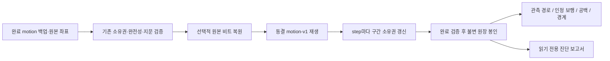

# 기존 산책 저널의 동선 그림자 계산

상태: **기존 입력 연결·누적 원장·관측/보행 투영 구현**, 2026-09-12.
기반은 `dev 3eb1f733`, 선행 계약은 [#467의 계약 문서](trajectory-contracts.md)다.
명시적으로 호출하는 읽기 전용 서비스와 오프라인 도구를 제공하며, 현재 앱/서버의
활성 거리·경로·장면을 바꾸거나 결과를 DB에 저장하지 않는다.

## 이번에 연결한 경로



| 구현 | 책임 |
| --- | --- |
| [walk_trajectory_shadow.py](../../backend/src/daengs_backend/services/walk_trajectory_shadow.py) | 기존 motion 입력·step과 새 계약을 연결하는 서비스 어댑터 |
| [trajectory_projection.py](../../backend/src/daengs_walk/trajectory_projection.py) | 최종 원장의 관측 경로·보행 구간·시작/종료 의미를 순수 투영 |
| [check_walk_trajectory_shadow.py](../../backend/tools/check_walk_trajectory_shadow.py) | 저장소/네트워크 없이 원본 export 또는 공통 fixture를 대조하는 CLI |
| [test_trajectory_shadow.py](../../backend/tests/walk/measurement/test_trajectory_shadow.py) | Kotlin golden, precision, 누적 처리·재진입·시간·소유권·진단 검증 |

`calculate_shadow(session, owner, walk_id)`는 기존 `completed_input()`을 호출한다.
그 함수가 회원 소유권·봉인 백업·chunk/원본/precision 지문을 검증하고 읽기 잠금을
해제한 뒤 CPU 계산으로 넘어간다. 새 HTTP endpoint나 자동 백필은 추가하지 않았다.
legacy·부분 백업·미지원 입력은 기존 오류를 반환하며 다른 계산으로 조용히 대체하지 않는다.

## 실제 입력 때문에 보완한 계약

기존 백업의 `client_seq == ingressSeq`는 **관측 순번**이다. 시작·종료는 epoch의
별도 필드이므로 제어 사건에 가짜 관측 번호를 넣을 수 없다.

- 관측 참조: 기존 session/source/clock/ingressSeq를 그대로 유지한다.
- epoch 제어 참조: 같은 session/source/clock에 `control_kind=epoch_start|epoch_end`,
  `ingress_seq=None`을 사용한다. 빈 epoch도 두 제어 사건이 구별된다.
- 원본 저널이 모든 사건에 ingressSeq를 부여하는 경우의 기존 참조 형식도 유지한다.
- 참조와 시간 payload 변경을 구별하기 위해 측정 key의 schema는
  `trajectory-contract-v2`로 올렸다. 기존 v1 측정 ID로 재사용하지 않는다.

원본에는 역전·중복·범위 밖 timestamp도 남아 있다. 입력을 정렬하거나 timestamp를
늘려 정상화하지 않는다. `original_elapsed_ns`에 원래 값을 남기고, motion-v1에서
시간 근거가 제외된 사건은 기록 시간축의 `elapsed_ns=None`과 이유로 표현한다.
이 사건은 원본 ID로 선택할 수 있지만 정밀 시간 보간의 경계로 사용하지 않는다.

유효한 두 시간 사이의 잘못된 표본들은 위치 미확인 범위로 함께 소유할 수 있다.
예를 들어 A→잘못된 시간 X→C에서 A/C 시각을 알면 공백 전체 길이는 알 수 있다.
X의 정확한 시각은 여전히 미확인이다. 제어 사건과 epoch 경계는 합쳐 지우지 않는다.
현 motion 백업 v1이 지원하지 않는 clock epoch 전환을 이 어댑터가 새로 추측하지 않는다.

## 판정과 투영의 의미

보행거리의 주인은 그대로 **동결 motion-v1의 INCLUDE 결정**이다. 그 결정의 원본
from/to, 거리, anchor 재평가와 재진입 근거를 최종 `IntervalAssessment`에 옮긴다.
저정확도·노이즈 표본을 넘어선 인정 edge가 오면 기존 부분 원장은 근거로 이동하고
하나의 소유 구간으로 교체된다. 기존 거리와 보행 경로 순서는 유지된다.

별도 `motion-shadow-observed-v1` 정책은 **보행거리로 인정되지 않은 관측 사이**의
연결 가능성을 판단한다. 첫 기본값은 시간 간격 20초 이하, 변위 200m 이하이며
양 끝 위치가 usable이고 시각 근거가 있어야 한다. 이 값은 그림자 검증용이며
실기기로 보정한 제품 기본값이 아니다. 설정 전체 hash가 측정 key에 포함된다.

이미 motion-v1이 인정한 보행 edge는 그 판정 근거로 연결을 유지한다. 위 20초/200m는
그 edge를 다시 필터링하는 상한이 아니다. 특히 노이즈 누적 anchor가 오래 유지돼도
중간의 유효 관측을 사용한 기존 평가를 보존한다.

- `HIGH_SPEED`만으로 관측 위치를 공백으로 만들지 않는다. 위치·시간·변위 조건을
  만족하면 관측 경로는 이어지고 보행 기여는 제외된다. 교통수단은 추론하지 않는다.
- GPS 시간 공백·관측 점프·일시정지는 관측 경로도 분리한다.
- `walking_use=unresolved`는 기존의 거리 미기여 결정만으로 보행 포함 여부를 더
  주장하지 않은 상태다. 노이즈에 묻힌 이동을 비보행이나 정지로 단정하지 않는다.
- 정지는 두 끝의 근거가 STILL이고 관측 변위도 0인 보수적인 경우만 표시한다.
- `PathSection(kind=observed_run)`과 `PathSection(kind=walking_section)`은 동일 원장의
  파생 결과다. 별도 산책 세션이 아니며, 탐색 slice를 저장하거나 거리를 재측정하지 않는다.
- 기록 시작/종료, 첫/마지막 유효 관측, 첫/마지막 인정 보행은 각각의 원본 참조다.
  고속 상태로 끝난 기록의 마지막 보행점을 실제 종료 위치로 바꾸지 않는다.

이 단계는 새 보행 속도 정책을 도입하지 않는다. 새로운 물리적 연결 정책의 정확도,
장면 binding과 화살표 표시 정책은 별도의 검증·화면 적용 대상이다.

## 누적 처리와 정밀도

`ShadowAssembler.accept()`는 각 step에서 잠정 구간을 실제로 갱신한다. 지연되어
확정된 anchor edge가 이전 부분 구간을 대체할 수 있다. 기존 replay가 정상 반환한 뒤
`seal()`에서 전체 원장 분할과 기존 거리 합계를 확인한다. 미완료 step은 봉인하지 않는다.
잠정 상태는 현재 앱 화면의 활성 결과로 공개하지 않는다.

기본 좌표 백업의 지문은 소수점 6자리를 사용한다. 원본 Float/Double 비트를 복원한
값에 그 지문 함수를 다시 적용하면 원래 wire의 정확도 값/숫자 형식과 달라질 수 있다.
따라서 **원래 백업을 먼저 검증 → precision의 base/session/count/hash 검증 → 비트 복원 → 계산**
순서다. 복원 후 좌표를 다시 반올림하지 않는다.

실제 계산 좌표·정확도 비트와 원래 백업 지문을 함께 `input_fingerprint`에 반영한다.
같은 6자리 지문 안에서 좌표가 달라져도 측정 ID가 충돌하지 않는다. precision 지문과
coordinate basis도 별도 key에 남긴다. 직접 `replay_shadow()`에 precision 지문을 전달하는
내부 호출자는 검증된 복원 입력을 제공해야 한다. 이 전제는 서비스와 CLI가 충족한다.

관측의 source 순번은 업로드·callback·step 공급 묶음으로 다시 부여하지 않는다.
기존 wire chunk 크기는 256으로 고정이며, 임의 크기의 새 업로드 형식을 추가한 것이 아니다.

## 실행

`backend/`에서 기존 공통 자료를 실행한다.

```powershell
uv run --no-sync python -m tools.check_walk_trajectory_shadow tests/walk/fixtures/gps-motion-replay-v1.json
uv run --no-sync python -m tools.check_walk_trajectory_shadow tests/walk/fixtures/gps-motion-precision-v1.json --case high-speed-reentry --batch-size 256
```

입력은 전체 `cases` 자료 또는 한 산책의 분리된 JSON export다. 한 산책에는
`manifest`, `points`, `raw_points`, `manifest_fingerprint`, `evidence_fingerprint`가 필요하다.
precision이 있으면 `precision_manifest`, `precision_points`, `precision_manifest_fingerprint`,
`precision_fingerprint`를 모두 제공한다. 일부만 있을 때는 정밀도 낮은 결과로 대체하지 않는다.
이 도구가 앱 원본을 추출하거나 서버에 로그인하는 것은 아니다.

기본 출력은 거리·구간 수·시간 요약과 마지막 원본 순번이다. 좌표·사건 timestamp는
`--details`를 명시해야 출력한다. `--output report.json`으로 저장할 수 있으며 입력 파일
자체를 덮어쓸 수 없다. 출력 파일을 지정하지 않으면 stdout만 사용한다.

## 확인 결과와 범위

2026-09-12, 기본 좌표 32건과 원본 비트 32건을 CLI로 각각 실행했다.
기존 Kotlin golden의 거리·활동시간·보행 경로와 대응했다.

| 합성 사례 | 보행거리(m) | 관측 경로 수 | 인정 보행 구간 수 |
| --- | ---: | ---: | ---: |
| 정상 보행 | 44.033 | 1 | 1 |
| 고속 뒤 보행 재진입 | 40.030 | 1 | 2 |
| GPS 시간 공백 | 8.006 | 2 | 2 |
| 일시정지와 재개 | 8.006 | 2 | 2 |
| 빈 기록 | 0 | 0 | 0 |

개별 step 처리와 2/16/256개 묶음의 최종 결과가 같고, 1,500개 관측의 복수 chunk 입력도
동일하게 봉인된다. 개발 중 별도로 만든 일괄 원장 결과와 누적 원장의 최종 payload는
기본 fixture 32건 모두 일치했다. Android에서 새 어댑터를 실행한 검증은 아니다.

관련 타겟 테스트는 다음 범위로 실행한다. 새 계약과 기존 시간·정밀도·소유권 읽기 경계가
영향 범위이며, DB/HTTP/앱 조립 변경이 없어 전체 앱·DB 테스트로 확대하지 않는다.

```powershell
uv run --no-sync pytest -q -rs --tb=short tests/walk/measurement/test_trajectory_shadow.py tests/walk/measurement/test_trajectory.py tests/walk/measurement/test_trajectory_view.py tests/walk/test_package_boundary.py tests/walk/measurement/test_motion_replay.py tests/walk/measurement/test_motion_precision.py tests/walk/api/test_walk_motion_contract.py tests/walk/api/test_motion_calculation.py
uv run --no-sync ruff check src/daengs_walk/trajectory.py src/daengs_walk/trajectory_projection.py src/daengs_walk/trajectory_view.py src/daengs_backend/services/walk_trajectory_shadow.py tools/check_walk_trajectory_shadow.py tests/walk/measurement/test_trajectory_shadow.py tests/walk/test_package_boundary.py
```

실행 결과 **307 passed, skip 없음**. 변경 파일 lint·format도 통과했다. 기존 활성 산책
계산·HTTP 응답·DB 저장·Android 화면은 변경하지 않았다. 실제 DB 왕복·Android 빌드·
새 모델의 실기기 렌더링·Kotlin/Python canonical hash 일치는 이번 검증에 포함되지 않는다.

## 실기기 원본 대조의 남은 조건

S25 연결과 앱 `com.daengs.app` versionName 1.1.2 / versionCode 7,
업데이트 시각 2026-09-11 20:15:43을 재확인했다. `adb shell run-as com.daengs.app pwd`는
`package not debuggable`로 거절됐다. USB 디버깅 활성화와 앱 자체의 디버그 빌드는 다르다.
앱 삭제·재설치·기존 기록 수정은 하지 않았다.

따라서 실제 509m/951m 기록의 원본·설치 빌드·거리 정의 대조는 아직 끝나지 않았다.
위 합성 결과를 그 차이의 확정 원인으로 사용하지 않는다. 최소 원본 export나 기존
회원 권한으로 조회한 완료 백업을 확보하면 이 도구/서비스로 바로 대조할 수 있다.
motion 백업 이전의 legacy 기록은 근거 부족을 명시하고 별도 reader로 다뤄야 한다.

다음 적용은 Android 동일 참조/조회 모델과 기존 지도·장면·탐색의 연결이다. 한 산책의
모든 유효 보행 section을 보존하면서 구간별 확대를 제공하고, 준비된 측정·경계·통계를
함께 전환한 뒤 해당 버전의 장면 대응을 붙이는 순서를 유지한다.
