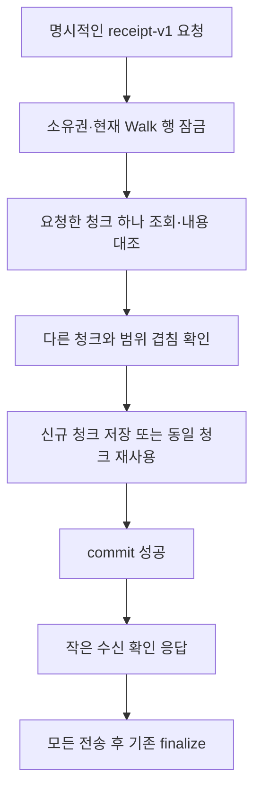

# 산책 좌표 수신 확인 v1

기존 산책 생성·좌표 추가의 기본 응답은 `WalkDetailResponse`다. 새 클라이언트는
`response=receipt-v1`을 명시해 이번 청크의 수신 확인만 받는다. 전체 좌표 조회·정렬·
recording receipt 계산은 이 경로에서 수행하지 않는다.

## HTTP 계약

| 요청 | 성공 응답 |
| --- | --- |
| `POST /app/walks?response=receipt-v1` | 최초 생성 201, 기존 산책 재사용 200 |
| `POST /app/walks/{walk_id}/points?response=receipt-v1` | 신규 청크·동일 재전송 모두 200 |
| 위 POST에서 옵션 생략 또는 `response=detail` | 기존 상세 응답과 기존 오류·재전송 의미 유지 |
| 위 POST에서 모르는 `response` 값 | 422 |
| `GET /app/walks/{walk_id}` | 기존 상세 응답, 경로 복원에 사용 |

요청 body는 각각 기존 `WalkUpload`·`WalkPointsAppend`다. 인증·소유권 경계를 유지한다.
없는 산책과 다른 사용자의 산책은 같은 404다. 기존처럼 `client_session_id`는 회원별 키다.

```json
{
  "contract_version": "walk-upload-receipt-v1",
  "walk_id": "11111111-1111-4111-8111-111111111111",
  "client_session_id": "22222222-2222-4222-8222-222222222222",
  "chunk": {
    "seq_from": 2000,
    "seq_to": 3999,
    "point_count": 2000,
    "status": "stored"
  }
}
```

- `stored`: 이번 요청에서 청크를 저장하고 commit했다.
- `replayed`: 해당 저장 청크의 범위·개수·내용을 대조하고 재사용했다.
- 좌표 없는 산책 생성 요청은 `chunk: null`이다. 산책 메타데이터의 생성/재사용만 확인하며
  서버에 좌표가 하나도 없다는 의미가 아니다. 좌표 추가는 기존처럼 빈 배열을 거부한다.
- `point_count`는 이번 청크의 좌표 수다. 누적 좌표 수·최대 수신 순번·전체 업로드 완료 상태를
  반환하지 않는다. 클라이언트는 모든 요청의 성공을 확인한 후 기존 finalize를 호출한다.
- 응답에는 `WalkDetailResponse.id` 대신 `walk_id`가 있다. 계약 버전을 확인한 뒤 해당 형식으로
  파싱해야 한다. OpenAPI의 두 POST 200 응답은 상세/수신 확인의 union으로 표시된다.

## 재전송과 충돌

새 계약의 청크 안에서는 순번이 중복·누락 없이 연속이어야 한다. 요청 배열의 순서는 자유다.
서로 겹치지 않는 청크는 순서가 바뀌어 도착해도 되고 청크 사이 빈 구간은 나중에 채울 수 있다.
전체 경로의 연속성과 종료 순번은 기존 finalize가 검증한다.

| 상황 | 새 계약의 처리 |
| --- | --- |
| 동일 청크 재전송 | 현재 저장된 내용까지 확인하고 `replayed` |
| 동일 첫 순번에 다른 끝 순번·개수·내용 | 409 `walk_chunk_conflict` |
| 다른 청크와 순번 범위가 겹침 | 409 `walk_chunk_overlap` |
| 한 청크 안의 순번 누락 | 409 `walk_chunk_not_contiguous` |
| 한 요청 안의 중복 순번 | 기존 schema 검증의 422 |
| 이미 있는 산책에 생성 요청으로 미저장 청크 전송 | 409 `walk_chunk_missing`; 좌표 추가 API로 전송 |
| 기존 생성 요청과 시작/종료 시각·날씨 불일치 | 409 `walk_upload_conflict` |
| 봉인된 산책에 좌표 추가 | 동일 재전송도 409 `walk_already_finalized` |

봉인 후에도 일치하는 최초 생성 요청의 재사용은 가능하다. 산책·분석·좌표를 변경하지 않는다.
참여견은 기존 정책대로 최초 생성에서 대표/돌보미 접근 가능 ID만 저장하고, 재요청으로
수정하지 않는다. 수신 확인에는 참여견 승인을 포함하지 않는다. 필요한 실제 참여견 목록은 GET 상세로 읽는다.

내용 비교는 기존 저장 정밀도(좌표 소수 여섯 자리·시각 밀리초)와 청크 decoder를 따른다.
payload의 `cols` 순서나 저장 v1/v2 형식 차이만으로 충돌을 만들지 않는다.

`recording_eligible` 생략/null은 해당 관측을 주장하지 않은 것으로 취급한다. 저장 후
recording-evidence로 보완한 값이 있어도 과거의 null 요청을 재전송할 수 있다. 명시적으로 보낸
true/false는 현재 저장값과 같아야 한다. 저장값이 null이거나 다른 명시적 값이면 충돌이며,
좌표 업로드가 GPS 구분을 채우거나 덮어쓰지 않는다. 보완은 기존 recording-evidence 계약을 사용한다.
이 확인서는 전체 경로의 GPS 기록 구분 영수증을 대체하지 않는다.

기존 API에서 만들어진 겹치는 청크나 불일치 데이터도 검사한다. 손상된 payload의 decoder 오류를
성공 응답으로 바꾸지 않는다. 새 요청 성공처럼 보이게 원본을 자동 수정하거나 삭제하지 않는다.

## 저장·조회 경계



- `services/walk_upload_receipt.py`가 새 계약의 검증·트랜잭션을 담당한다.
- `repositories/walk_upload.py`는 Walk 상태와 특정 `(walk_id, seq_from)` 청크만 로드한다.
  `points`·`pets` 관계의 자동 로딩을 금지하며 새 청크를 컬렉션 전체 로드 없이 추가한다.
- 겹침은 `seq_from`·`seq_to`의 SQL EXISTS로 검사한다. 이전 청크 payload를 Python으로 가져오지
  않지만 이 쿼리의 DB 실행 비용까지 청크 수와 무관하다고 보장하지는 않는다.
- 현재 세션에 남은 Walk·청크도 잠금 조회 시 최신 DB 값으로 갱신한다.
- 산책 최초 생성은 기존처럼 게임 공통 잠금 → 저장을 사용한다. 해당 사용자·client session의
  유니크 충돌만 rollback 후 게임 잠금·기존 Walk 잠금을 다시 획득해 복구한다.
- 새 산책·참여견·최초 청크·활동 연결은 함께 저장된다. 추가·생성·commit 실패와 요청 취소는
  rollback하며 성공 확인서를 반환하지 않는다.
- 좌표 추가는 기존처럼 Walk 행 잠금으로 finalize·recording-evidence와 직렬화한다.
  날씨 대기 중 append는 진행할 수 있고, finalize는 최신 입력을 재검사한다.

기존 상세 응답 경로의 저장 규칙은 유지한다. 기존 좌표 인코딩·PK·메타데이터 컬럼을 사용하므로
새 SQL migration·환경 변수·의존성은 없다.

## APP 적용 순서

DEV를 먼저 배포해도 기존 APP의 기본 응답은 그대로다. 후속 APP 변경이 새 옵션을 선택해야
전송량 감소가 적용된다. 이 DEV PR에서는 Android 코드를 변경하지 않는다.

APP은 계약 버전·산책/클라이언트 세션 ID·보낸 청크의 범위/개수·상태를 확인해야 한다.
구형 서버는 모르는 query를 무시하고 기존 상세 응답을 반환할 수 있다. 신형 APP은 이를
명시적으로 구분해 기존 형식으로 처리해야 하며, 응답 형식을 추측해 미저장 청크를 완료로 표시하지 않는다.
401·403·409·서버 오류를 계약 미지원으로 취급하거나 재요청으로 덮어쓰지 않는다.

모든 청크 확인 → 기존 recording-evidence 확인/보완 → 기존 finalize 순서를 유지한다.
기존 분석 ID 재사용, manifest 대조, 계정 전환 중단도 유지한다. 청크별 재개 지점의 로컬 영속
저장은 이 계약과 별개의 후속 작업이다.

## 검증

폐기용 loopback PostgreSQL의 `claims_test`를 사용한다. 앱/팀 DB를 대체 연결로 쓰지 않는다.

```powershell
# backend/
$env:TERRITORY_TEST_DATABASE_URL = 'postgresql+asyncpg://postgres@127.0.0.1:55439/claims_test'
uv run pytest -q -s -rs tests/walk/api/test_walk_upload_receipt_db.py --tb=short
```

HTTP 응답·기본 상세 호환, 생성/추가 경쟁, 게임 ON/OFF, 구형/신형 요청 혼합, 내용/범위 충돌,
recording-evidence 실제 보완, 오래된 ORM 객체, 저장 실패/취소, finalize 경합을 검사한다.
recording 보완 검사에는 실제 entry/pin SQL 의존성도 준비한다.

2026-09-12, Windows·Python 3.12·PostgreSQL 17.11에서 각 청크 100점으로 비교했다.
아래는 이전 청크 N개가 있는 산책에 100점을 추가한 요청의 JSON 응답 바이트다.

| 이전 청크 | 기존 상세 응답 | 새 수신 확인 | 새 추가의 기존 payload 로드 | 재전송 payload 로드 |
| --- | ---: | ---: | ---: | ---: |
| 1 | 31,910 | 227 | 0개 | 해당 1개 |
| 10 | 173,249 | 229 | 0개 | 해당 1개 |
| 50 | 804,969 | 229 | 0개 | 해당 1개 |

게임 OFF의 새 추가·추가 재전송·생성 재전송은 위 세 크기 모두 SELECT 3회였다.
이는 이 입력의 응답/ORM 로딩 측정이며 네트워크 압축 후 전송량·운영 지연·DB CPU 측정은 아니다.
최종 테스트 범위·결과는 [DEV #478](https://github.com/SAJOYO/DAENGS_dev/pull/478)에 기록한다.
